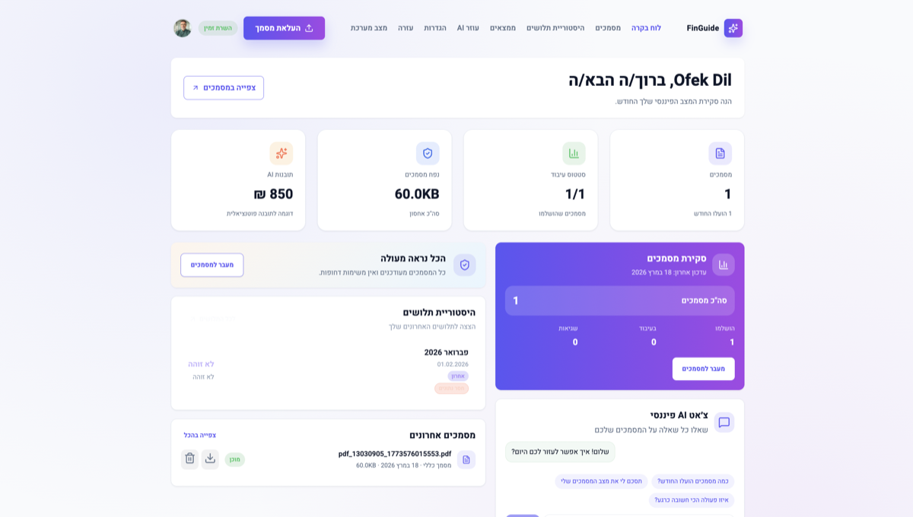
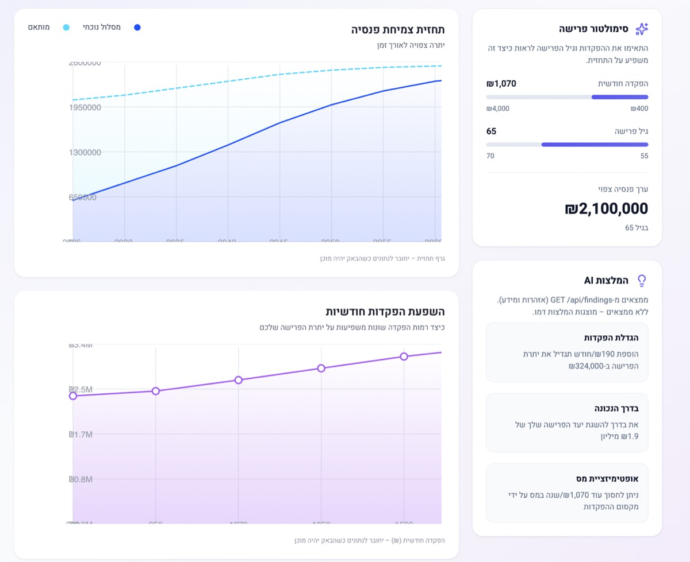

# FinGuide: An Automated Platform for Israeli Payslip Analysis and Personalized Financial Guidance

<div class="title-page-meta">

<p>by</p>

<p><strong>Shahar Mayster</strong><br />
<strong>Ofek Dil</strong><br />
<strong>Segev Partush</strong><br />
<strong>Ofir Raz</strong><br />
<strong>Emily Belenky</strong></p>

<p>Approved by the supervisor: Eliav Menashe</p>

<p>Submitted to the Computer Science Faculty of College of Management</p>

<p>July 2026, Rishon LeZion</p>

</div>

---

## Acknowledgments

We thank the Computer Science Faculty of the College of Management for the academic environment, project-day structure, and support throughout our degree. We are especially grateful to our supervisor, Eliav Menashe, for sustained guidance, technical feedback, and availability during the research and implementation phases.

We also thank the open-source communities behind Tesseract OCR, Node.js, React, and MongoDB, whose tools form the technical foundation of FinGuide. Finally, we thank our families and teammates for their patience and encouragement during the development of this work.

---

## Executive Summary

Israeli salaried employees receive monthly payslips (תלושי שכר) that encode salary, statutory deductions, and employer contributions, yet most lack tools to verify compliance or act on the data. Employers and payroll vendors issue complex documents governed by income tax, National Insurance, and mandatory pension law; employees rarely have the expertise or software to detect missing deposits, rate inconsistencies, or longitudinal gaps. FinGuide addresses this gap with a full-stack web platform that automates payslip ingestion, Hebrew-aware extraction, compliance checking, and personalized financial guidance.

The system applies a multi-path PDF and OCR pipeline, normalizes results into a canonical `analysisData` schema (version 1.9), and runs rule-based detectors for missing pension deposits, contribution-rate gaps, and deposit continuity breaks. A hybrid AI assistant combines deterministic intent routing with Claude and Ollama fallback; a multi-agent layer synthesizes payslip, pension, insurance, and profile analysis into a financial health score and prioritized action items. The implementation uses a Node.js and Express backend with a React 19 and TypeScript frontend, connected through twenty REST route modules.

Development followed an iterative, backend-first methodology with golden-fixture regression tests, reproducible `eval:*` scripts, and Jest-based unit and integration testing (115 backend and 5 frontend test files). Evaluation on a seven-fixture OCR corpus reported 100% accuracy on `gross_total` and `period_month`, with `net_payable` at 85.7%; a ten-scenario findings set (seven synthetic plus three golden-derived) achieved 100% precision and recall; a thirty-nine-query Hebrew routing set reached 94.9% intent classification accuracy; and Path-1 extraction latency on the same corpus measured a 16 ms median on development hardware. FinGuide demonstrates that employee-facing, Hebrew-native payslip analysis is feasible and establishes a foundation for expanded regulatory coverage and advisory features.

---

## Table of Contents

- [Chapter 1: Introduction](#chapter-1-introduction)
  - [1.1 Background](#11-background)
  - [1.2 Problem Statement](#12-problem-statement)
  - [1.3 Objectives](#13-objectives)
  - [1.4 Scope and Limitations](#14-scope-and-limitations)
  - [1.5 Methodology](#15-methodology)
  - [1.6 Organization of the Project Book](#16-organization-of-the-project-book)
  - [1.7 Team Contributions](#17-team-contributions)
- [Chapter 2: Literature Review](#chapter-2-literature-review)
  - [2.1 Overview of Relevant Literature](#21-overview-of-relevant-literature)
  - [2.2 Document Digitization and Optical Character Recognition](#22-document-digitization-and-optical-character-recognition)
  - [2.3 Hebrew Language Processing](#23-hebrew-language-processing)
  - [2.4 Israeli Financial Regulations Governing Employment](#24-israeli-financial-regulations-governing-employment)
  - [2.5 Personal Financial Management Systems](#25-personal-financial-management-systems)
  - [2.6 Web Application Architecture Patterns](#26-web-application-architecture-patterns)
  - [2.7 AI and Large Language Models in Fintech](#27-ai-and-large-language-models-in-fintech)
  - [2.8 Literature Synthesis and Research Gap](#28-literature-synthesis-and-research-gap)
- [Chapter 3: System Design and Implementation](#chapter-3-system-design-and-implementation)
  - [3.1 System Architecture](#31-system-architecture)
  - [3.2 Data Collection and Preprocessing](#32-data-collection-and-preprocessing)
  - [3.3 Implementation Details](#33-implementation-details)
  - [3.4 Evaluation Metrics](#34-evaluation-metrics)
  - [3.5 Software and Hardware Specifications](#35-software-and-hardware-specifications)
  - [3.6 Security and Data Privacy](#36-security-and-data-privacy)
- [Chapter 4: Results and Analysis](#chapter-4-results-and-analysis)
  - [4.1 Experimental Setup](#41-experimental-setup)
    - [4.1.5 Regression and Continuous Verification](#415-regression-and-continuous-verification)
  - [4.2 Presentation of Results](#42-presentation-of-results)
  - [4.2.5 Error Analysis — Deduction Fields and Net Mismatch](#425-error-analysis--deduction-fields-and-net-mismatch)
  - [4.2.6 Functional Verification for Objectives 4–6](#426-functional-verification-for-objectives-46)
  - [4.3 Data Analysis and Interpretation](#43-data-analysis-and-interpretation)
  - [4.4 Comparison with Existing Approaches](#44-comparison-with-existing-approaches)
  - [4.5 Discussion of Findings](#45-discussion-of-findings)
- [Chapter 5: Conclusion and Future Work](#chapter-5-conclusion-and-future-work)
  - [5.1 Summary of Contributions](#51-summary-of-contributions)
  - [5.2 Limitations](#52-limitations)
  - [5.3 Future Work](#53-future-work)
- [References](#references)
- [Appendix A: API Endpoint Reference](#appendix-a-api-endpoint-reference)
- [Appendix B: Project Setup and Reproduction](#appendix-b-project-setup-and-reproduction)
- [Appendix C: analysisData v1.9 Field Reference](#appendix-c-analysisdata-v19-field-reference)

---

## Table of Abbreviations

| Abbreviation | Expansion |
|---|---|
| API | Application Programming Interface |
| CSS | Cascading Style Sheets |
| DPI | Dots Per Inch |
| ESM | ECMAScript Module |
| HTML | HyperText Markup Language |
| HTTP | Hypertext Transfer Protocol |
| HTTPS | Hypertext Transfer Protocol Secure |
| ILS | Israeli New Shekel (₪) |
| JSON | JavaScript Object Notation |
| JWT | JSON Web Token |
| LLM | Large Language Model |
| MVC | Model–View–Controller |
| NII | National Insurance Institute (ביטוח לאומי) |
| NLP | Natural Language Processing |
| OCR | Optical Character Recognition |
| OEM | OCR Engine Mode |
| PDF | Portable Document Format |
| PNG | Portable Network Graphics |
| PSM | Page Segmentation Mode |
| REST | Representational State Transfer |
| RTL | Right-to-Left |
| SPA | Single-Page Application |
| SQL | Structured Query Language |
| SSE | Server-Sent Events |
| UUID | Universally Unique Identifier |

---

## Table of Figures

- **Figure 1:** High-level system architecture diagram
- **Figure 2:** Document processing pipeline (OCR extraction flow)
- **Figure 3:** Backend layered architecture
- **Figure 4:** analysisData canonical schema (version 1.9) structure
- **Figure 5:** Multi-agent AI orchestration pipeline
- **Figure 6:** Financial health score computation model
- **Figure 7:** Frontend route tree
- **Figure 8:** Authentication flow (JWT and Google OAuth 2.0)
- **Figure 9:** Findings detection decision tree
- **Figure 10:** OCR accuracy results by extraction path
- **Figure 11:** Verification and regression test flow
- **Figure 12:** Capability comparison summary
- **Figure 13:** Authenticated Hub dashboard (Hebrew RTL UI)
- **Figure 14:** Pension and findings-oriented UI view
- **Figure 15:** Public landing page (Hebrew marketing surface)
- **Figure 16:** Login screen with email/password and Google OAuth
- **Figure 17:** Public team page

---

## Table of Tables

- **Table 1:** Field extraction accuracy on golden fixture corpus (§4.2.2)
- **Table 2:** Findings engine precision and recall (§4.2.3)
- **Table 3:** AI assistant intent routing accuracy (§4.2.4)
- **Table 4:** Document processing latency (§4.2.1)
- **Table 5:** Capability comparison matrix (§4.4)
- **Table 6:** Functional verification evidence for Objectives 4–6 (§4.2.6)
- **Table 7:** Forced Path 3 image-OCR outcomes (§4.2.1)

---

## Chapter 1: Introduction

This chapter introduces the problem FinGuide addresses, the objectives and scope of the project, and the methodology used to carry out the work. It establishes the context and significance of Israeli payslip analysis and outlines how the remainder of this project book is organized.

### 1.1 Background

The management of personal finances is a complex and deeply consequential activity that affects every employed individual. For Israeli salaried workers, this complexity is amplified by the structure of the local labor market and the regulatory environment. Every employee in Israel receives a monthly payslip (תלוש שכר) that documents not only their gross and net salary but also a web of statutory deductions and employer contributions governed by multiple legislative frameworks: the Income Tax Ordinance (פקודת מס הכנסה), the National Insurance Law (חוק הביטוח הלאומי), the Pension Obligation Law (חוק הפנסיה החובה, 2008), and the Individual Labor Agreements and Collective Bargaining Agreements that set the terms for study fund (קרן השתלמות) participation.

A typical Israeli payslip includes dozens of distinct line items. Gross salary may be composed of base salary, travel allowance, meal allowance, commissions, overtime premiums, and other components. From this gross amount, the employer deducts income tax (מס הכנסה), the employee's share of National Insurance (ביטוח לאומי), and the employee's health insurance levy (מס בריאות). Simultaneously, the employer transfers contributions to the employee's pension fund (קרן פנסיה) or provident fund (קופת גמל) — an amount that includes the employee's own contribution (typically 6% of pensionable salary), the employer's contribution (typically 6.5%), and a severance provision (typically 6%) — as well as employer and employee contributions to a study fund when applicable. The result is a document that functions as both a wage statement and a compliance certificate for multiple overlapping regulatory obligations.

Despite this complexity, most Israeli employees have limited means to analyze their payslips beyond reading the net payable figure at the bottom. Commercial accounting software exists for businesses but is rarely targeted at individual employees seeking to audit their own payslips. Generic personal finance applications lack the domain-specific models required to interpret Israeli payslip structure, and the language barrier created by Hebrew text further limits the utility of international tools. This situation creates a systematic blind spot: employees may be unknowingly receiving below-minimum pension contributions, experiencing unnoticed deposit gaps, or failing to identify discrepancies between stated and implied contribution rates — all of which can translate into material financial harm over time.

FinGuide was developed to close this gap. It provides automated payslip ingestion, structured financial data extraction, statutory compliance verification, personalized financial guidance, and longitudinal analysis of payslip history — all within a Hebrew-language, mobile-responsive web interface accessible to employees with no specialist financial knowledge.

### 1.2 Problem Statement

The problem addressed by this project may be stated as follows: Israeli salaried employees receive complex monthly payslips containing critical financial and regulatory information that the overwhelming majority are unable to independently verify, analyze, or act upon. Three specific failure modes motivate this work:

**Missing or incomplete pension deposits** (addressed by Objective 2). Under Israeli law, pension participation is mandatory for most salaried employees since 2008. However, employers may fail to allocate contributions for new employees during a probationary period, for employees working below minimum thresholds, or due to administrative errors. Without automated detection, such failures may go unnoticed for months or years.

**Contribution rate gaps** (addressed by Objective 2). Even when pension or study fund contributions are recorded on the payslip, the stated rate (as a percentage) and the implied rate (derived from the deposited amount divided by the applicable salary base) may diverge. Such gaps can indicate calculation errors, incorrect salary base definitions, or deliberate under-contribution. Manual cross-checking requires spreadsheet calculations that most employees do not perform.

**Temporal continuity gaps** (addressed by Objective 2). An employee's total pension accumulation depends on uninterrupted contribution for the duration of their working career. Gaps — months in which no contribution appears on the payslip — reduce the terminal balance. Detecting such gaps requires comparing payslip history over time, a task impractical without an automated system.

Beyond these three compliance-oriented problems, there is a broader challenge of financial literacy and actionability (addressed by Objectives 3, 4, and 5). Even employees who understand their payslip in isolation often lack the context to evaluate whether their salary trajectory is normal, whether their deductions are correctly computed, or whether they are on track to meet retirement savings targets.

### 1.3 Objectives

The primary objectives of this project are:

1. **Automated payslip ingestion and OCR.** Design and implement a document processing pipeline that reliably extracts structured financial data from Israeli payslip PDFs, handling Hebrew text, varied layouts, and password-protected files. Image-based OCR for scanned or text-layer-deficient PDFs is implemented in the pipeline (Path 3) but was not part of the golden-corpus evaluation reported in Chapter 4, which used digital text-layer PDFs only.

2. **Financial findings detection.** Build a rule-based analysis engine that detects missing pension or study fund deposits, contribution rate inconsistencies, and deposit continuity gaps, with findings linked to specific payslip periods.

3. **Personalized AI assistant.** Integrate a hybrid language model system that answers financial queries in Hebrew using deterministic rule-based responses for well-defined intents and LLM inference for open-ended questions, grounded in the user's actual payslip data.

4. **Multi-agent financial analysis.** Design and implement a multi-agent orchestration architecture that runs specialized domain analyzers in parallel and synthesizes their outputs into an aggregate financial health score and actionable recommendations.

5. **Longitudinal financial planning.** Implement a savings forecast module that projects pension accumulation over the user's career horizon and supports scenario-based what-if analysis.

6. **Accessible, Hebrew-native UI.** Build a full right-to-left web interface in React that requires no financial expertise to navigate, surfaces findings prominently, and integrates the AI assistant as a conversational layer over the user's financial data.

### 1.4 Scope and Limitations

**In scope:** The system processes Israeli salary payslips (תלושי שכר) in PDF format from standard Hebrew-language payroll exports. Regulatory models reflect Israeli law as of 2026, including prevailing income tax brackets, National Insurance rates, pension minimum contribution rates, and study fund thresholds. The system supports one to approximately fifty payslip documents per user and stores data in a MongoDB instance.

**Out of scope:** The system does not provide certified financial advice; all outputs are informational and disclaimed accordingly. It does not file taxes, interact with pension fund management companies directly, or support the full range of Form 106 (annual income report) processing beyond basic metadata extraction. Support for languages other than Hebrew and English is not implemented. The savings forecast model is a linear projection that does not account for investment returns or inflation. Integration with banking APIs, pension fund portals, or the Israeli Tax Authority API is not part of the current implementation but is discussed as future work.

**Product limitations:** OCR accuracy depends on source PDF quality and layout consistency; heavily scanned or non-standard payslips may require manual field entry via `needs_review` status. The LLM assistant may cite outdated regulatory figures unless overridden by system-prompt constants; users are advised to verify specific statutory amounts.

### 1.5 Methodology

The project was developed using an iterative, feature-driven approach broadly aligned with the Agile methodology. Work was organized into thematic verticals — document ingestion, findings detection, AI assistant, multi-agent analysis, and frontend — which were developed and tested independently before integration. Each feature was validated against a corpus of real payslips obtained with user consent, supplemented by synthetic documents generated for testing edge cases.

**Development timeline.** The project proceeded in four phases aligned with repository history:

1. **Phase 1 — Backend foundation (months 1–3).** Definition of the `analysisData` v1.9 schema, document upload API, authentication, and the multi-path OCR pipeline (`payslipOcr.js`, golden fixtures). Findings detectors and statutory threshold configuration.
2. **Phase 2 — Core product (months 4–6).** React frontend with RTL layout, payslip history, findings UI, and `documentToPayslip.ts` mapping layer. Integration of insights, recommendations, and savings forecast.
3. **Phase 3 — AI layer (months 7–9).** Hybrid assistant (`detectIntent`, `claudeChatService`), multi-agent orchestration (`full-analysis`), financial health score, and extended domains (pension, insurance, copilot, Gmail import).
4. **Phase 4 — Evaluation and documentation (months 10–12).** Reproducible `eval:ocr`, `eval:findings`, and `eval:ai-routing` scripts; Jest regression suite; project book and submission packaging.

The backend was developed first, as it defines the data contracts on which all other functionality depends. The `analysisData` canonical schema was defined early and treated as a stable interface; all OCR improvements, golden-fixture regression tests, and manual field-filling flows were constrained to produce outputs conforming to this schema. The frontend was developed in parallel after the core API endpoints were stabilized, using mock responses during the period before backend integration was complete.

Testing followed a mixed strategy: unit tests verified the correctness of isolated financial calculations (contribution rate gap detection, deposit continuity timeline construction, savings forecast arithmetic); integration tests verified the full request-to-response cycle including database writes; and manual exploratory testing evaluated OCR quality on real documents. The full test suite is executed via Jest with the `--runInBand` flag to prevent database contention.

Reproducible evaluation harnesses complement manual testing: `npm run eval:ocr` scores field extraction against a golden fixture corpus; `npm run eval:findings` and `npm run eval:ai-routing` measure findings detection and intent classification on annotated scenario sets. Results from these scripts are reported in Chapter 4.

### 1.6 Organization of the Project Book

Chapter 2 reviews the relevant academic and technical literature. Chapter 3 presents system architecture, implementation details, and evaluation metrics. Chapter 4 reports experimental setup, results, analysis, and comparison with existing approaches. Chapter 5 concludes with contributions, limitations, and future work. The front matter includes tables of abbreviations, figures, and tables, plus references; appendices provide API documentation, setup instructions, and schema reference.

### 1.7 Team Contributions

Contributions reflect primary ownership areas verified against repository commit history:

| Team member | Primary contributions |
|---|---|
| **Shahar Mayster** | Project coordination, findings utilities (`detectContributionRateGap`, `detectDepositContinuityGap`), evaluation scripts, project book authoring, integration testing |
| **Ofek Dil** | Frontend architecture (React/Vite), Hub and payslip UI, OCR service integration, primary UI development |
| **Ofir Raz** | Backend controllers and API layer, AI assistant wiring, document processing, authentication flows |
| **Emily Belenky** | Backend services (OCR pipeline, financial document processing), frontend components, test coverage |
| **Segev Partush** | Multi-agent orchestration, pension and insurance domains, AI prompt and agent tooling |

All team members participated in code review, manual payslip validation, and end-to-end testing of the integrated platform.

---

## Chapter 2: Literature Review

This chapter surveys the academic and technical literature relevant to FinGuide. Sections 2.2 through 2.7 examine document digitization, Hebrew language processing, Israeli employment regulation, personal financial management systems, web architecture, and AI in fintech. Section 2.8 synthesizes these strands and states the research gap that motivates the project.

### 2.1 Overview of Relevant Literature

FinGuide sits at the intersection of four research areas that must be resolved together to build an employee-facing Israeli payslip advisory system: document digitization and OCR, natural language processing for Hebrew, computational models of personal finance grounded in Israeli labor and social-security law, and AI-assisted advisory systems. Each area independently has a mature literature, but the design of the system depends on how they interlock — the quality gate of the OCR layer determines the numeric inputs available to the compliance layer, and the compliance layer in turn determines when the AI advisory layer may quote a value and when it must defer to deterministic logic. This section previews the argument that runs through Sections 2.2–2.7 and shows how each body of literature is translated into a concrete design choice in Chapter 3.

Section 2.2 reviews document digitization and OCR. Its central conclusion is that no single extraction path is sufficient for the target domain — programmatically generated PDFs from Israeli payroll vendors mix intact text layers with non-standard Hebrew encodings, and rasterization is required only when text extraction fails a quality gate [1]–[4]. This motivates the multi-path extraction cascade instantiated in Section 3.2.2 (text-layer via `pdftotext` and `pdf-parse`, numeric rescue when Hebrew is corrupted, and image-based Tesseract as the final fallback), the field-level rather than character-level accuracy metric adopted in Section 3.4, and the use of a combined `heb+eng` language model with three PSM candidates ranked by resolution and confidence [1], [3], [6].

Section 2.3 reviews Hebrew language processing. It argues that for a finite-vocabulary, semi-structured domain such as payslip fields, deterministic label dictionaries and positional heuristics dominate general-purpose morphological analysis or transformer layout models — the marginal accuracy gain is not worth the loss of auditability, the opacity of failure modes, and the risk of numeric confabulation in a compliance-adjacent tool [5], [6], [18]. This underwrites the rule-based extractors documented in Section 3.2 and the decision not to fine-tune a layout model despite the availability of pre-trained checkpoints.

Section 2.4 reviews Israeli employment regulation. Findings are defined against statutory floors published by the Tax Authority, the National Insurance Institute, and the Ministry of Finance rather than against thresholds derived from user history [7], [14], [15]. This directly shapes the findings analyzers in Section 3.3.3, the tuning knobs codified in `contributionRateThresholds.js`, and the boundary between rule-based determinations and LLM narrative in Section 3.3.5.

Section 2.5 reviews the personal financial management (PFM) category. It identifies the recurrent trade-offs of that space — comprehensive aggregation versus privacy, automation versus user agency, awareness versus behavior change [8] — and shows that the dominant international products do not localize to Hebrew, Israeli payslip structure, or the specific line items required for statutory compliance checking [16]. Coupled with the still-early state of Israeli open-banking rollout [17], this justifies FinGuide's payslip-first ingestion model over a banking-API model and reduces the trust surface accordingly.

Section 2.6 reviews web application architecture patterns. The dominant industry pattern — a REST backend over HTTP with a single-page application frontend and a document-oriented database — is grounded in Fielding's REST specification [9] and is well suited to a workload characterized by I/O-bound OCR subprocess invocations, external LLM calls, and an evolving extraction schema. This section is expanded in the following pages to explain why the monorepo layout, the `analysisData` schema-less contract, and the Vite proxy configuration are consequences of the same architectural choice rather than incidental decisions.

Section 2.7 reviews AI and LLMs in fintech. It identifies two design responses to the confabulation risk that make LLMs usable in a regulated advisory setting: hybrid rule-first routing that keeps numeric answers under program control while reserving the LLM for open-ended natural-language questions [10], [11], and multi-agent orchestration that distributes prompt complexity across bounded sub-tasks [12]. Server-Sent Events [13] are identified as the appropriate delivery mechanism for unidirectional token streaming without introducing a new protocol surface. These three ingredients are the substrate that Sections 3.3.6 and 3.3.7 instantiate.

Section 2.8 consolidates the four strands, restates how each contributes to the design of FinGuide, and identifies the research gap that no prior integrated platform simultaneously addresses.

### 2.2 Document Digitization and Optical Character Recognition

#### 2.2.1 Text-Layer Extraction versus Image-Based OCR

Modern payroll PDFs are typically generated programmatically and embed a searchable text layer. Direct extraction via tools such as Poppler's `pdftotext` is faster and generally more accurate than image-based OCR when the text layer is intact, avoiding the character-recognition error introduced by rasterization and neural inference [1]. In the Israeli context, however, this assumption breaks down more often than in Latin-script domains: several major payroll vendors export PDFs in which Hebrew glyphs are stored with non-standard encodings, causing downstream tools to substitute the Unicode replacement character (U+FFFD) or produce reversed byte order in bidirectional runs. Because such artifacts are undetectable from the MIME type alone, an extraction system targeting Israeli payslips cannot rely solely on file-format heuristics; it must inspect the recovered text and fall back to rasterized OCR when quality gates fail [3]. This requirement — a graceful, quality-driven cascade rather than a single extraction path — informs the multi-path design described in Section 3.2.2.

#### 2.2.2 OCR Engines and Page Segmentation

The Tesseract engine, originally developed at Hewlett-Packard and later open-sourced under Google, remains the dominant open-source OCR tool [1]. Version 4.0 introduced an LSTM-based neural network architecture (OEM 1) that substantially improved recognition on complex scripts compared to the legacy character-pattern classifier (OEM 0) [2]. Tesseract supports Hebrew (`heb`) and provides several page segmentation modes (PSM): PSM 6 treats the image as a single uniform text block; PSM 4 assumes a single column of variable-size text; PSM 3 performs fully automatic segmentation. Research on document layout analysis shows that no single PSM mode is optimal across all document types, motivating multi-candidate evaluation and ranking [3].

#### 2.2.3 Preprocessing and Evaluation Challenges

Image preprocessing prior to OCR significantly affects recognition quality. Converting to grayscale, normalizing contrast, and applying threshold binarization improve character recognition on both printed and scanned documents [4]. For the target domain — payslips generated by commercial payroll software (Michpal, Malam Plus, and comparable vendors) and rendered from digital PDF sources — illumination is uniform and background noise is negligible. Under these conditions, a fixed global threshold is empirically effective and avoids the computational overhead of adaptive schemes such as Otsu's method [4], which pay dividends primarily on scanned or unevenly illuminated inputs. Evaluation of extraction systems is further complicated by semi-structured layouts: character error rate alone is insufficient because downstream compliance checking depends on the *correct numeric value being attributed to the correct field*. A single-character transposition inside a gross-salary figure is a functional failure regardless of how many surrounding characters were recognized. Field-level accuracy — computed on labeled ground-truth annotations — is therefore the appropriate measure for a payslip extraction system [6], and it is the metric adopted by FinGuide's evaluation harness (Section 4.2.2).

#### 2.2.4 Mixed-Script and Bidirectional Text

Israeli payslips typically mix Hebrew labels, Latin-script identifiers, Arabic numerals, and currency symbols. This requires a combined language model (`heb+eng`) and careful handling of bidirectional text, where reading order alternates between right-to-left (Hebrew) and left-to-right (numbers and Latin tokens) within a single line [5], [18]. Field extraction therefore relies on domain-specific label dictionaries and positional heuristics rather than generic sentence-level NLP.

### 2.3 Hebrew Language Processing

Hebrew presents challenges beyond those of Latin-script languages. The writing system is a consonantal alphabet (abjad) in which vowel markings (nikud) are optional and absent in professional payslips. Ambiguity at the character level propagates to word level in ways that do not occur in fully vocalized scripts [5]. Hebrew is also morphologically rich: a single stem may produce dozens of inflected forms through prefixation and suffixation.

For payslip field extraction, however, full morphological analysis is not required. The vocabulary of Israeli payslip labels is finite and domain-specific — terms such as "ברוטו", "נטו לתשלום", and "ביטוח לאומי" recur across vendors with limited orthographic variation, and the payroll domain has no free-text prose to parse. Keyword-based matching with normalization is therefore both sufficient and preferable in this constrained setting [6]. Research on multilingual information extraction from semi-structured documents spans a spectrum: rule-based template matching at one end, layout-aware transformer models such as LayoutLM at the other [6]. Model-based approaches offer superior generalization to unseen layouts but require labeled training data at a scale not available for Hebrew payslips, and they can confabulate numeric values in ways that are difficult to audit. For high-stakes financial documents in a small-data regime, rule-based approaches offer three properties that outweigh the loss in generalization: deterministic outputs that support regression testing on golden fixtures (Section 3.3.2), transparent failure modes (a null value rather than a hallucinated one), and the ability to encode statutory reasoning directly in code. These properties become critical in Section 2.4, where the extracted values must be interpreted against Israeli labor and social security law.

### 2.4 Israeli Financial Regulations Governing Employment

The financial calculations performed in employee-facing compliance tools are grounded in Israeli labor and social security law. The key regulatory frameworks are:

**The Income Tax Ordinance (פקודת מס הכנסה).** Income tax in Israel is levied at progressive marginal rates. For the **2026 statutory floors** published by the Israel Tax Authority, the bracket structure begins at 10% for income up to approximately ₪84,120 annually, rising through five additional brackets to 50% for income exceeding ₪876,720 annually [14]. Employees are entitled to credit points (נקודות זיכוי); each credit point reduces annual tax liability by a fixed shekel amount set annually by the Tax Authority [14].

**National Insurance Law (חוק הביטוח הלאומי).** The National Insurance Institute (ביטוח לאומי) collects compulsory contributions from both employee and employer [15]. Employee contributions fund old-age, disability, survivors', and unemployment benefits, together with a health levy. Employer NII contributions are paid in addition to the employee's deduction. FinGuide's deduction validators compare extracted amounts against NII rate tables for the active tax year [15].

**Pension Obligation Law (חוק הפנסיה החובה, 2008) and subsequent amendments.** Since 2008, pension participation has been mandatory for most salaried employees in Israel with limited exceptions [7]. Minimum contribution rates (2026 statutory floors, as a percentage of pensionable salary): employee 6%, employer contribution 6.5%, and employer severance provision 6% (or a combined contribution-and-severance model at 12.5%) [7]. Collective bargaining agreements and individual contracts frequently specify higher rates.

**Study Fund (קרן השתלמות).** Study funds are a tax-advantaged savings vehicle. Employer contributions of up to 7.5% of salary and employee contributions of up to 2.5% may receive tax exemptions up to statutory caps [14]. Participation is not universally mandatory but is common under collective agreements.

Compliance checking maps finding types to legal bases: *missing deposit* → Pension Obligation Law minimum allocation [7]; *rate gap* → stated vs implied percent against statutory floors in `contributionRateThresholds.js` [7]; *continuity gap* → uninterrupted pensionable service expectation under pension accumulation practice [7], [15].

### 2.5 Personal Financial Management Systems

The personal financial management (PFM) category spans lightweight budget trackers to full wealth-management platforms. Academic surveys identify recurrent design tensions in this space: comprehensive data collection (which typically requires account aggregation) versus user privacy; automation versus user agency; and, most difficult, moving users from passive awareness of their finances to sustained behavior change [8]. These tensions are amplified in the Israeli market by structural factors: open-banking APIs have only begun to be deployed under Bank of Israel supervision [17], and the dominant PFM products in English-speaking markets do not localize to Hebrew or to the specific line items that appear on Israeli payslips.

International PFM tools such as Mint, YNAB, and Copilot rely primarily on bank-transaction aggregation and are designed around Anglophone credit-card and current-account structures. When this project was initiated, no comparable tool combined Israeli bank integration with Hebrew-native payslip parsing and rule-based statutory compliance checking [16]. Employer-integrated payroll portals such as Hilan and iCount and general-purpose bank applications each cover part of the surface area — see Section 2.5.1 for a capability comparison — but none of them treats the payslip as an object of longitudinal, employee-centric compliance analysis across employer changes.

The design implication is direct: a system targeting the Israeli employee must accept payslip PDFs as its primary input rather than banking credentials. This reduces the trust surface (no third-party bank read access, no aggregation-provider dependency) while focusing analysis precisely on the document that encodes regulated employer obligations [8], [17]. Section 2.6 examines the web-application patterns that make such a system feasible in practice.

#### 2.5.1 Employer Portals versus Employee-Centric Tools

| Capability | Hilan / iCount portal | Bank PFM app | FinGuide |
|---|---|---|---|
| Structured payslip display | Yes (employer-scoped) | No (transactions only) | Yes (user-uploaded) |
| Cross-employer history | No | Partial (bank view) | Yes |
| Compliance findings (deposit/rate/continuity) | No | No | Yes |
| Hebrew-native advisory | No | Limited | Yes (rule + LLM) |
| Banking API required | No | Yes | No |

Employer portals excel as authoritative payslip viewers tied to payroll systems; bank apps excel at cash-flow visibility [16]. Neither performs statutory minimum checking against payslip line items — the gap FinGuide targets [8].

### 2.6 Web Application Architecture Patterns

Consumer-facing financial applications commonly use a REST API backend with a single-page application (SPA) frontend [9]. Fielding's original specification of the REST architectural style identifies uniform-interface constraints — resource identification, self-descriptive messages, statelessness of the server, and a layered system — that map naturally onto the domain: each document, finding, and pension record is a resource with a stable identifier, authentication is carried per-request via a Bearer token so the server holds no session state, and the API can be evolved without breaking clients as long as the media type remains stable [9]. For FinGuide these constraints have three concrete consequences discussed below: the layering choice, the persistence choice, and the frontend/monorepo choice.

**Layering.** A REST server that carries no session state and exposes cross-cutting concerns (rate limiting, CORS, body parsing, authentication) as ordered middleware benefits from a strict horizontal separation between routes, controllers, services, and persistence [9]. Each layer has a single responsibility: routes bind HTTP verbs and paths to controllers, controllers translate requests into service calls, services encapsulate business logic and hold no request-level state, and models express persistence. Node.js and Express together provide the non-blocking I/O model that suits an I/O-bound workload — file reads for uploaded PDFs, OCR subprocesses (`pdftotext`, `pdftoppm`, Tesseract), MongoDB reads and writes, and external LLM API calls — where request threads spend most of their time waiting on system calls or the network rather than on CPU-bound computation. The alternative of a thread-per-request server model was rejected on the same grounds identified in the REST literature [9]: for I/O-bound workloads it adds context-switching overhead and per-thread memory cost without a proportional improvement in throughput.

**Persistence.** Document-oriented databases such as MongoDB match a workload in which the extraction schema evolves faster than any relational migration cycle would tolerate. Each Israeli payslip vendor introduces layout variants that surface new fields on the `analysisData` object; a document-oriented store admits these fields without a coordinated schema migration, at the acknowledged cost of reduced query expressiveness over nested fields and the absence of database-level referential integrity [9]. The trade-off is deliberate — the same `schema_version` field on the document body that Section 2.8 identifies as the versioning mechanism is what makes this cost tolerable, because backfill scripts (`npm run reprocess:payslips`) can rewrite older documents to the current schema on demand.

**Frontend and monorepo.** The frontend pattern — React with TypeScript, compiled by Vite, with a dedicated mapping layer at the API boundary — provides compile-time type safety without freezing the backend contract. The mapping layer (`documentToPayslip.ts`) is the only place in the frontend that reads `analysisData` field names directly; the rest of the UI consumes typed `PayslipDetail` and `PayslipHistoryItem` values. This isolates schema drift to a single file and keeps the REST contract as the single source of coordination between the two workspaces [9]. Right-to-left layout is handled through CSS `direction: rtl` at the document root, with component-level overrides for Latin and numeric content. The choice of a monorepo containing both workspaces — rather than two separate repositories — follows from the same layering argument: because the mapping layer must move in lockstep with the backend's `analysisData` contract, an atomic commit across both sides is preferable to coordinating two independent version streams. The trade-off is that deployment is coupled and that both workspaces must share a release cadence; this is acceptable for a two-developer academic project but would be revisited at team scales where independent release trains dominate. Development ergonomics reinforce the choice: `concurrently` starts both dev servers from the root, and the Vite reverse proxy of `/api` and `/uploads` to the local Express server removes CORS complexity from the day-to-day loop.

### 2.7 AI and Large Language Models in Fintech

The integration of large language models into financial advisory applications has attracted significant attention since instruction-tuned models demonstrated strong few-shot performance on knowledge-intensive tasks [10]. LLMs perform well on qualitative financial reasoning benchmarks but exhibit a well-documented failure mode: confabulation of specific numerical facts. In the FinGuide context this failure mode is directly harmful — a model that quotes an incorrect pension contribution threshold or an outdated income-tax bracket does not merely produce a plausible-sounding answer, it produces one that could induce the user to draw the wrong conclusion about employer compliance [11].

Two design responses in the literature address this risk. The first is *hybrid routing*: structured, rule-sensitive queries are dispatched to deterministic handlers that read from the user's own data, and the LLM is reserved for open-ended natural-language questions that fall outside the deterministic surface [11]. This preserves the LLM's conversational strengths while keeping numerical answers under program control. The second response is *multi-agent orchestration*: several specialized agents each analyze a distinct sub-domain, and an orchestrator synthesizes their outputs [12]. Multi-agent designs distribute prompt-engineering complexity across bounded sub-tasks and constrain each LLM call to a smaller context, both of which reduce the incidence of confabulation on numeric fields.

Delivery mechanics also matter for the assistant's user experience. For streaming LLM token delivery to a browser client, Server-Sent Events (SSE) are a simpler, HTTP/1.1-compatible alternative to WebSockets when only unidirectional server-to-client communication is required, and they do not add a new protocol surface to authenticate [13]. Together, hybrid routing, multi-agent orchestration, and SSE streaming form the AI substrate that Section 3.3.6 and Section 3.3.7 instantiate for Hebrew financial advisory.

### 2.8 Literature Synthesis and Research Gap

The four bodies of literature reviewed above — document digitization, Hebrew NLP, Israeli employment law, and applied fintech AI — do not merely coexist; they interlock. OCR quality determines the numeric inputs available to the compliance layer; the compliance layer, in turn, is meaningful only against the statutory floors codified in Israeli labor law; and the AI advisory layer is trustworthy only when it either reads verified numeric values from the compliance layer or explicitly disclaims that it is providing a general narrative. Four synthesis points follow directly:

1. **Document / OCR.** A multi-path extraction cascade (text layer → numeric rescue → image OCR) with field-level evaluation on Hebrew payslips with mixed scripts and vendor-specific layouts is necessary rather than optional [1]–[4], [6].
2. **Hebrew NLP.** For a finite-vocabulary, semi-structured domain, domain-specific label dictionaries and deterministic parsers dominate general-purpose morphological analysis; the marginal accuracy of a transformer layout model does not justify its opacity for a compliance-adjacent tool [5], [6].
3. **Israeli labor regulation.** Compliance findings must be defined against statutory floors published by the Ministry of Finance, the Tax Authority, and the National Insurance Institute — not against heuristic thresholds derived from the user's own history [7], [14], [15].
4. **Fintech AI.** Rule-first routing with LLM fallback, augmented by multi-agent orchestration for cross-domain synthesis, is the design pattern that best balances natural-language coverage with resistance to numeric hallucination in a regulated advisory setting [10]–[13].

**Research gap.** No prior integrated platform, to the authors' knowledge, combines all three of the following properties simultaneously: (a) automated Hebrew payslip extraction with field-level quality gating; (b) rule-based compliance checking against Israeli statutory minimums along the *deposit*, *rate*, and *continuity* dimensions of pension and study-fund contributions [7], [14], [15]; and (c) a hybrid AI advisory layer grounded in the user's own extracted payslip history — all delivered as an employee-facing, Hebrew-native web application that does not require banking-API access [16], [17]. Employer portals address the display of a current payslip but not cross-employer longitudinal analysis; international PFM tools lack Israeli regulatory models and Hebrew-specific parsing; and academic OCR work targets character- and layout-level accuracy rather than downstream statutory compliance [18]. FinGuide is positioned to fill this gap, and its evaluation scope, measured performance, and residual limitations are reported in Chapters 4 and 5.

---

## Chapter 3: System Design and Implementation

This chapter describes FinGuide's architecture, data pipeline, and implementation. Section 3.1 presents the high-level design; Sections 3.2 and 3.3 detail preprocessing, extraction, findings, AI, and frontend components; Section 3.4 defines evaluation metrics; and Section 3.5 lists software and hardware specifications.

### 3.1 System Architecture

FinGuide is organized as a monorepo containing two workspaces: `backend/` (Node.js + Express) and `frontend/` (React 19 + TypeScript). **Why a monorepo:** both workspaces share release cadence and the `finguide-monorepo` workspace dependency, and `concurrently` starts both dev servers from the root. **Alternative considered:** separate repositories with published API contracts. **Trade-off:** the monorepo simplifies local development and cross-cutting refactors (e.g., renaming `analysisData` fields) but couples deployment and requires coordinated versioning of the mapping layer in `documentToPayslip.ts`.

The root `package.json` orchestrates both via `concurrently`, which starts the backend development server on port 5000 and the Vite development server on port 5173 simultaneously. The Vite configuration reverse-proxies `/api` and `/uploads` requests to `127.0.0.1:5000`, eliminating cross-origin request complexity during development.


At the top sits the browser client running the React SPA. The client communicates with the Express API server over HTTPS. The API server interacts with four external systems: MongoDB (data persistence), Tesseract and Poppler utilities (OCR processing, run as child processes), the Anthropic Claude API (LLM inference), and optionally an Ollama local server as an LLM fallback. The filesystem stores uploaded PDF files under `backend/uploads/`.

#### 3.1.1 Request Lifecycle

Every request served by the Express application in `backend/app.js` passes through a fixed ordered pipeline of middleware before reaching the route handler. The order is a design choice rather than an incidental one, and each stage is placed where it is because the stages downstream depend on invariants it establishes.

1. **Rate limiting.** `express-rate-limit` is installed as the first middleware, with a fixed 15-minute sliding window and a threshold that switches on `NODE_ENV`: 2 000 requests per window in development and 100 in production. Placing rate limiting first ensures that abusive clients are rejected before any per-request work is performed — no CORS preflight logic, no body parsing, no database lookup. Rejected requests return a Hebrew error message consistent with the rest of the user-facing surface.
2. **CORS.** A dynamic origin function accepts requests either with no `Origin` header (server-to-server, health checks, curl) or from a whitelist consisting of the configured `CLIENT_URL` and the two localhost development origins (`http://localhost:5173`, `http://127.0.0.1:5173`); requests from any other origin are refused without adding CORS headers. `credentials: true` is enabled so that authenticated cross-origin `fetch` calls carry the Authorization header. Placing CORS before body parsing avoids reading a request body only to discover the response cannot legally be delivered to the caller.
3. **Body parsing.** `express.json({ strict: false })` and `express.urlencoded({ extended: true })` parse JSON and form-encoded request bodies respectively; `strict: false` accepts JSON primitives at the top level, which some clients emit for single-value updates. The Multer middleware responsible for multipart file uploads is not installed here — it is attached only to the specific upload routes that require it (`POST /api/documents/upload`, `POST /api/auth/profile/image`) so that the general request path is not burdened with multipart parsing overhead.
4. **Static uploads.** A narrow static file route serves `/uploads/profile-images` from the local filesystem. This is intentionally the *only* subdirectory of `backend/uploads/` exposed as static content: payslip PDFs are not served statically. Downloads of payslip files go through the authenticated `GET /api/documents/:id/download` handler, which resolves the requested path and rejects any path that escapes the uploads directory.
5. **Health check.** `GET /api/health` is defined before the authenticated route modules and returns a JSON payload with a server timestamp. It is deliberately unauthenticated so that container orchestrators and reverse proxies can probe liveness without holding a JWT.
6. **Route modules.** Twenty route modules are mounted under `/api`, one per bounded domain (auth, documents, ai, findings, onboarding, profile, insights, recommendations, notifications, integrations/gmail, tax-assistant, financial-health, copilot, score-agent, pension, insurance, dashboard, agents, gov, and summary-email). Each module owns its own path prefix and internally applies the `protect` middleware from `backend/middleware/auth.js` to every route that requires authentication. `protect` extracts the Bearer token from the `Authorization` header, verifies it against `JWT_SECRET`, loads the corresponding user via `User.findById(decoded.id).select('-password')`, and attaches the loaded document to `req.user`. Any failure — missing header, invalid signature, expired token, or a user id whose record has been deleted — is converted into a typed `AuthError` and delegated to the error handler with a Hebrew message; the route handler never runs. This design keeps the identity check at the boundary of the routing layer rather than inside individual controllers, so a controller that reads `req.user` can assume it has been populated by an authenticated request.
7. **404 handler and error handler.** Any request that reaches the end of the middleware chain without a match is answered by a `404` JSON body, and any error passed via `next(err)` — whether raised by `protect`, by a controller, by a Mongoose operation, or by Multer — is centralized in `middleware/errorHandler.js`. The error handler maps Mongoose validation errors, JWT errors, Multer errors, and custom `AppError` subclasses to typed responses with appropriate status codes and Hebrew messages.

This lifecycle establishes the invariant that every route handler runs with a valid `req.user` (except for the small set of unauthenticated auth and health routes), a parsed request body of a known shape, and a caller whose origin and rate have already been accepted. Controllers therefore contain no cross-cutting concerns of their own — they translate the validated request into service calls and return the shaped response.

#### 3.1.2 Deployment Topology

The deployment topology for local development is defined by `docker-compose.yml` and the `backend/Dockerfile`. The `dev:docker` command provisions two services on a shared Docker network. The `mongo` service uses the `mongo:7` image and exposes port 27017 to the host, with a named `mongo_data` volume so that database state survives container restarts. The `backend` service is built from `backend/Dockerfile`, which starts from `node:20-bullseye` and installs the `tesseract-ocr`, `tesseract-ocr-heb`, and `poppler-utils` system packages — the same binaries required by Paths 1 and 3 of the extraction pipeline described in Section 3.2.2. Bundling these binaries into the container image removes the ordinary macOS developer requirement of installing them via Homebrew and guarantees that OCR behavior is reproducible across development machines; without them, `pdftotext` and `pdftoppm` would fail with `ENOENT` and the extraction pipeline would fall through to a `failed` document status.

Inside the container the Node.js server listens on port 5000, but the Compose file publishes it to host port **5001** to avoid conflicts with a native `npm run dev:backend` process that may already occupy 5000 on the developer's machine. This is the single practical caveat of the containerized workflow: the Vite proxy hard-coded in `frontend/vite.config.ts` targets `127.0.0.1:5000`, so when the backend runs under `dev:docker`, the frontend must either be pointed at port 5001 via `VITE_API_URL` or the proxy target adjusted. The container environment sets `MONGODB_URI=mongodb://mongo:27017/finguide` to reach the sibling `mongo` service by its Compose service name, and mounts `backend/uploads` and `backend/.work` as bind volumes so that uploaded PDFs and intermediate OCR artifacts persist across container rebuilds and remain visible to the host filesystem for inspection during development.

### 3.2 Data Collection and Preprocessing

#### 3.2.1 Document Ingestion

Documents are submitted to the system via the `POST /api/documents/upload` endpoint. Multer middleware validates the uploaded file against two criteria: the MIME type must be `application/pdf` or one of the Microsoft Excel types (`application/vnd.ms-excel`, `application/vnd.openxmlformats-officedocument.spreadsheetml.sheet`), and the file size must not exceed a configurable limit (default 10 MB, governed by the `MAX_UPLOAD_SIZE_MB` environment variable). Files that pass validation are stored with a UUID-generated filename under `backend/uploads/`. A SHA-256 checksum of the file content is computed immediately after storage and recorded on the Document record to enable future deduplication.


The upload handler calls `processFinancialDocument`, which creates a MongoDB Document record with `status: 'pending'` and immediately invokes the synchronous extraction pipeline. The pipeline proceeds through up to three extraction paths in order of reliability, falls back to the next path upon failure, and ultimately writes the result back to the Document record as `analysisData` with `status: 'completed'`, `status: 'needs_review'`, `status: 'needs_password'`, or `status: 'failed'`.

#### 3.2.2 Multi-Path Text Extraction

The extraction pipeline attempts three paths in sequence, choosing the highest-quality result:

**Path 1 — Direct PDF text extraction (pdf_text).** The pipeline first attempts text extraction via Poppler's `pdftotext` utility, which handles Hebrew encoding more reliably than pure JavaScript PDF parsers on many Israeli payroll exports. If `pdftotext` yields fewer than 50 characters, the system falls back to the `pdf-parse` Node.js module. If the combined text contains at least 200 characters and does not exhibit the broken-Hebrew encoding pattern described in Section 2.2, the text is passed directly to `extractPayslipFinancialEN`. An additional quality gate requires that the extracted `analysisData` contains `gross_total > 500` and `net_payable > 500` — without both of these salary fields, the extraction is considered to have failed even if the text was successfully read. The gate is implemented as follows:

```javascript
// payslipOcr.js — Path 1 success requires both core salary fields
const gross = data?.salary?.gross_total;
const net = data?.salary?.net_payable;
if (!(gross > 500 && net > 500)) {
  // fall through to Path 2 or Path 3
}
```

**Why synchronous processing:** the upload handler runs extraction inside the HTTP request cycle. **Alternative:** `processDocumentAsync` with a job queue (tested but not wired to upload). **Trade-off:** synchronous processing simplifies status handling and avoids polling infrastructure, but multi-page image OCR can add 10–20 seconds of request latency (see Section 5.2).

**Path 2 — Numeric rescue.** If Path 1 yields text of adequate length but broken Hebrew encoding (as detected by the `isLikelyBrokenHebrew` heuristic, which checks for a ratio of Unicode replacement characters above 1.5% or fewer than 8 Hebrew characters in a 400-character sample), the system still attempts extraction. Hebrew labels cannot be reliably matched, but numeric values — salary amounts, percentages, identification numbers — can often still be extracted from the corrupted text because Arabic numerals survive encoding corruption.

**Path 3 — Image-based OCR.** When text extraction fails, the system falls back to rendering each PDF page as a 300 DPI PNG image using `pdftoppm`, preprocessing the image with Sharp, and submitting the result to Tesseract.

#### 3.2.3 Image Preprocessing

Before submission to Tesseract, each page image undergoes a preprocessing chain implemented with the Sharp Node.js library:

1. **Auto-rotation.** Sharp applies EXIF-based rotation to correct orientation artifacts from scanning.
2. **Grayscale conversion.** The color image is converted to an 8-bit grayscale representation, eliminating color variation that adds noise without contributing to character recognition.
3. **Contrast normalization.** Sharp's `normalize()` operation stretches the grayscale histogram to the full 0–255 range, improving contrast on faded or low-contrast documents.
4. **Thresholding.** A global threshold of 170 binarizes the image: pixels with luminance above 170 become white, those below become black. This produces a clean black-on-white binary image that Tesseract's LSTM network processes most effectively. The threshold value of 170 was determined empirically on a development corpus of payslips.

The preprocessing chain is intentionally simple and deterministic. Adaptive preprocessing (e.g., Otsu's method for automatic threshold selection) was considered but rejected because the uniformly illuminated, printer-generated documents in the target domain consistently benefited from a fixed threshold value.

After preprocessing, the image is submitted to Tesseract with the combined Hebrew and English language model (`heb+eng`), LSTM-based OEM 1, the `preserve_interword_spaces=1` configuration, and three PSM candidates (6, 4, 3) run in sequence. The raw text output from each candidate is scored by `rankExtractionCandidates`, which sorts candidates by resolution score, confidence, and warning count:

```javascript
// payslipOcrResolver.js — select best OCR candidate
function rankExtractionCandidates(candidates = []) {
  return [...candidates].sort(
    (a, b) =>
      (b.data?.quality?.resolution_score ?? 0) - (a.data?.quality?.resolution_score ?? 0) ||
      (b.data?.quality?.confidence ?? 0) - (a.data?.quality?.confidence ?? 0) ||
      (a.data?.quality?.warnings?.length ?? 0) - (b.data?.quality?.warnings?.length ?? 0),
  );
}
```

The highest-scoring candidate advances to field extraction.

#### 3.2.4 LLM Adjudication for Ambiguous Fields

When multiple extraction candidates are available and their extracted values for a specific field conflict, the system invokes an LLM adjudication step. The `adjudicateField` function submits the conflicting candidates to Claude Haiku 4.5 (`claude-haiku-4-5`) with a structured prompt requesting selection of the most plausible value given the field's domain constraints. The adjudication model returns a chosen value and a confidence score in the range [0, 1]. The final field score is adjusted upward from the base candidate score using the formula:

```
finalScore = max(chosenScore, min(1.0, 0.85 + (confidence − 0.6) × 0.3))
```

This formula ensures that high-confidence adjudications produce field-level scores near 0.85–1.0, providing a calibrated quality signal to downstream components. The use of Claude Haiku for this task (rather than the more capable Sonnet model used for the chat assistant) reflects a deliberate cost-performance trade-off: adjudication requires only short-context field comparison, a task well within Haiku's capabilities at substantially lower cost.

#### 3.2.5 analysisData Canonical Schema

All extraction paths ultimately produce an `analysisData` object conforming to schema version 1.9. This object is stored as a schema-less BSON `Object` in the MongoDB `Document` record. **Why schema-less storage:** the extraction algorithm evolves frequently; new fields are added without relational migrations. **Alternative:** a normalized relational schema with migration scripts. **Trade-off:** MongoDB's `Schema.Types.Mixed` enables rapid iteration and backfill via `npm run reprocess:payslips`, but nested-field queries are not enforced at the database level.

The schema is versioned via the `schema_version` field, allowing the reprocessing script to identify and backfill documents produced by older extraction algorithms.

The top-level structure of `analysisData` v1.9 is:

```
{
  schema_version: "1.9",
  period: { month: string },
  salary: { gross_total: number, net_payable: number, components: [...] },
  deductions: { mandatory: { total, income_tax, national_insurance, health_insurance } },
  contributions: {
    pension: { employee, employee_amount, employer, base_salary_for_pension },
    study_fund: { employee, employer }
  },
  tax: { gross_for_income_tax, tax_credit_points, personal_credit },
  national_insurance: { employee_amount, employer_amount },
  employment: { employer_name, employment_start_date, employment_type },
  parties: { employer_name, employee_name, employee_id },
  insurances: { ... },
  quality: { score, extraction_path, validation: { issues, warnings } },
  raw: { rawText, ocr_text },
  summary: { date }
}
```


The `quality` sub-object records the extraction path taken, an overall quality score, and a list of validation issues detected during extraction. Documents with quality scores below a threshold are given `status: 'needs_review'` rather than `status: 'completed'`, which triggers a prompt in the UI encouraging the user to manually verify the extracted values.

### 3.3 Implementation Details

The subsections below trace the data flow from backend request handling through findings detection, AI advisory, and frontend presentation. Each major subsystem includes explicit design rationale where architectural alternatives were considered.

#### 3.3.1 Backend Architecture


The backend is structured as five horizontal layers:

- **Routes (`backend/routes/`).** Twenty Express router modules are mounted in `app.js`: auth, documents, ai, findings, onboarding, profile, insights, recommendations, notifications, Gmail integration, tax-assistant, financial-health, copilot, score-agent, pension, insurance, dashboard, agents, gov (government data nets), and summary-email. Each module mounts on a URL prefix and delegates request handling to the corresponding controller. Route modules are responsible only for URL-level concerns: HTTP method, URL parameters, middleware application, and controller dispatch.

- **Controllers (`backend/controllers/`).** Controller functions extract validated inputs from the request object, call the appropriate services, and format the HTTP response. Controllers contain no business logic; they translate between HTTP and the internal domain model.

- **Services (`backend/services/`).** Service modules implement business logic. The `financialDocumentService` orchestrates the extraction pipeline. The `savingsForecastService` computes pension projections. The `claudeChatService` manages communication with the Anthropic API.

- **Utilities (`backend/utils/`).** Utility modules implement pure algorithmic logic without external dependencies: the findings detectors (`detectFundWithoutDeposit`, `detectContributionRateGap`, `detectDepositContinuityGap`), the financial health score utilities, and the payslip period normalization functions.

- **Models (`backend/models/`).** Mongoose schema definitions and model constructors. The User model and Document model are described in detail in Section 3.3.4.

Request lifecycle: An incoming HTTP request is processed by the global middleware stack defined in `app.js` — rate limiter (2,000 requests per 15 minutes in development, 100 per 15 minutes in production), CORS whitelisting (CLIENT_URL and localhost:5173), JSON body parsing — before reaching the matching route handler. Protected routes pass through the `protect` middleware, which extracts the Bearer token from the Authorization header, verifies it using `jsonwebtoken.verify`, and attaches the retrieved User document to `req.user`. Error propagation uses Express's `next(error)` pattern; the global `errorHandler` middleware normalizes Mongoose `ValidationError`, `CastError`, duplicate key (error code 11000), JWT verification failures, Multer upload errors, and custom `AppError` subclasses into typed JSON error responses.

#### 3.3.2 Golden-Fixture Regression Testing

The extraction pipeline is regression-tested against a labeled golden corpus stored under `backend/services/__fixtures__/golden/` (seven anonymized payslips spanning Michpal and Malam Plus templates as of July 2026). The `npm run eval:ocr` script uploads each fixture programmatically, compares extracted fields against ground-truth annotations, and reports per-field accuracy and confusion details. This provides a repeatable baseline for measuring extraction quality as the label dictionary and preprocessing chain evolve. A next-generation extraction architecture (extraction-v2) is under evaluation using additional fixtures under `backend/fixtures/extraction-v2/`; it is not yet wired into the production upload path.

Once a document reaches `status: 'completed'` with a populated `analysisData` object, the findings engine consumes the same canonical schema without re-parsing the PDF. This separation — extract once, analyze many times — keeps compliance logic deterministic and testable independently of OCR variance.

#### 3.3.3 Findings Detection Engine

The findings detection engine is invoked by `GET /api/findings` and produces a structured list of financial anomalies and warnings for the authenticated user. The findings are generated from two layers:

**Layer 1 — Metadata findings.** Before analyzing payslip content, the engine checks for document-level problems: the user has no uploaded documents at all; there are multiple documents with identical filename and file size (suspected duplicates); one or more documents have remained in `pending` or `processing` status without update for more than 30 days (stale documents); one or more payslips have missing `periodMonth` or `periodYear` metadata; and a payslip has a period date in the future (likely a data entry error).

**Layer 2 — Financial findings.** Three specialized detectors analyze the content of completed payslips. Each detector is a pure function of the `analysisData` payload plus the user's onboarding data, which makes the layer independently unit-testable and reproducible against the golden fixture corpus (Section 4.1.3).

*Fund deposit detection* (`detectFundWithoutDeposit.js`). **What:** for each payslip, and for both `pension` and `study_fund`, the detector determines whether a fund section was identified in extraction and whether the summed employee-plus-employer deposit for that section is zero. **How:** section presence is established from any of four positive signals — a stored OCR detection flag (`storedDetection.sectionDetected`), a positive `base_salary_for_pension` (or study-fund equivalent), the presence of un-abstained contribution candidates in the quality object, or a non-empty contribution block without the `missingLine` warning. Deposit-zero is inferred from a stored `noDeposit` flag when available, otherwise from the sum of extracted amounts. **Why this way:** the four-signal disjunction addresses OCR variance across vendors — one vendor emits a `base_salary_for_pension` line without an explicit pension header, another emits the header without a base — so a single indicator would either miss cases (low recall) or over-flag them (low precision). A special case exempts a `severance`-only pension deposit, because Israeli pension law recognises employer-side severance provisioning independently of the employee/employer contribution channel [7]. **Alternative considered:** flagging on a single high-confidence indicator (for example, only when the OCR emits `noDeposit: true`). This alternative was rejected as too conservative: extraction confidence on the golden corpus is not high enough to make a single-signal detector reach the 100% recall observed in the seven-scenario evaluation. In addition to per-document findings, the detector performs an onboarding cross-check: if the user declared `hasPension` or `hasStudyFund` during onboarding but the most recent payslip shows no fund section, it emits a mismatch finding, closing the loop between user-declared expectations and payslip reality.

*Contribution rate gap detection* (`detectContributionRateGap.js`). **What:** for each fund side (employee, employer, and — for pension — severance), the detector computes an *implied* percentage as `(amount / base) × 100` and compares it against the *stated* percentage extracted from the payslip and against the statutory minimum configured in `config/contributionRateThresholds.js`. **How:** three finding types can be emitted per side: `inconsistency` (stated vs implied differ by more than `inconsistencyTolerancePercent`, default 0.35 pp), `belowMinimum` (the effective rate — stated when available, otherwise implied — is below the statutory floor), and `dataIncomplete` (the section is present but neither amount nor rate can be recovered). The statutory floors used are pension employee 6.0%, pension employer 6.5%, pension severance 6.0%, study-fund employee 2.5%, and study-fund employer 7.5%, matching the 2026 obligations discussed in Section 2.4 [7], [14]. All thresholds are overridable through environment variables (`PENSION_EMPLOYEE_MIN_RATE_PERCENT`, `CONTRIBUTION_RATE_INCONSISTENCY_TOLERANCE`, and related keys) so that the compliance layer can be tuned per collective-agreement scenario without a code change. The core comparison logic is:

```javascript
// detectContributionRateGap.js — implied vs stated rate check
const impliedPercent = computeImpliedPercent(amount, base, analysisData, thresholds);
const consistencyGap =
  statedPercent != null && impliedPercent != null &&
  Math.abs(statedPercent - impliedPercent) > thresholds.inconsistencyTolerancePercent;
const effectivePercent = statedPercent ?? impliedPercent;
const belowMinimum =
  effectivePercent != null && minimumPercent != null &&
  effectivePercent < minimumPercent;
```

**Why the 0.35 pp tolerance:** payslip PDFs frequently round percentage displays to the tenth or half of a percent, so a strict equality check on stated versus implied would produce a large volume of false positives that carry no compliance meaning. The 0.35 pp band was chosen to remain inside the smallest published rounding step used by observed vendors while still surfacing genuine discrepancies. **Alternative considered:** deriving statutory floors dynamically from an authoritative online source. This was rejected for the same reason discussed in Section 2.7 for LLM confabulation — a static, version-controlled configuration file that engineers can review is the auditable ground truth [7], [14], [15]. **Trade-off:** the configuration file must be refreshed when statutory rates change, which is a documented operational task rather than a system property.

*Deposit continuity gap detection* (`detectDepositContinuityGap.js`). **What:** across a user's uploaded payslip history, the detector distinguishes between two structurally different kinds of contribution breaks: *on-payslip gaps*, where a payslip exists for a month but the deposit column is zero; and *missing-payslip gaps*, where two deposit-bearing payslips are separated by one or more months for which no payslip was uploaded at all. **How:** the shared `buildFundTimeline` utility (`utils/contributionTimeline.js`) constructs a monthly timeline across the user's history, classifying every month as `hasDeposit`, `noDepositOnPayslip`, `missing`, `uncertain`, or `beforeEmployment`. The detector then runs a windowed scan that looks for runs of `noDepositOnPayslip` bracketed by `hasDeposit` months (an internal on-payslip break) or `hasDeposit` followed by trailing `noDepositOnPayslip` (a trailing break). A separate branch counts contiguous `missing` months to emit missing-payslip findings, and an uncertainty counter tracks months where extraction quality is too low to classify confidently. **Why two categories:** the two break types have different remediation actions — on-payslip zero deposits require the user to contact the employer or fund manager, while missing-payslip gaps typically require the user to upload the corresponding months. Collapsing them into a single "gap" finding would obscure this distinction. **Why the `beforeEmployment` filter:** without it, the detector would flag every month prior to the user's employment start date as a missing-payslip gap. The detector consults `analysisData.employment.employment_start_date` and skips months earlier than the resolved employment start, treating unknown start dates as a soft signal rather than a hard mask [15]. The behaviour is tunable through `config/depositContinuityConfig.js` (minimum-gap length, lookback window, and required deposit density), reflecting the same configuration-first discipline used for the rate detector.

All findings are assigned a severity level and sorted with `warning` findings listed before informational findings. Each finding carries a `meta` object containing the relevant fund type, the affected period months, the associated document identifiers, and a `findingKind` discriminator (`deposit`, `rate`, or `continuity`), enabling the frontend to render deep-link URLs into the payslip history view with the relevant periods highlighted.

Findings feed both the Hub dashboard and the AI assistant: rule-based intents such as `pension_status` read the same `contributions` fields that the detectors analyze, ensuring consistent answers whether the user views a finding card or asks a conversational question.


The figure illustrates the three-level decision tree for pension deposit detection: (1) Was a pension section identified in extraction? If not, skip. (2) Is the sum of employee and employer deposits zero? If not, skip. (3) Is the missingLine warning absent? If so, emit `PENSION_MISSING_DEPOSIT` finding.

#### 3.3.4 Data Models

**User model** (`backend/models/User.js`). The user schema stores authentication credentials and onboarding data:
- `name`: string, max 100 characters.
- `email`: string, unique indexed, lowercase normalized.
- `googleId`: string, sparse unique index (null for non-Google users).
- `password`: string, `select: false` (never returned in queries by default), minimum 6 characters.
- `onboarding`: nested object containing `completed` (boolean), `completedAt` (date), and `data` (a sub-document recording salary type, expected monthly gross, employment start date, pension and study fund participation flags).
- `gmailIntegration`: nested object recording Gmail OAuth tokens for the optional email integration feature.
Password hashing is handled by a Mongoose `pre('save')` hook that calls `bcryptjs.genSalt(10)` followed by `bcryptjs.hash` on the plain-text password whenever the password field is modified.

**Document model** (`backend/models/Document.js`). The document schema represents a single uploaded payslip:
- `user`: ObjectId reference to the User, with a compound index on `{user, uploadedAt}` for efficient per-user queries sorted by upload date.
- `filename`: string, unique — the UUID filename assigned at upload time.
- `checksumSha256`: string — the hex-encoded SHA-256 digest of the file content.
- `status`: enum `['uploaded', 'pending', 'processing', 'completed', 'needs_review', 'needs_password', 'failed']`.
- `analysisData`: `Schema.Types.Mixed` — the schema-less extraction result object.
- `processingError`: string — the error message recorded when status is `failed`.
- `source`: enum `['manual', 'gmail']` — whether the document was uploaded manually or imported via the Gmail integration.
- `emailMetadata`: nested object storing Gmail message and attachment identifiers for deduplicated Gmail imports.

#### 3.3.5 Authentication


**Figure 16** shows the Hebrew login surface that exposes the JWT and Google OAuth entry points summarized in Figure 8.

The system supports two authentication modes.

*Local authentication* is implemented using JSON Web Tokens. The `POST /api/auth/register` endpoint accepts a validated name, email, and password (minimum 6 characters, must contain at least one uppercase letter, one lowercase letter, and one digit, per express-validator rules). The user record is created in MongoDB — the pre-save hook hashes the password — and a 7-day JWT is returned. The `POST /api/auth/login` endpoint finds the user by email using `User.findOne().select('+password')` (the `+password` projection overrides the default `select: false`), verifies the password with `bcrypt.compare`, and returns a new JWT on success.

*Google OAuth 2.0* is implemented via the `POST /api/auth/google` endpoint. The client submits a Google ID token obtained from the Google Sign-In button. The server verifies the token using `OAuth2Client.verifyIdToken` from the `google-auth-library` package, which validates the token's signature, issuer, expiry, and audience against the configured client ID (`GOOGLE_CLIENT_ID`). The verified payload yields the user's email, name, and Google subject identifier. The server performs an upsert: it searches for a user with a matching `googleId` or email, linking the Google identity to an existing account if one is found, or creating a new account with a random UUID password placeholder if the email is not registered.

All protected API routes pass through the `protect` middleware. JWT verification failure, missing token, or a deleted user account produce standardized 401 responses. Token expiry is configurable via the `JWT_EXPIRE` environment variable; the default is 7 days.

#### 3.3.6 AI Assistant

The AI assistant is exposed through the `POST /api/ai/chat` (standard request/response) and `POST /api/ai/chat/stream` (Server-Sent Events streaming) endpoints, and the `GET /api/ai/financial-tips` endpoint.

*Intent detection.* Before invoking any language model, the `detectIntent` function in `aiController.js` performs keyword-based intent classification over the user's message text. The classifier recognises roughly two dozen distinct intents covering the domain of Israeli personal finance: gross/net salary questions, pension and study-fund status, income-tax and credit-point queries, what-if salary simulations, month-over-month comparisons, insurance gap detection, savings forecast requests, onboarding-status questions, and general financial-health inquiries. Each intent branch is a small set of Hebrew (and English fallback) keyword tests, with explicit *negative* keywords to avoid false positives — for example, a message that mentions "פנסיה" together with "ממוצע" or "בישראל" is treated as a general knowledge query rather than a personal `pension_employee` intent, so the response is routed to the LLM rather than to the rule layer.

**Why rule-first routing:** the deterministic handlers reach into the user's own `analysisData` and return values that can be traced back to a specific payslip field, labelled `source: "rule"` in the response. This is the layer at which numeric hallucination is *structurally* impossible, because no LLM is on the answer path [11]. **Alternative considered:** LLM-first classification, i.e., ask the model to both classify and answer. This was rejected because it removes the auditability guarantee — a wrong answer becomes indistinguishable from a right one until it is caught by a downstream check — and because it would move the rate of numeric-correctness under a probabilistic model instead of a deterministic one. **Trade-off:** keyword routing is brittle to paraphrase, as the two misclassified queries in the n = 39 evaluation set (Section 4.2.4) illustrate. Extending intent coverage is a matter of adding keyword rules and regression tests to the AI-routing evaluation script; each added intent monotonically increases the deterministic surface without changing the LLM contract.

```javascript
// aiController.js — keyword intent routing (excerpt)
function detectIntent(message) {
  const msg = normalizeMessage(message);
  if (msg.includes('חריג') || msg.includes('anomaly')) return 'anomaly_check';
  if (msg.includes('פנסיה') && msg.includes('הפקדה')) return 'pension_status';
  // ... additional intent patterns
  return 'fallback';
}
```

*Rule-based responses.* When `detectIntent` returns a recognised intent, `buildRuleBasedAnswer` produces a deterministic, data-grounded response by reading from the user context assembled earlier in the request (payslips, profile, insights, recommendations). For example, the `pension_status` intent retrieves the most recent payslip, reads `contributions.pension.employee` and `contributions.pension.employer`, compares them against the statutory minimums from `contributionRateThresholds.js`, and returns a Hebrew-language message quoting the exact shekel amounts and percentage rates taken directly from the document. Because these responses read from `analysisData` (already extracted by the OCR pipeline) rather than from the raw PDF, they are consistent with the findings engine described in §3.3.3 by construction.

*LLM fallback.* When `buildRuleBasedAnswer` returns `null` — either because the intent is `'fallback'` or because the user context lacks the fields needed for a deterministic answer — control passes to `claudeChatService.chat()`. The service constructs an enhanced system prompt that includes the user's completed payslip data (up to 50 documents), active insights and recommendations, pension and insurance analysis results, and a reference block covering Israeli pension rates, common insurance types, the 2026 income-tax brackets, and mortgage-rate ranges. The user and assistant turns are persisted as `ChatMessage` documents so that subsequent turns pass conversation history to the model. **API contract:** the JSON response includes a `source` field that takes exactly one of three values — `"rule"` for deterministic answers, `"claude"` for Anthropic-served LLM answers, and `"ollama"` for locally-served fallback answers. This label is the primary observability signal for evaluating routing quality (Section 4.2.4) and for triaging user complaints about wrong numeric answers.

The primary LLM is Claude Sonnet 4.6, selected for its strong performance on Hebrew financial reasoning tasks. When `ANTHROPIC_API_KEY` is unset — for example, during local development or offline testing — the service transparently falls back to an Ollama-hosted local model (default `llama3.1:8b`), and the response is labelled `source: "ollama"`. This keeps the assistant demonstrable without an external key while preserving a single call site for downstream code.

*Streaming.* The `/chat/stream` endpoint uses Node.js's `res.write()` to deliver Server-Sent Events. **Why SSE over WebSockets:** LLM token delivery in this application is strictly unidirectional server-to-client, and SSE requires no protocol handshake, no separate authentication surface, and works over the same HTTP/1.1 connection as the rest of the API [13]. **Trade-off:** SSE does not support client-to-server streaming within the same connection. For the current chat UX — where the user submits a full message and receives a streamed answer — that limitation is not binding. If future work introduces client-side audio streaming during the same turn, WebSockets would be reconsidered.

The response header sets `Content-Type: text/event-stream` and `Cache-Control: no-cache`. The LLM response is streamed token by token using the `@anthropic-ai/sdk` streaming API, with each token chunk wrapped in an SSE `data:` frame of type `token`. A final `done` event signals stream completion, and error events deliver error metadata to the client for graceful degradation.

#### 3.3.7 Multi-Agent AI Orchestration


The orchestration layer is exposed through the `POST /api/ai/full-analysis` endpoint (`backend/controllers/fullAnalysisController.js` → `ai/agents/orchestratorAgent.js`). On the Hub page it runs only when the user explicitly triggers it via the Run control in `MasterAgentPanel`; it is not invoked automatically on page load. **Why user-triggered rather than automatic:** a full analysis fans out to four domain agents and can make one or more LLM calls per agent plus a final orchestrator call, which is both cost-bearing (LLM tokens) and latency-bearing (several seconds of wall-clock time). Triggering it on page load would tax the API budget and delay first paint for a majority of visits in which the user did not intend to re-analyse. **Alternative considered:** running a subset automatically on data change (e.g., after a new payslip upload) and caching the result. This remains a plausible future direction but was deferred because the orchestrator's outputs depend on multiple sources (payslips, insurance profile, onboarding), which complicates cache-invalidation logic.

The pipeline proceeds through four steps:

**Step 0 — Execution Canvas.** `buildExecutionCanvas` loads the user's onboarding data, completed documents, user profile, existing recommendations, and insurance and pension records to construct a domain task inventory. The canvas determines which domain agents need to run (based on `focus`: `'all'`, `'payslip'`, `'insurance'`, or `'pension'`) and records the data availability status for each domain.

**Step 0.5 — Government data prefetch and global score (parallel).** `prefetchGovMarketData` warms an in-memory cache with Israeli government data from data.gov.il — pension fund market returns, indexed contribution rates, and similar benchmark data — by making HTTP requests to the public API. Concurrently, `buildFinancialHealthScore` computes the user's financial health score for the current year.

The financial health score is a composite of five weighted categories, totaling 100 points:
- *Document completeness* (max 25 points): rewards users who have uploaded payslips for most months of the year.
- *Salary stability* (max 20 points): rewards consistent month-over-month salary, penalizes unexplained drops.
- *Tax readiness* (max 20 points): rewards timely Form 106 availability and absence of tax anomalies.
- *Pension consistency* (max 20 points): rewards regular, above-minimum pension contributions.
- *Risk insurance* (max 15 points): rewards completion of the insurance profile onboarding questionnaire.


Each sub-score is computed by a dedicated function within `financialHealthScoreService.js` using the user's payslip history and profile data.

**Step 1 — Domain agents in parallel.** Four agent functions run concurrently via `Promise.allSettled`:
- `runPayslipAgent`: retrieves payslip summaries, runs salary trend analysis, generates rule-based recommendations, and optionally calls Claude for an LLM explanation.
- `runInsuranceAgent`: loads the user's insurance profile and compares declared coverage types against benchmark coverage expectations for the user's income bracket.
- `runPensionAgent`: fetches pension data from the pension database model and PensiaNet comparison data, evaluates contribution adequacy, and generates recommendations.
- `runFinancialProfileAgent`: analyzes the user's overall financial profile across all domains.

Each agent follows the same internal pipeline: fetch data via tool functions → run deterministic analysis → generate rule-based recommendations → optionally call Claude for an LLM-generated narrative explanation. Agents return structured DTOs; they never pass raw database documents to the LLM. **Why `Promise.allSettled` rather than `Promise.all`:** a transient failure inside one agent (for example, a Claude timeout) must not fail the entire analysis run. `allSettled` allows the orchestrator to record a per-agent error status and continue synthesis with the remaining agents, so the user still receives a partial result and an explanatory summary rather than an empty response. **Alternative considered:** running the four agents sequentially. This was rejected because the domain agents have no data dependencies on each other — payslip analysis does not need insurance data, and vice-versa — so serialising them would only add latency.

**Step 2 — Recommendation merging and action items.** `mergeRecommendations` deduplicates and ranks recommendations from all four agents by priority and domain overlap, so that identical recommendations produced by two agents (e.g., "check your pension deposit" from both the payslip and pension agents) collapse into a single, higher-confidence item. `buildActionItems` then selects the highest-priority subset and formats them as concrete actions with urgency indicators, bridging automated analysis to user-visible next steps on the Hub.

**Step 3 — Orchestrator summary.** The orchestrator assembles a *safe context object* from the canvas, government data, global score, action items, and agent results. This object is explicitly stripped of raw credentials and of raw document text before it is passed to the LLM — the goal is to give the model a compact structured summary of what the deterministic layers already concluded, not to re-run analysis inside the prompt. The context forms the system prompt for a final Claude call that produces a unified Hebrew narrative summarising the user's financial health and highest-priority next actions. If Claude is unavailable or the caller sets `skipLLM: true`, the `generateHebSummary` fallback in `explanationAgent.js` produces a deterministic rule-based summary from the same agent results, prefixed with the numeric health score. The response body identifies which path was taken via the `finalSummarySource` field (`"claude"` or `"rule"`), preserving the same auditability discipline as the chat endpoint.

Every analysis run is logged to an `AgentRunLog` document recording the run identifier, start time, duration, per-agent statuses, total recommendation count, and summary source. This log supports post-hoc debugging of individual runs and provides a longitudinal record for evaluating LLM reliability over time.

#### 3.3.8 Savings Forecast

The savings forecast module (`POST /api/findings/savings-forecast`) implements a linear projection model for pension accumulation:

```
projectedBalance = currentBalance + monthlyContribution × monthsToRetirement
```

The model is intentionally simple: it does not account for investment returns on the accumulated balance, inflation, or changes in contribution rate over the forecast horizon. This design choice prioritizes transparency and auditability over false precision; users are informed of the model's assumptions in the UI.

`savingsForecastService` resolves the monthly contribution input from one of two sources in order of priority: the `pension.employee` plus `pension.employer` fields from the most recent completed payslip with non-zero pension contributions; or an explicit `currentMonthlyContribution` parameter provided by the user in the request body. If neither source is available, the endpoint returns HTTP 400. The service generates two scenarios — current trajectory (unmodified monthly contribution) and an adjusted scenario (with a user-specified increased contribution) — and returns a yearly timeline of projected balances for each scenario, enabling a comparison chart in the frontend.

#### 3.3.9 Frontend Architecture


The React 19 application is organized around a route tree declared in `App.tsx`. Public routes (accessible without authentication) include the landing page, login, registration, password reset, and marketing pages such as `/team`. All other routes are wrapped in `RequireAuth`, a route guard component that reads the authentication state from `AuthProvider` and redirects unauthenticated users to the login screen. Figures 15 and 17 illustrate the public Hebrew marketing surfaces; Figure 16 shows the authentication screen.

The primary application areas accessible after authentication are:
- **Welcome / Welcome Back** (`/welcome`, `/welcome-back`): First-run and return-session onboarding screens (completion signaled via `POST /api/auth/welcome/complete`).
- **Hub** (`/hub`): The main dashboard; the user triggers multi-agent analysis via the Run control and the page displays the health score, key findings, recent payslips, and action items (Figure 13).
- **Documents** (`/documents`): The document upload area with drag-and-drop support, OCR status indicators, and document management actions.
- **Payslip History** (`/documents/history`): A chronological view of all uploaded payslips with salary trend visualizations implemented primarily as custom inline SVG components with CSS animation, providing pixel-level control over the Hub trend chart.
- **Pension** (`/pension`): A dedicated view combining extracted payslip pension data with PensiaNet market comparison (Figure 14).
- **Insurance** (`/insurance`): The insurance coverage assessment page.
- **Financial Planning** (`/planning`): The savings forecast calculator.
- **AI Assistant** (`/assistant`): The conversational chat interface with streaming response support.
- **Tax Assistant** (`/tax-assistant`): A Form 106 and tax-year summary view.
- **Financial Health** (`/financial-health`): The detailed health score breakdown.
- **Copilot / Insights / AI Agents** (`/copilot`, `/insights`, `/ai-agents`): Extended advisory surfaces that consume the same analysis and recommendation APIs.





The application entry (`main.tsx`) composes four nested providers: `BrowserRouter` → `AuthProvider` → `AiChatProvider` → `App`. `AuthProvider` calls `GET /api/auth/me` on mount to restore an authenticated session from the JWT stored in `localStorage`. `AiChatProvider` manages the global floating AI assistant state — conversation history, streaming SSE connection, and voice input — so that the chat panel remains accessible on every authenticated page without re-mounting. The API client (`client.ts`) reads the JWT on every request and attaches it as a `Bearer` token in the `Authorization` header. All UI strings are in Hebrew, and the document root receives `direction: rtl` at the page container level to ensure correct bidirectional text rendering.

The single mapping layer between the backend `analysisData` structure and the frontend UI types is `documentToPayslip.ts`. This module exports two primary mappers: `documentToPayslipHistoryItem` (for the compact list view) and `documentToPayslipDetail` (for the detailed payslip view), both of which translate the snake_case backend field names to camelCase TypeScript types. Changes to the backend schema are propagated to the frontend exclusively by editing this file, preventing drift between the two representations. The frontend never reads raw OCR text or internal `quality.debug` fields — those are stripped by `documentSerializer.js` before API responses leave the backend.

#### 3.3.10 Extended Domain Modules

Beyond the core payslip pipeline, FinGuide implements additional REST domains mounted in `app.js`:

**Insights and recommendations** (`/api/insights`, `/api/recommendations`). The insights module runs payslip trend analysis via `POST /api/insights/run` and persists structured insight records with severity and dismissal state. The recommendations module executes rule-based insurance and pension recommenders through `POST /api/recommendations/run`, surfacing actionable items the Hub and assistant can reference.

**Copilot** (`/api/copilot`). Provides a consolidated financial snapshot via `GET /api/copilot/analysis` (profile, latest payslip, budget, investments, health score, goals) and supports goal management and monthly markdown reports generated by Claude with a rule-based fallback.

**Gmail integration** (`/api/integrations/gmail`). Optional OAuth connection allowing users to import payslip PDF attachments from Gmail (`POST /connect`, `POST /sync`), reducing manual upload friction while keeping credentials scoped to the user's account.

**Dashboard aggregation** (`/api/dashboard/summary`). Combines documents, profile, policies, and recommendations in a single `Promise.all` response for overview screens.

These modules share the same authentication, error-handling, and MongoDB persistence patterns described in Section 3.3.1; their detailed route tables appear in Appendix A.

### 3.4 Evaluation Metrics

The system is evaluated along three dimensions, using the same thresholds reported in Chapter 4:

**OCR accuracy.** Field-level extraction rate on the golden fixture corpus (n = 7): a numeric field counts as correct when its value is within **0.5%** of the annotated ground truth (`npm run eval:ocr`). String fields require exact match.

**Findings precision and recall.** On the annotated scenario corpus (n = 7), precision is the fraction of generated findings that correspond to genuine anomalies; recall is the fraction of annotated anomalies detected (`npm run eval:findings`).

**AI assistant routing.** Intent classification accuracy on the Hebrew query set (n = 39): a query is correct when `detectIntent()` returns the expected intent label (`npm run eval:ai-routing`). Rule-based responses are additionally checked for factual accuracy against payslip fixtures.

**Functional verification (Objectives 4–6).** Automated unit and integration tests confirm multi-agent orchestration, savings-forecast calculation, and frontend mapping contracts (Table 6). These tests do not measure end-user usability; they establish that the implemented code paths succeed under fixture-driven assertions.

### 3.5 Software and Hardware Specifications

**Backend software (from `backend/package.json`):**

| Component | Version |
|---|---|
| Node.js runtime | 20.x (Docker base image) |
| Express | ^4.18.2 |
| Mongoose | ^8.0.3 |
| Jest | ^30.2.0 |
| pdf-parse | ^1.1.4 |
| Sharp | ^0.34.5 |
| @anthropic-ai/sdk | ^0.97.1 |
| bcryptjs, jsonwebtoken, multer | ^2.4.3 / ^9.0.2 / ^1.4.5-lts.1 |

**Frontend software (from `frontend/package.json`):**

| Component | Version |
|---|---|
| React | ^19.2.0 |
| TypeScript | ~5.9.3 |
| Vite | ^7.2.4 |
| react-router-dom | ^7.13.0 |
| Jest + ts-jest | ^30.2.0 / ^29.4.6 |

**System binaries (OCR pipeline):** Tesseract OCR with Hebrew language pack (`tesseract-ocr-heb`), Poppler utilities (`pdftoppm`, `pdftotext`). These are bundled in the backend Docker image (`dev:docker`); on macOS development hosts they must be installed separately or accessed via Docker.

**Hardware and deployment environment:** Development was carried out on macOS and Linux workstations. Docker Compose provisions MongoDB and the backend with OCR dependencies. Uploaded PDFs are stored on the local filesystem under `backend/uploads/` (not object storage). Production-oriented constraints include synchronous upload processing latency, dev rate limits of 2,000 requests per 15 minutes (100 in production), and optional Ollama (`llama3.1:8b`) as an LLM fallback when `ANTHROPIC_API_KEY` is unset.

### 3.6 Security and Data Privacy

Payslips (תלושי שכר) contain sensitive personal and financial data — national ID numbers, salary amounts, employer names, and contribution details. FinGuide treats this data as confidential employee information subject to access control, transport security assumptions, and informational-use disclaimers (see §1.4).

**Authentication.** Local accounts use bcrypt-hashed passwords (`bcryptjs`, salt rounds 10) with the password field stored as `select: false` on the User model so that it is never returned by default queries. JSON Web Tokens are issued on register and login using `JWT_SECRET` (minimum 10 characters, validated at server boot in `server.js`). Google OAuth 2.0 verifies ID tokens via `OAuth2Client.verifyIdToken`, checking signature, issuer, expiry, and audience against `GOOGLE_CLIENT_ID`. All non-auth routes pass through the `protect` middleware (`middleware/auth.js`), which extracts the Bearer token from the `Authorization` header, verifies it with `jsonwebtoken`, attaches the corresponding User document to `req.user`, and returns a standardised 401 `AuthError` on any failure. **Why a Bearer-token model:** it decouples authentication from cookies, simplifies the CORS story, and lets the same API serve the browser SPA and, in the future, headless mobile clients. **Trade-off:** JWTs cannot be revoked before expiry without a stateful denylist, so the default 7-day `JWT_EXPIRE` window is a deliberate compromise between session ergonomics and blast radius; a shorter window would improve security at the cost of more frequent re-authentication.

**Authorization and data isolation.** Every Document record is indexed by `user`, and controllers scope queries to `req.user._id`. Download endpoints resolve filesystem paths and reject traversal using an anchored prefix check: `path.resolve(document.filePath).startsWith(path.resolve(process.cwd(), 'uploads'))` must hold before the PDF is streamed (`documentController.js`). **Why resolve-and-prefix rather than substring:** `path.resolve` normalises `..` segments and symbolic links before the check, closing the class of attacks in which a malicious filename encodes `../` to escape the uploads directory. Users cannot access another user's payslips or `analysisData` because both the ownership check (`document.user.equals(req.user._id)`) and the path check must succeed on every read.

**AI data grounding.** The assistant's `buildUserContext(userId)` loads payslips, profile, insights, and recommendations exclusively from the database for the authenticated user. Client-supplied `userData` in chat requests is not treated as a trusted financial source — preventing clients from injecting fabricated payslip values that would then be quoted by rule-based answers. **Why this matters:** the rule layer is designed to be numerically auditable (§3.3.6). If client data were accepted, the source label `"rule"` would no longer guarantee that the numbers came from a stored, extractable payslip.

**Storage and transport.** PDFs are stored locally under `backend/uploads/{uuid}.pdf` with SHA-256 checksums recorded on the Document for deduplication. The API is intended to run behind HTTPS in production; development uses localhost with Vite proxying `/api` and `/uploads` to `127.0.0.1:5000`. Gmail OAuth tokens, when the optional Gmail integration is enabled, may be encrypted at rest with `GOOGLE_TOKEN_ENCRYPTION_KEY` (or `JWT_SECRET` as a fallback) via `tokenCrypto.js`. **Alternative considered:** object storage (S3 or equivalent) for uploads. This was deferred because local filesystem storage keeps the local-development experience simple and does not require additional secrets or IAM configuration; the migration path is a services-level change with no schema impact.

**Rate limiting and boot validation.** The `express-rate-limit` middleware is installed as the first entry in the app-wide middleware chain, applying **2,000 requests per 15 minutes in development** and **100 requests per 15 minutes in production** per client IP (`app.js`). CORS is configured with an allow-list including `CLIENT_URL` and the Vite development origins (`http://localhost:5173`, `http://127.0.0.1:5173`); unknown origins are rejected. `server.js` refuses to start without `JWT_SECRET` (≥ 10 characters) and `MONGODB_URI`, so the process fails fast on misconfiguration rather than boot with an unsafe fallback. **Why 100 requests per 15 minutes in production:** the volume was chosen to accommodate a single authenticated user's typical browsing session (dashboard load, a payslip upload, several chat turns) while still throttling brute-force login attempts. The development value is deliberately much higher so that the Jest integration tests, which issue hundreds of requests per file, do not spuriously trip the limit.

**Privacy posture.** FinGuide does not sell or share payslip data with third parties. When the user invokes the assistant, the payslip context is included in the system prompt sent to the configured LLM provider (Anthropic or, in fallback mode, a locally-hosted Ollama model); no other outbound traffic transports personal financial data. Outputs are informational only and do not constitute certified financial, tax, or legal advice (§1.4, §5.2).

---

## Chapter 4: Results and Analysis

This chapter reports evaluation results against the objectives stated in Section 1.3. Section 4.1 describes the experimental setup and reproducibility harnesses; Sections 4.2 and 4.3 present and interpret measured outcomes; Section 4.4 compares FinGuide with existing alternatives; and Section 4.5 discusses whether the project objectives were met.

### 4.1 Experimental Setup

Evaluation was conducted in a development environment on macOS with Node.js 20.x, MongoDB (local or Atlas via `MONGODB_URI`), and Poppler/Tesseract available either natively or through `dev:docker`. No production load test was performed. All reproducible metrics are produced by `npm run eval:ocr`, `npm run eval:findings`, `npm run eval:ai-routing`, and `npm run bench:upload-latency`, supplemented by the Jest unit and integration test suite described below. Rate limiting during development is set to 2,000 requests per 15 minutes (100 in production), which did not constrain the evaluation runs.

#### 4.1.1 Automated Test Suite

The backend test suite comprises **115** `*.test.js` files (excluding `node_modules`), executed against an in-process MongoDB instance provided by `mongodb-memory-server` (v11). Jest 30 runs with `--runInBand` to prevent race conditions from concurrent database writes. Tests are organized under:

- `backend/__tests__/` — unit tests for parsers, OCR resolver, and service modules
- `backend/tests/unit/` — additional unit tests for utilities and controllers
- `backend/tests/integration/` — end-to-end API tests via Supertest (auth, documents, findings, pension, recommendations)

The frontend test suite comprises **5** test files under `frontend/src/`, running in jsdom with ts-jest and `@testing-library/react` 16. Root `npm test` also runs `vite build`, enforcing TypeScript compile checks.

**Not covered:** browser-based end-to-end (Playwright/Cypress) tests, production load tests, and formal penetration testing. OCR quality on unseen vendors relies on golden fixtures plus manual exploratory review.

The key test files and what each covers are:

| File | Coverage focus |
|---|---|
| `auth.routes.test.js` | Registration, login, Google OAuth, password reset flows |
| `documents.uploadMetadata.test.js` | File upload, metadata assignment, status transitions |
| `payslipOcrParser.test.js` | Amount parsing, period parsing, Hebrew label recognition |
| `payslipOcrResolver.test.js` | Candidate ranking, PSM selection, gross/net disambiguation |
| `documentProcessingService.test.js` | Pipeline state machine (pending → completed / failed) |
| `findings.savingsForecast.test.js` | Linear forecast model, edge cases (zero balance, same-year retirement) |
| `payslipHistoryAggregationService.test.js` | Annual aggregation, monthly bucketing, missing-month detection |
| `detectSalaryAnomalies.test.js` | Month-over-month anomaly detection, outlier flagging |
| `documentToPayslip.test.ts` | `analysisData` → `PayslipHistoryItem` mapping correctness |

#### 4.1.2 OCR Evaluation Framework

The golden fixture corpus comprises **n = 7** anonymized Israeli payslip PDFs from Michpal and Malam Plus payroll systems (July 2026), stored under `backend/services/__fixtures__/golden/`. Each fixture has a companion `expected.json` annotation file with ground-truth values for primary financial fields.

**Annotation protocol.** Two team members independently annotated each fixture by reading the PDF and recording `gross_total`, `net_payable`, deduction line items, and identifiers. Disagreements were resolved by a third review against the source PDF. Personal identifiers in fixtures were anonymized; only payroll-vendor structure and numeric values needed for field matching were retained.

Each document is processed via `extractPayslipFile`. A numeric field counts as correct when within **0.5%** of ground truth; string fields require exact match. Reproduction: `cd backend && npm run eval:ocr`.

Password-protected PDFs are pre-unlocked before evaluation. The corpus consists entirely of digital PDFs with intact text layers; scanned payslips are not yet represented (Section 5.2).

#### 4.1.3 Findings Detection Evaluation Framework

The findings evaluation corpus comprises **n = 10** scenarios in `backend/scripts/fixtures/findings-eval/scenarios.json`: seven annotated synthetic controls plus three scenarios derived from golden Michpal/Malam payslip periods and OCR contribution shapes. Expected finding kinds cover `deposit`, `rate`, and `continuity`, including negative controls.

Ground truth was defined by applying the statutory rules in Section 2.4 to each `analysisData` payload. Reproduction: `cd backend && npm run eval:findings`.

#### 4.1.4 AI Assistant Evaluation Framework

The AI routing evaluation set comprises **n = 39** Hebrew queries in `backend/scripts/fixtures/ai-routing-eval/queries.json`, spanning salary, pension (employee/employer/total), tax, National Insurance, vacation/sick days, documents, notifications, recommendations, insurance profile, what-if, anomaly, and open-ended advisory intents. Each query is classified by `detectIntent()` and compared against the annotated expected intent. Reproduction: `cd backend && npm run eval:ai-routing`.

#### 4.1.5 Regression and Continuous Verification


Regression is enforced at three layers: (1) Jest unit and integration tests on every `npm test`; (2) golden-fixture OCR evaluation via `npm run eval:ocr`; (3) annotated scenario sets for findings and AI routing. The `analysisData` schema version (`1.9`) is treated as a stable contract — changes to extraction must pass golden fixtures before merge.

**Latency benchmarking.** Synchronous Path-1 extraction latency was measured on the golden corpus using `npm run bench:upload-latency` (see Table 4). This characterizes development-machine performance only; production latency under concurrent uploads was not evaluated.

### 4.2 Presentation of Results

#### 4.2.1 Document Processing Pipeline Outcomes

The pipeline assigns one of four terminal statuses to every uploaded document:

- **`completed`**: All critical fields (`gross_total`, `net_payable`, mandatory deductions, `period.month`) were extracted with confidence above the quality threshold. The document is fully usable for analysis and findings detection.
- **`needs_review`**: Processing succeeded but at least one critical field is missing or below the confidence threshold. The document is partially usable; the frontend presents the extracted fields alongside the original PDF and prompts the user to verify or fill in missing values via `PATCH /api/documents/:id/fields`.
- **`needs_password`**: The PDF is encrypted. The document enters this state before any extraction is attempted; the user provides the password via the unlock flow and the pipeline re-runs.
- **`failed`**: An unrecoverable error occurred (corrupt PDF, missing Tesseract binary, unhandled exception). The `processingError` field records the failure reason.

The `needs_review` status is the key graceful-degradation mechanism: it ensures that even partial extractions are preserved and can be corrected through manual field entry, rather than silently discarding the document.


On the seven-fixture golden corpus evaluated in July 2026, all documents (100%) were resolved via Path 1 direct text extraction (`pdf_text` via `pdftotext` / `pdf-parse`) when the native PDF was supplied. Average extraction confidence was 0.653 and average resolution score was 12.36 across fixtures. Paths 2 and 3 were measured separately as forced-path probes (July 2026 re-run).

**Table 7:** Forced Path 3 (image OCR) outcomes — golden PDFs rasterized with `pdftoppm` at 200 DPI, first page only (`npm run eval:ocr-path3`, n = 7)

| Vendor | Fixtures | Quality-gate pass (`gross>500` ∧ `net>500`) | Gross recovered | Median latency (ms) |
|---|---|---|---|---|
| Michpal | 4 | 0 / 4 | 4 / 4 | ~3,200 |
| Malam Plus | 3 | 0 / 3 | 0 / 3 | ~2,300 |
| **All** | **7** | **0 / 7** | **4 / 7** | **3,166** |

Path 3 always selected `extractionMethod: "ocr"` with multi-PSM ranking. On Michpal rasterizations, gross salary was recovered but `net_payable` remained null, so the quality gate failed and the upload path would surface `needs_review`. Malam Plus image OCR recovered neither core salary field on this probe. Absolute latency is about two orders of magnitude above Path 1 (median 16 ms), matching the Section 5.2 warning about synchronous image OCR.

**Path 2 probe.** A synthetic PDF with intact Arabic numerals but deliberately broken Latin-mojibake labels (`services/__fixtures__/path-eval/broken-encoding-synthetic.pdf`) triggered the broken-Hebrew branch (`numeric_rescue` attempt logged). Rescue alone did not satisfy the quality gate, so the pipeline fell through to Path 3 OCR and recovered `net_payable` only. This confirms path *selection* logic under encoding failure; it does not claim Path 2 field accuracy on a large corpus.

**Table 4:** Document processing latency — Path 1 extraction (`npm run bench:upload-latency`, n = 7, July 2026)

| Fixture | Latency (ms) |
|---|---|
| michpal-202209 | 16 |
| michpal-202210 | 16 |
| michpal-202211 | 16 |
| michpal-202212 | 16 |
| malam-plus-202512 | 107 |
| malam-plus-202601 | 50 |
| malam-plus-202602 | 49 |
| **Median** | **16** |
| **Mean** | **39** |
| **Min / Max** | **16 / 107** |

Malam Plus fixtures exhibit higher Path-1 latency due to larger PDF size and more complex layout parsing, but all remain under one second on the development machine. Path-3 image OCR on the same payslips incurs multi-second latency (Table 7).

#### 4.2.2 Field-Level Extraction Accuracy

**Table 1:** Field extraction accuracy on golden fixture corpus (n = 7, July 2026)

| Field | Correct | Mismatch | Missing | Accuracy |
|---|---|---|---|---|
| `period_month` | 7 | 0 | 0 | 100.0% |
| `gross_total` | 7 | 0 | 0 | 100.0% |
| `net_payable` | 6 | 1 | 0 | 85.7% |
| `employee_id` | 7 | 0 | 0 | 100.0% |
| `tax_credit_points` | 7 | 0 | 0 | 100.0% |
| `base_salary` | 3 | 0 | 4 | 100.0% (of applicable) |
| `mandatory_total` | 4 | 3 | 0 | 57.1% |
| `national_insurance` | 4 | 3 | 0 | 57.1% |
| `health_insurance` | 4 | 3 | 0 | 57.1% |
| `income_tax` | 4 | 3 | 0 | 57.1% |
| `personal_credit` | 7 | 0 | 0 | 100.0% |

`gross_total`, `period_month`, `employee_id`, `tax_credit_points`, and `personal_credit` achieved perfect accuracy on this corpus. `income_tax` and `personal_credit` were annotated as **0** (verifiably absent below the income-tax threshold); the eval harness treats expected `0` as matching a correctly omitted extraction. On Malam Plus fixtures, `income_tax` still mismatches (actuals 188.96–1,089.00) because the resolver confuses adjacent deduction cells — the same label-disambiguation failure mode as the other mandatory fields (57.1%). `net_payable` mismatched on one Michpal fixture (`michpal-202209`: expected 5,636.85, extracted 5,936.85), yielding 85.7%. Expanding the corpus beyond seven fixtures and additional payroll vendors is necessary before drawing generalization claims.

#### 4.2.2a Format Diversity — IDF Payslip Profile (Unit Evidence)

Beyond Michpal and Malam Plus golden PDFs, the repository includes three IDF (צה״ל) Hebrew payslip text fixtures (`tests/fixtures/payslip-he-regression-idf-{march,may,june}.txt`) exercised by `tests/unit/idfPayslipProfile.test.js`. These are **not** PDF OCR measurements; they validate the format-profile layer (`idfPayslipProfile.js` / `payslipFormatProfiles.js`) that specializes parsing when IDF layout markers are detected.

| Harness | Result (July 2026) |
|---|---|
| `idfPayslipProfile.test.js` | **15 / 15** passed |
| Broader Jest filter matching `idf`/`IDF` identifiers | **26** related tests passed across **6** suites |

This evidence supports Objective 1's claim that layout-specific handling exists for more than two payroll vendors, while remaining honest that field-level OCR accuracy for IDF **PDFs** was not scored in Table 1.

#### 4.2.3 Findings Detection


**Table 2:** Findings engine precision and recall (annotated scenario corpus, n = 10, July 2026)

| Metric | Value |
|---|---|
| Scenarios evaluated | 10 |
| Of which synthetic | 7 |
| Of which derived from golden payslip periods / OCR contributions | 3 |
| Finding kinds tested | deposit, rate, continuity |
| True positives | 9 |
| False positives | 0 |
| False negatives | 0 |
| Precision | 100.0% |
| Recall | 100.0% |

The original seven scenarios remain synthetic `analysisData` controls. Three additional scenarios reuse periods and contribution shapes extracted from the golden Michpal/Malam fixtures (pension `noDeposit` payloads and an Oct–Dec 2022 period pair with a missing November). Precision and recall stay at 100% on this expanded set (n = 10). Generalization beyond these vendors and synthetic controls still requires a larger manually reviewed corpus.

The findings engine applies a conservative definition of compliance gaps: any calendar month between two deposit-bearing payslips for which no payslip exists in the system is flagged as a potential continuity gap. This design choice favors recall over precision — a false positive (spurious gap alert) requires only user confirmation to dismiss, while a false negative (missed genuine gap) may allow employer non-compliance to go undetected.

#### 4.2.4 AI Assistant Intent Classification

**Table 3:** AI assistant intent routing accuracy (Hebrew query set, n = 39, July 2026)

| Metric | Value |
|---|---|
| Queries evaluated | 39 |
| Intent classification correct | 37 (94.9%) |
| Misclassified | 2 |
| Routed to rule-based layer | 33 |
| Routed to LLM fallback | 6 |

The expanded evaluation set adds pension employee/employer intents, vacation and sick days, documents summary, notifications, recommended actions, and additional what-if phrasing. Two misclassifications remain:

1. *"האם יש לי ביטוח חיים מספיק בגיל 45?"* — classified as `profile_insurance` (expected `fallback`) because the `האם יש לי` pattern matches before advisory context is considered.
2. *"מה מצב הביטוחים שלי?"* — classified as `fallback` (expected `profile_insurance`) because the query lacks the `יש לי ביטוח` trigger phrase.

These cases illustrate keyword-routing brittleness for compound insurance questions (Section 5.3).

#### 4.2.5 Error Analysis — Deduction Fields and Net Mismatch

The 57.1% accuracy on `mandatory_total`, `national_insurance`, and `health_insurance` is not a character-level OCR failure — Path 1 text extraction succeeds on all Malam Plus fixtures. The errors arise in **label disambiguation** within `payslipOcrResolver.js`: multi-row deduction tables place National Insurance, health levy, and income tax on adjacent lines with similar Hebrew labels. The resolver's `resolveMandatoryTotalCandidate` and related numeric candidate collectors sometimes attribute the summed mandatory block to the wrong row when labels repeat or when Malam Plus uses abbreviated column headers (see Figure 10 for per-field accuracy).

Separately, `net_payable` mismatched on `michpal-202209` by exactly ₪300 (expected 5,636.85 vs extracted 5,936.85). The Path 1 text layer is intact; the failure is a **candidate selection** error among competing net-like amounts on the page, not a missing field. This single case lowers `net_payable` accuracy from 100% to 85.7% and illustrates that even core salary fields remain sensitive to local label/amount pairing.

**Mitigation path:** expand the label dictionary for Malam Plus-specific deduction headers, tighten net-vs-component ranking when multiple net-like amounts appear, add row-level spatial heuristics, or promote extraction-v2 layout-aware parsing once it exceeds the rule baseline on an expanded corpus.

#### 4.2.6 Functional Verification for Objectives 4–6

Objectives 4–6 were not subjected to user-study metrics (task-completion time, SUS, or NPS). They were, however, verified by automated unit and integration tests that exercise the implemented contracts. Table 6 summarizes the July 2026 re-run used for this project book.

**Table 6:** Functional verification evidence for Objectives 4–6 (automated tests, July 2026)

| Objective | Scope verified | Harness / suites (examples) | Result |
|---|---|---|---|
| 4 — Multi-agent analysis | Parallel domain agents, orchestrator assembly, controller dispatch, Hub `POST /api/ai/full-analysis` path | `ai.parallelAnalysisService`, `ai.payslipAgent`, `agents.orchestrator`, `agentController` | **30 / 30** passed |
| 5 — Savings forecast | Linear projection math and service resolution of document vs manual contribution sources | `linearSavingsForecast`, `savingsForecastService` | **10 / 10** passed |
| 6 — Hebrew RTL UI mapping | `analysisData` → UI mappers, welcome-back session helpers, payslip upload hook, analysis summary helpers | frontend `documentToPayslip`, `welcomeBackSession`, `usePayslipUpload`, `payslipAnalysisSummary` | **10 / 10** passed |

These counts are *functional* evidence: they confirm that orchestrated analysis, forecast calculation, and frontend mapping behave as coded under controlled fixtures. They do **not** measure usability with end users. UI screenshots in Figures 13–17 document the Hebrew surfaces that the Objective 6 routes render.

### 4.3 Data Analysis and Interpretation

The results are interpreted against the six objectives defined in Section 1.3.

**Objective 1 — Automated payslip ingestion and OCR (partially met).** On the n = 7 golden corpus, `gross_total` and `period_month` achieved 100% accuracy and Path 1 resolved every fixture, validating text extraction for Michpal and Malam Plus digital PDFs. `net_payable` reached 85.7% (one Michpal numeric near-miss of ₪300). Deduction line items (`mandatory_total`, `national_insurance`, `health_insurance`) reached only 57.1% due to systematic label-disambiguation failures on Malam Plus multi-row deduction tables — not OCR character recognition failures, but parser logic that conflates adjacent rows. Objective 1 is met for primary salary extraction on gross and period; net and deduction-level accuracy require corpus expansion and label-map refinement.

**Objective 2 — Financial findings detection (met on test corpus).** The n = 10 scenario set (synthetic + golden-derived) achieved 100% precision and recall on deposit, rate, and continuity kinds.

**Objective 3 — Personalized AI assistant (largely met).** Intent routing reached 94.9% (37/39) on the expanded Hebrew query set. Two misclassifications involve compound insurance adequacy questions (Section 4.2.4).

**Objectives 4–6 — Multi-agent analysis, savings forecast, Hebrew UI (implemented and functionally verified).** The multi-agent orchestration (30 automated tests), linear savings forecast (10 tests), and RTL mapping/UI helpers (10 frontend tests) passed on the July 2026 harness (Table 6). No end-user study was conducted; attainment is therefore architectural and functional rather than UX-scored. Figures 13–17 show the corresponding product surfaces.

**Pipeline design validation.** Path 1 resolved 100% of the digital golden corpus. Separate forced-path probes (Table 7 and the Path 2 synthetic) show that Path 3 runs when only images are available and that Path 2's broken-encoding detector fires under mojibake labels, but neither probe currently meets the dual gross/net quality gate on these fixtures — confirming `needs_review` as the correct degradation mode rather than silent success.

**Findings and AI coupling.** The findings engine and AI assistant read the same `analysisData` contract, ensuring consistent answers whether the user views a finding card or asks a conversational question. Hybrid rule-first routing limits hallucination risk on factual queries [11].

### 4.4 Comparison with Existing Approaches

The following comparison follows a structured format: each alternative's strength, FinGuide's advantage, and FinGuide's limitation relative to that alternative.

**Manual payslip review**
- *Strength:* Requires no software; the employee can spot obvious gross/net errors immediately.
- *FinGuide advantage:* Automates implied-rate computation, deposit timeline construction, and statutory minimum checks that employees rarely perform manually (Objective 2).
- *FinGuide limitation:* Depends on extraction accuracy; manual review may catch layout-specific errors the parser misses (e.g., Malam Plus deduction rows).

**Employer payslip portals (Hilan, iCount)**
- *Strength:* Authoritative, structured display of each payslip as issued by the payroll system; no upload required when accessed through the employer.
- *FinGuide advantage:* Cross-period longitudinal analysis, compliance findings, and AI advisory across employers in a single Hebrew-native view (Objectives 2, 3, 6).
- *FinGuide limitation:* Requires PDF upload; does not replace the employer portal as the source of record.

**Generic personal financial management applications**
- *Strength:* Bank transaction aggregation provides spending visibility and budgeting across accounts.
- *FinGuide advantage:* Domain-specific payslip parsing and Israeli regulatory compliance checking unavailable in transaction-based PFM tools (Objectives 1, 2).
- *FinGuide limitation:* No banking API integration; cannot reconcile payslip net salary against bank deposits automatically.

**Tax advisors and accountants**
- *Strength:* Professional judgment, certification, and holistic tax planning including Form 106 and annual filings.
- *FinGuide advantage:* Continuous monthly monitoring at no marginal cost per review; immediate findings on each uploaded payslip (Objectives 2, 5).
- *FinGuide limitation:* Informational only — not certified financial or tax advice; linear savings forecast omits investment returns and inflation.

**Table 5:** Capability comparison matrix (qualitative)

| Capability | Manual | Hilan / iCount | Bank PFM | Accountant | FinGuide |
|---|---|---|---|---|---|
| Payslip parse | Partial | Yes | No | Yes | Yes |
| Compliance checks (deposit/rate/continuity) | Partial | No | No | Yes | Yes |
| Cross-employer longitudinal view | No | No | Partial | Yes | Yes |
| Hebrew AI advisory | No | No | No | Partial | Yes |
| No banking API required | Yes | Yes | No | Yes | Yes |
| Certified professional advice | No | No | No | Yes | No |


The matrix summarizes §4.4 in tabular form. FinGuide's measured advantages (Table 1 salary fields, Table 2 findings on n = 10 scenarios) support the compliance and parsing rows; the accountant column remains stronger on certified advice, which FinGuide explicitly disclaims (§1.4).

### 4.5 Discussion of Findings

Relative to the primary project aim — enabling Israeli employees to verify, analyze, and act on payslip data without specialist knowledge — the evaluation supports three conclusions.

First, **automated Hebrew payslip extraction is feasible** for digital PDFs from major payroll vendors, with perfect accuracy on `gross_total` and `period_month` in the evaluated corpus and high (but not perfect) accuracy on `net_payable`. The remaining extraction weakness is localized to multi-row deduction tables and occasional net candidate mis-selection — parser refinement problems rather than a fundamental OCR limitation.

Second, **rule-based compliance checking is reliable** on annotated scenarios when extraction output is complete. The 100% precision and recall on n = 7 synthetic cases demonstrates that the three detectors (deposit, rate, continuity) implement the regulatory models in Section 2.4 correctly [7], [14], [15]. Confidence in real-world deployment requires expanding the findings corpus beyond synthetic payloads.

Third, **hybrid AI routing is effective but not complete**. The 94.9% intent accuracy on n = 39 queries validates the rule-first design for structured Hebrew financial queries, while two remaining misclassifications on compound insurance questions indicate that keyword routing needs either priority rules for `fallback` or embedding-based classification (Section 5.3).

The project objectives are **substantially met** for extraction (core fields), findings (on test corpus), and AI routing (94.9%), with acknowledged scope limits on corpus size and deduction parsing. Objectives 4–6 are functionally verified by automated tests (Table 6) but lack end-user UX scoring. These outcomes address the research gap stated in §2.8: an integrated Hebrew payslip compliance and advisory platform for employees, without banking API dependency [16], [17].

---

## Chapter 5: Conclusion and Future Work

### 5.1 Summary of Contributions

This project addressed the problem stated in Section 1.2 — Israeli employees' inability to independently verify payslip compliance and act on financial data — through six objectives. The contributions map to those objectives as follows:

1. **Multi-path Hebrew PDF payslip extraction pipeline** (Objective 1). Combines `pdftotext` / `pdf-parse` direct extraction, numeric rescue, and Tesseract image OCR with PSM multi-candidate ranking, LLM adjudication for conflicting fields, and the `analysisData` v1.9 canonical schema. Golden-fixture evaluation (n = 7) reported 100% on `gross_total` and `period_month`, 85.7% on `net_payable`, and 57.1% on deduction line items.

2. **Rule-based financial findings engine** (Objective 2). Three detectors — missing fund deposits, contribution rate gaps (including below-statutory-minimum subtypes), and deposit continuity — achieved 100% precision and recall on the annotated findings scenario corpus.

3. **Hybrid AI assistant** (Objective 3). Keyword intent routing (24 categories) with rule-based data-grounded responses and Claude/Ollama fallback; 94.9% intent classification accuracy on n = 39 Hebrew queries; SSE streaming for conversational delivery.

4. **Multi-agent financial analysis orchestration** (Objective 4). Four parallel domain agents (payslip, insurance, pension, financial profile) with recommendation merging, a 100-point composite health score, and orchestrator narrative generation via `POST /api/ai/full-analysis`. Verified by 30 automated agent/orchestrator unit tests (Table 6).

5. **Longitudinal financial planning** (Objective 5). Linear savings forecast module with scenario comparison, grounded in extracted pension contribution rates from the most recent completed payslip. Verified by 10 automated forecast unit tests (Table 6).

6. **Hebrew-native RTL web application** (Objective 6). React 19 and TypeScript SPA with Hub dashboard, payslip history, findings deep-links, AI assistant, and onboarding profile capture — all UI copy in Hebrew with `direction: rtl` (Figures 13–17). Verified by 10 frontend mapping and session helper tests (Table 6).

### 5.2 Limitations

**Evaluation corpus size.** OCR accuracy (n = 7), findings precision/recall (n = 10), and AI routing (n = 39) were measured on small, manually constructed corpora. Results validate the implementation on representative cases but do not support broad generalization across all Israeli payroll vendors and employment configurations.

**OCR completeness.** Deduction line items showed 57.1% accuracy on Malam Plus fixtures due to multi-row label disambiguation. `net_payable` mismatched on one Michpal fixture (85.7%). Non-standard employer layouts and scanned payslips may yield `needs_review` status requiring manual field entry.

**Extraction quality gate.** The requirement that both `gross_total > 500` and `net_payable > 500` be present is a pragmatic heuristic that may reject legitimate edge cases (e.g., zero-gross unpaid-leave months).

**Synchronous processing.** Upload extraction runs inside the HTTP request cycle. Multi-page image OCR may add 10–20 seconds of latency; `processDocumentAsync` exists but is not wired to the upload flow.

**Schema-less `analysisData`.** MongoDB `Schema.Types.Mixed` storage enables rapid schema iteration but sacrifices database-level query enforcement on nested extraction fields.

**LLM knowledge cutoff.** The assistant may cite outdated regulatory figures unless overridden by system-prompt constants; users must verify specific statutory amounts.

**Linear savings forecast.** The projection model omits investment returns and inflation, potentially underestimating terminal pension balances despite UI disclaimers.

**Scalability and load testing.** The system has not been load-tested under concurrent upload scenarios. Development rate limits (2,000/15 min) do not reflect production constraints.

**Israeli regulatory specificity.** Findings detectors are coupled to 2026 Israeli statutory floors; adaptation to other jurisdictions would require regulatory model replacement.

**No banking API integration.** Payslip PDF upload is the sole automated data source; bank and pension portal connections remain future work.

### 5.3 Future Work

Future work is prioritized by expected impact on the objectives in Section 1.3:

**High impact — extraction and scale**
1. *Asynchronous processing.* Integrate `processDocumentAsync` with a job queue (Bull/BullMQ) to decouple upload latency from OCR duration and enable retry on transient failures.
2. *Expanded golden corpus.* Grow the OCR and findings evaluation sets across Hilan, iCount, Priority, and scanned payslips to strengthen generalization claims.
3. *Extraction-v2 promotion.* Promote the offline-evaluated next-generation extractor to production once it exceeds the rule-based baseline on an expanded corpus.

**Medium impact — advisory depth**
4. *PensiaNet integration.* Surface pension fund fee and return comparisons from government registry data in the findings engine.
5. *Embedding-based intent classification.* Replace or augment keyword routing to handle compound advisory questions (e.g., the misclassified life-insurance adequacy query in Section 4.2.4).
6. *Banking and pension portal APIs.* Connect to Israeli Open Banking and fund management portals for automated data import.

**Lower priority — scope expansion**
7. *Annual tax return assistance.* Extend Form 106 parsing and tax-year summary beyond basic metadata.
8. *Compounding savings model.* Add optional investment-return scenarios to the forecast module with explicit assumption disclosure.
9. *Machine learning for field extraction.* Fine-tuned Hebrew table extraction or layout models (e.g., LayoutLM variants) to improve non-standard payslip layouts.
10. *Multi-language support.* Arabic-language OCR and UI to expand coverage beyond Hebrew-primary users.

---

## References

[1] Smith, R. (2007). An overview of the Tesseract OCR engine. *Proceedings of the Ninth International Conference on Document Analysis and Recognition (ICDAR 2007)*, vol. 2, pp. 629–633. IEEE. https://doi.org/10.1109/ICDAR.2007.4376991

[2] Tesseract OCR Contributors. (2018). Tesseract 4.x: LSTM-based text recognition engine. Open-source project, Google. Available: https://github.com/tesseract-ocr/tesseract

[3] Nagy, G. (2000). Twenty years of document image analysis in PAMI. *IEEE Transactions on Pattern Analysis and Machine Intelligence*, 22(1), 38–62.

[4] Trier, Ø. D., & Jain, A. K. (1995). Goal-directed evaluation of binarization methods. *IEEE Transactions on Pattern Analysis and Machine Intelligence*, 17(12), 1191–1201.

[5] Goldberg, Y. (2017). *Neural Network Methods for Natural Language Processing*. Synthesis Lectures on Human Language Technologies. Morgan & Claypool Publishers. (Discusses morphologically rich languages including Hebrew in the context of NLP model design.)

[6] Xu, Y., Li, M., Cui, L., Huang, S., Wei, F., & Zhou, M. (2020). LayoutLM: Pre-training of text and layout for document image understanding. *Proceedings of the 26th ACM SIGKDD International Conference on Knowledge Discovery & Data Mining*, pp. 1192–1200.

[7] Israel Ministry of Finance. (2008). *Pension Obligation Law (חוק הפנסיה החובה)*. State of Israel. Published in Reshumot (Official Gazette) 2156, 2008.

[8] Lusardi, A., & Mitchell, O. S. (2014). The economic importance of financial literacy: Theory and evidence. *Journal of Economic Literature*, 52(1), 5–44.

[9] Fielding, R. T. (2000). *Architectural styles and the design of network-based software architectures* (Doctoral dissertation, University of California, Irvine). Chapter 5 defines the REST architectural style.

[10] Brown, T. B., Mann, B., Ryder, N., Subbiah, M., Kaplan, J., Dhariwal, P., ... & Amodei, D. (2020). Language models are few-shot learners. *Advances in Neural Information Processing Systems*, 33, 1877–1901.

[11] Ji, Z., Lee, N., Frieske, R., Yu, T., Su, D., Xu, Y., ... & Fung, P. (2023). Survey of hallucination in natural language generation. *ACM Computing Surveys*, 55(12), 1–38.

[12] Xi, Z., Chen, W., Guo, X., He, W., Ding, Y., Hong, C., ... & Zhang, D. (2023). The rise and potential of large language model based agents: A survey. *arXiv preprint arXiv:2309.07864*. (Survey of LLM agent architectures including orchestration and tool-use patterns relevant to multi-domain financial analysis.)

[13] World Wide Web Consortium (W3C). (2015). *Server-Sent Events specification*. W3C Recommendation. https://www.w3.org/TR/eventsource/

[14] Israel Tax Authority. (2026). *Income tax rates, brackets, and credit points for the 2026 tax year*. Israel Ministry of Finance. https://www.gov.il/he/departments/topics/income_tax

[15] National Insurance Institute of Israel. (2026). *National Insurance and health levy contribution rates*. State of Israel. https://www.btl.gov.il/

[16] OECD. (2020). *OECD/INFE 2020 International Survey of Adult Financial Literacy*. OECD Publishing. https://www.oecd.org/financial/education/

[17] Bank of Israel. (2024). *Open banking and payment services — regulatory framework*. Bank of Israel. https://www.boi.org.il/

[18] Wintner, S. (2000). Hebrew computational linguistics: Challenges and directions. *Natural Language Engineering*, 6(1), 1–25.

---

## Appendix A: API Endpoint Reference

The following table lists all API endpoints exposed by the FinGuide backend. All endpoints except those under `/api/auth` and `GET /api/health` require a valid JWT Bearer token in the `Authorization` header.

### Authentication (`/api/auth`)

| Method | Path | Description |
|---|---|---|
| POST | `/api/auth/register` | Register a new user (name, email, password) |
| POST | `/api/auth/login` | Authenticate with email and password; returns JWT |
| POST | `/api/auth/google` | Authenticate with a Google ID token |
| GET | `/api/auth/me` | Return the authenticated user's profile |
| PATCH | `/api/auth/me` | Update name or email |
| POST | `/api/auth/welcome/complete` | Mark first-run welcome flow as completed |
| POST | `/api/auth/change-password` | Change password for authenticated user |
| POST | `/api/auth/profile/image` | Upload a profile image (JPEG/PNG/HEIC, resized to 512×512) |
| POST | `/api/auth/forgot-password` | Send a password reset email |
| POST | `/api/auth/reset-password` | Consume a reset token and set a new password |

### Documents (`/api/documents`)

| Method | Path | Description |
|---|---|---|
| POST | `/api/documents/upload` | Upload and process a payslip PDF |
| GET | `/api/documents` | List all documents for the authenticated user |
| GET | `/api/documents/payslip-history` | Structured payslip history with year-level statistics |
| GET | `/api/documents/recent-payslips` | The N most recent completed payslips (limit 1–12) |
| GET | `/api/documents/ai-insights` | AI-generated insights based on recent payslips |
| GET | `/api/documents/:id` | Retrieve a single document |
| GET | `/api/documents/:id/download` | Download the original PDF |
| GET | `/api/documents/:id/digest` | Return the AI-generated digest for a completed document |
| POST | `/api/documents/:id/reprocess` | Re-run extraction on an existing document |
| POST | `/api/documents/:id/unlock` | Supply a PDF password and re-process |
| PATCH | `/api/documents/:id/fields` | Manually fill fields the OCR did not extract |
| DELETE | `/api/documents/:id` | Delete a document and its file |
| DELETE | `/api/documents/all` | Delete all documents for the authenticated user |

### Findings (`/api/findings`)

| Method | Path | Description |
|---|---|---|
| GET | `/api/findings` | Generate and return all financial findings |
| POST | `/api/findings/savings-forecast` | Compute a savings forecast for two scenarios |

### AI Assistant (`/api/ai`)

| Method | Path | Description |
|---|---|---|
| POST | `/api/ai/chat` | Submit a chat message; returns a complete response |
| POST | `/api/ai/chat/stream` | Submit a chat message; streams tokens via SSE |
| GET | `/api/ai/chat/history` | Retrieve conversation history |
| GET | `/api/ai/chat/conversations` | List distinct conversation threads |
| GET | `/api/ai/financial-tips` | Return rule-based financial tips |
| POST | `/api/ai/full-analysis` | Run the full multi-agent financial analysis |
| POST | `/api/ai/debate` | Multi-agent debate analysis (non-streaming) |
| POST | `/api/ai/debate/stream` | Multi-agent debate via SSE |

### Pension (`/api/pension`)

| Method | Path | Description |
|---|---|---|
| GET | `/api/pension/analysis` | Full pension analysis for the user |
| GET | `/api/pension/import-history` | Pension import history |
| POST | `/api/pension/simulate` | What-if pension scenario simulation |
| POST | `/api/pension/upload` | Upload pension statement metadata |
| POST | `/api/pension/upload-file` | Upload pension statement file |
| GET | `/api/pension/funds` | List user's pension funds |
| PATCH | `/api/pension/funds/:id` | Update a pension fund record |
| DELETE | `/api/pension/funds/:id` | Delete a pension fund |
| GET | `/api/pension/risk-advice` | Risk profile advice |
| GET | `/api/pension/fund-advice` | Fund-level advice |
| GET | `/api/pension/leading-funds` | Market leading funds reference |
| GET | `/api/pension/fund/:id` | Single fund detail |

### Copilot (`/api/copilot`)

| Method | Path | Description |
|---|---|---|
| GET | `/api/copilot/analysis` | Consolidated financial snapshot |
| GET | `/api/copilot/problems` | Detected financial problems |
| PUT | `/api/copilot/profile` | Update copilot financial profile |
| POST/PUT | `/api/copilot/goals` | Create or update savings goals |
| DELETE | `/api/copilot/goals/:id` | Delete a goal |
| POST | `/api/copilot/monthly-report` | Generate monthly markdown report |

### Insurance (`/api/insurance`)

| Method | Path | Description |
|---|---|---|
| GET | `/api/insurance/analysis` | Insurance coverage analysis for the user |
| GET | `/api/insurance/policies` | List imported insurance policies |
| GET | `/api/insurance/import-history` | Insurance import history |
| POST | `/api/insurance/upload-excel` | Upload Har HaBituach Excel export |
| DELETE | `/api/insurance/policies/:id` | Delete a policy record |
| GET | `/api/insurance/profile-insights` | Profile-derived insurance insights |
| GET | `/api/insurance/market-advice` | Market advice relative to profile |
| GET/POST | `/api/insurance/onboarding/*` | Insurance onboarding session and answers |
| DELETE | `/api/insurance/data` | Clear user insurance data |

### Government data nets (`/api/gov`)

| Method | Path | Description |
|---|---|---|
| GET | `/api/gov/status` | Aggregate status of government-net sync |
| POST | `/api/gov/sync` | Trigger government-net synchronization |
| GET | `/api/gov/gemel/advice` | Provident-fund (גמל) advice helpers |
| GET | `/api/gov/bituah/advice` | Insurance-net advice helpers |
| GET | `/api/gov/payslip/benchmarks` | Payslip benchmark helpers |
| GET/POST | `/api/gov/:net/*` | Per-net status, sync, and fund lookup routes |

### Additional Routes

| Method | Path | Description |
|---|---|---|
| GET | `/api/health` | Health check (unauthenticated) |
| GET/PUT/POST | `/api/onboarding/*` | User onboarding flow |
| GET/PATCH | `/api/profile/*` | Extended user profile management |
| GET/POST/DELETE | `/api/integrations/gmail/*` | Gmail OAuth and payslip import |
| GET | `/api/financial-health/score` | Financial health score and breakdown |
| GET/POST/DELETE | `/api/notifications/*` | In-app notification management |
| GET/POST | `/api/recommendations/*` | Personalized recommendation management |
| GET/POST | `/api/insights/*` | Financial insight records |
| GET | `/api/tax-assistant/summary` | Tax assistant and Form 106 support |
| GET/POST/PUT/DELETE | `/api/copilot/*` | Copilot assistant endpoints |
| GET/POST | `/api/score-agent/*` | Score agent gaps and answers |
| GET | `/api/dashboard/summary` | Dashboard aggregation |
| GET/POST | `/api/agents/*` | Agent ask/list and RAG endpoints |
| GET/POST | `/api/summary-email/*` | Summary email / WhatsApp helpers |

Twenty Express route modules are mounted in `app.js` (auth, documents, ai, findings, onboarding, profile, insights, recommendations, notifications, Gmail, tax-assistant, financial-health, copilot, score-agent, pension, insurance, dashboard, agents, gov, summary-email).

---

## Appendix B: Project Setup and Reproduction

### B.1 Prerequisites

- Node.js 20.x and npm
- MongoDB (local, Atlas, or Docker Compose via `npm run dev:docker`)
- For OCR on macOS without Docker: `tesseract` (with `heb` pack) and `poppler` (`pdftotext`, `pdftoppm`)
- Google Chrome (for `npm run build` in `Final_Project_Book/`)

### B.2 Installation

```bash
# From repository root
npm run install:all
```

### B.3 Environment variables (backend `.env`)

| Variable | Required | Purpose |
|---|---|---|
| `JWT_SECRET` | Yes (≥10 chars) | JWT signing |
| `MONGODB_URI` | Yes | MongoDB connection |
| `PORT` | No (default 5000) | API port |
| `CLIENT_URL` | Yes | CORS whitelist |
| `GOOGLE_CLIENT_ID` | For OAuth | Google Sign-In |
| `ANTHROPIC_API_KEY` | For Claude | AI assistant |
| `OLLAMA_URL`, `OLLAMA_MODEL` | Optional | LLM fallback |
| `MAX_UPLOAD_SIZE_MB` | No (default 10) | Upload limit |

Frontend `.env`: `VITE_API_URL`, `VITE_GOOGLE_CLIENT_ID`.

### B.4 Run development stack

```bash
npm run dev              # backend :5000 + frontend :5173
npm run dev:docker       # MongoDB + backend with OCR tools; backend on host port 5001
```

When using `dev:docker`, set frontend `VITE_API_URL` (or Vite proxy) to the backend on port **5001**.

### B.5 Evaluation and benchmark commands

```bash
cd backend
npm run eval:ocr
npm run eval:findings
npm run eval:ai-routing
npm run bench:upload-latency
npm test
```

### B.6 Build project book PDF

```bash
cd Final_Project_Book
export CHROME_PATH="/Applications/Google Chrome.app/Contents/MacOS/Google Chrome"  # macOS; updates figures/puppeteer.config.json
npm run build          # figures + PDF
npm run build:pdf      # PDF only (if figures already rendered)
npm run serve          # preview at http://127.0.0.1:8765
```

---

## Appendix C: analysisData v1.9 Field Reference

Top-level fields produced by the extraction pipeline (`schema_version: "1.9"`):

| Group | Key fields | Type / notes |
|---|---|---|
| `period` | `month` (YYYY-MM) | string |
| `salary` | `gross_total`, `net_payable`, `components[]` | numbers + line items |
| `deductions.mandatory` | `total`, `income_tax`, `national_insurance`, `health_insurance` | numbers |
| `contributions.pension` | `employee`, `employer`, `base_salary_for_pension`, rate percents | numbers |
| `contributions.study_fund` | `employee`, `employer`, `base_salary_for_study_fund` | numbers |
| `tax` | `gross_for_income_tax`, `tax_credit_points`, `personal_credit` | numbers |
| `employment` | `employer_name`, `employment_start_date`, `employment_type` | string / date |
| `parties` | `employer_name`, `employee_name`, `employee_id` | string |
| `quality` | `score`, `extraction_path`, `validation.issues`, `warnings` | metadata |
| `summary` | `date`, derived salary summaries | UI-facing aggregates |

Raw OCR text (`raw.rawText`, `raw.ocr_text`) and `quality.debug` are stripped by `documentSerializer.js` before API responses. The frontend never consumes those fields; `frontend/src/utils/documentToPayslip.ts` maps snake_case `analysisData` into camelCase UI types (`PayslipHistoryItem`, `PayslipDetail`).

---

*End of Final Project Book*
