<div class="cover-logo">

<span>FinGuide</span>
</div>

# FinGuide: Your AI-Powered Financial Companion

<p class="cover-tagline">Payslips. Pension. Insurance. Savings.<br />One intelligent financial picture, built around you.</p>

<div class="title-page-meta">

<p>by</p>

<p><strong>Shahar Mayster</strong><br />
<strong>Ofek Dil</strong><br />
<strong>Segev Partush</strong><br />
<strong>Ofir Raz</strong><br />
<strong>Emily Belenky</strong></p>

<p><strong>Final Project — Full Stack<br />
Group 116</strong></p>

<p>Supervisor: Eliav Menashe</p>

<p>Submitted to the Computer Science Faculty of College of Management</p>

<p>July 2026, Rishon LeZion</p>

</div>

---

## Acknowledgments

We would like to thank the Computer Science Faculty of the College of Management for the academic framework and resources provided during the Full Stack final project. The project gave us the opportunity to transform a financial-technology idea into an integrated system.

We are especially grateful to our supervisor, Eliav Menashe, for supervising the research, design, implementation, evaluation, and documentation of FinGuide.

We also acknowledge the open-source communities behind Tesseract OCR, Poppler, Node.js, Express, React, MongoDB, and the supporting libraries that form the technical foundation of FinGuide. Finally, Group 116 thanks every team member for the collaborative work required to integrate and document the project.

---

## Executive Summary

Israeli salaried employees receive monthly payslips (תלושי שכר) that encode salary, statutory deductions, and employer contributions, yet most lack tools to verify compliance or act on the data. Employers and payroll vendors issue complex documents governed by income tax, National Insurance, and mandatory pension law; employees rarely have the expertise or software to detect missing deposits, rate inconsistencies, or longitudinal gaps. FinGuide addresses this gap with a full-stack web platform that automates payslip ingestion, Hebrew-aware extraction, compliance checking, and personalized financial guidance.

The system applies a multi-path PDF and OCR pipeline, normalizes results into a canonical `analysisData` schema (version 1.9), and runs rule-based detectors for missing pension deposits, contribution-rate gaps, and deposit continuity breaks. A hybrid AI assistant combines deterministic intent routing with Claude and Ollama fallback; a multi-agent layer synthesizes payslip, pension, provident-fund, insurance, and profile analysis into a financial health score and prioritized action items. The implementation uses a Node.js and Express backend with a React 19 and TypeScript frontend, connected through 23 mounted REST route modules.

Development followed an iterative full-stack methodology supported by committed fixtures, reproducible `eval:*` scripts, and Jest unit and integration tests. The recorded OCR evaluation run discovered nine fixtures: seven contain scored annotations, while two IDF image fixtures currently contain no scored fields. Across the seven scored fixtures, `gross_total` reached 85.7%, `period_month` 57.1%, and `net_payable` 42.9%; three Malam Plus files used direct PDF text and four Michpal files required Tesseract OCR. The two unscored IDF images verified that the image path executes but cannot support accuracy claims. A ten-scenario findings set achieved 100% precision and recall on that limited set, while a thirty-nine-query Hebrew routing set reached 92.3% intent accuracy. These results demonstrate an implemented, testable pipeline while also exposing extraction and routing weaknesses that require further work before broad real-world deployment.

---

## Table of Contents

- [Chapter 1: Introduction](#chapter-1-introduction) — 9
  - [1.1 Background](#11-background) — 9
  - [1.2 Problem Statement](#12-problem-statement) — 9
  - [1.3 Objectives](#13-objectives) — 10
  - [1.4 Scope and Limitations](#14-scope-and-limitations) — 10
  - [1.5 Methodology](#15-methodology) — 10
  - [1.6 Organization of the Project Book](#16-organization-of-the-project-book) — 11
  - [1.7 Team Contributions](#17-team-contributions) — 11
  - [1.8 Full-Stack Requirements and User Journey](#18-full-stack-requirements-and-user-journey) — 11
- [Chapter 2: Literature Review](#chapter-2-literature-review) — 13
  - [2.1 Overview of Relevant Literature](#21-overview-of-relevant-literature) — 13
  - [2.2 Document Digitization and Optical Character Recognition](#22-document-digitization-and-optical-character-recognition) — 13
  - [2.3 Hebrew Language Processing](#23-hebrew-language-processing) — 14
  - [2.4 Israeli Financial Regulations Governing Employment](#24-israeli-financial-regulations-governing-employment) — 14
  - [2.5 Personal Financial Management Systems](#25-personal-financial-management-systems) — 15
  - [2.6 Web Application Architecture Patterns](#26-web-application-architecture-patterns) — 16
  - [2.7 AI and Large Language Models in Fintech](#27-ai-and-large-language-models-in-fintech) — 16
  - [2.8 Literature Synthesis and Research Gap](#28-literature-synthesis-and-research-gap) — 16
- [Chapter 3: System Design and Implementation](#chapter-3-system-design-and-implementation) — 18
  - [3.1 System Architecture](#31-system-architecture) — 18
  - [3.2 Data Collection and Preprocessing](#32-data-collection-and-preprocessing) — 20
  - [3.3 Implementation Details](#33-implementation-details) — 23
  - [3.4 Evaluation Metrics](#34-evaluation-metrics) — 37
  - [3.5 Software and Hardware Specifications](#35-software-and-hardware-specifications) — 37
  - [3.6 Security and Data Privacy](#36-security-and-data-privacy) — 39
- [Chapter 4: Results and Analysis](#chapter-4-results-and-analysis) — 41
  - [4.1 Experimental Setup](#41-experimental-setup) — 41
    - [4.1.1 Automated Test Suite](#411-automated-test-suite) — 41
    - [4.1.2 OCR Evaluation Framework](#412-ocr-evaluation-framework) — 41
    - [4.1.3 Findings Detection Evaluation Framework](#413-findings-detection-evaluation-framework) — 42
    - [4.1.4 AI Assistant Evaluation Framework](#414-ai-assistant-evaluation-framework) — 42
    - [4.1.5 Regression and Continuous Verification](#415-regression-and-continuous-verification) — 42
  - [4.2 Presentation of Results](#42-presentation-of-results) — 42
    - [4.2.1 Document Processing Pipeline Outcomes](#421-document-processing-pipeline-outcomes) — 42
    - [4.2.2 Field-Level Extraction Accuracy](#422-field-level-extraction-accuracy) — 44
    - [4.2.3 Findings Detection](#423-findings-detection) — 45
    - [4.2.4 AI Assistant Intent Classification](#424-ai-assistant-intent-classification) — 45
    - [4.2.5 Error Analysis — Period, Salary, and Deduction Fields](#425-error-analysis--period-salary-and-deduction-fields) — 46
    - [4.2.6 Functional Verification for Objectives 4–6](#426-functional-verification-for-objectives-46) — 46
  - [4.3 Data Analysis and Interpretation](#43-data-analysis-and-interpretation) — 46
  - [4.4 Comparison with Existing Approaches](#44-comparison-with-existing-approaches) — 47
  - [4.5 Discussion of Findings](#45-discussion-of-findings) — 48
- [Chapter 5: Conclusion and Future Work](#chapter-5-conclusion-and-future-work) — 49
  - [5.1 Summary of Contributions](#51-summary-of-contributions) — 49
  - [5.2 Limitations](#52-limitations) — 49
  - [5.3 Future Work](#53-future-work) — 50
- [References](#references) — 51
- [Appendix A: API Endpoint Reference](#appendix-a-api-endpoint-reference) — 52
- [Appendix B: Project Setup and Reproduction](#appendix-b-project-setup-and-reproduction) — 56
- [Appendix C: analysisData v1.9 Field Reference](#appendix-c-analysisdata-v19-field-reference) — 58

---

## Table of Abbreviations

| Abbreviation | Expansion |
|---|---|
| API | Application Programming Interface |
| CSS | Cascading Style Sheets |
| DPI | Dots Per Inch |
| ESM | ECMAScript Module |
| HTML | HyperText Markup Language |
| HTTP | Hypertext Transfer Protocol |
| HTTPS | Hypertext Transfer Protocol Secure |
| ILS | Israeli New Shekel (₪) |
| JSON | JavaScript Object Notation |
| JWT | JSON Web Token |
| LLM | Large Language Model |
| MVC | Model–View–Controller |
| NII | National Insurance Institute (ביטוח לאומי) |
| NLP | Natural Language Processing |
| OCR | Optical Character Recognition |
| OEM | OCR Engine Mode |
| PDF | Portable Document Format |
| PNG | Portable Network Graphics |
| PSM | Page Segmentation Mode |
| REST | Representational State Transfer |
| RTL | Right-to-Left |
| SPA | Single-Page Application |
| SQL | Structured Query Language |
| SSE | Server-Sent Events |
| UUID | Universally Unique Identifier |

---

## Table of Figures

<div class="front-list">
<div class="front-list-row"><span><strong>Figure 1:</strong> High-level system architecture diagram</span><span class="front-list-dots"></span><span class="front-list-page">18</span></div>
<div class="front-list-row"><span><strong>Figure 2:</strong> Financial-document dispatch and payslip extraction pipeline</span><span class="front-list-dots"></span><span class="front-list-page">20</span></div>
<div class="front-list-row"><span><strong>Figure 3:</strong> Backend request, dependency, and response flow</span><span class="front-list-dots"></span><span class="front-list-page">23</span></div>
<div class="front-list-row"><span><strong>Figure 4:</strong> analysisData canonical schema (version 1.9) structure</span><span class="front-list-dots"></span><span class="front-list-page">23</span></div>
<div class="front-list-row"><span><strong>Figure 5:</strong> Multi-agent AI orchestration pipeline</span><span class="front-list-dots"></span><span class="front-list-page">31</span></div>
<div class="front-list-row"><span><strong>Figure 6:</strong> Financial health score computation model</span><span class="front-list-dots"></span><span class="front-list-page">32</span></div>
<div class="front-list-row"><span><strong>Figure 7:</strong> Frontend route tree</span><span class="front-list-dots"></span><span class="front-list-page">33</span></div>
<div class="front-list-row"><span><strong>Figure 8:</strong> Authentication flow (JWT and Google OAuth 2.0)</span><span class="front-list-dots"></span><span class="front-list-page">28</span></div>
<div class="front-list-row"><span><strong>Figure 9:</strong> Fund-without-deposit detection decision tree</span><span class="front-list-dots"></span><span class="front-list-page">26</span></div>
<div class="front-list-row"><span><strong>Figure 10:</strong> OCR field-extraction evaluation</span><span class="front-list-dots"></span><span class="front-list-page">43</span></div>
<div class="front-list-row"><span><strong>Figure 11:</strong> Verification and regression test flow</span><span class="front-list-dots"></span><span class="front-list-page">42</span></div>
<div class="front-list-row"><span><strong>Figure 12:</strong> Capability comparison summary</span><span class="front-list-dots"></span><span class="front-list-page">48</span></div>
<div class="front-list-row"><span><strong>Figure 13:</strong> Hebrew AI assistant UI</span><span class="front-list-dots"></span><span class="front-list-page">35</span></div>
<div class="front-list-row"><span><strong>Figure 14:</strong> Payslip history UI (demonstration records)</span><span class="front-list-dots"></span><span class="front-list-page">36</span></div>
<div class="front-list-row"><span><strong>Figure 15:</strong> Public landing page (illustrative marketing values)</span><span class="front-list-dots"></span><span class="front-list-page">34</span></div>
<div class="front-list-row"><span><strong>Figure 16:</strong> Login screen (decorative sample payslip values)</span><span class="front-list-dots"></span><span class="front-list-page">29</span></div>
<div class="front-list-row"><span><strong>Figure 17:</strong> Public team page</span><span class="front-list-dots"></span><span class="front-list-page">34</span></div>
</div>

---

## Table of Tables

<div class="front-list">
<div class="front-list-row"><span><strong>Table 1:</strong> Field extraction accuracy on golden fixture corpus (§4.2.2)</span><span class="front-list-dots"></span><span class="front-list-page">44</span></div>
<div class="front-list-row"><span><strong>Table 2:</strong> Findings engine precision and recall (§4.2.3)</span><span class="front-list-dots"></span><span class="front-list-page">45</span></div>
<div class="front-list-row"><span><strong>Table 3:</strong> AI assistant intent routing accuracy (§4.2.4)</span><span class="front-list-dots"></span><span class="front-list-page">45</span></div>
<div class="front-list-row"><span><strong>Table 4:</strong> Document processing latency (§4.2.1)</span><span class="front-list-dots"></span><span class="front-list-page">43</span></div>
<div class="front-list-row"><span><strong>Table 5:</strong> Capability comparison matrix (§4.4)</span><span class="front-list-dots"></span><span class="front-list-page">47</span></div>
<div class="front-list-row"><span><strong>Table 6:</strong> Functional verification evidence for Objectives 4–6 (§4.2.6)</span><span class="front-list-dots"></span><span class="front-list-page">46</span></div>
</div>

---

## Chapter 1: Introduction

This chapter introduces the problem FinGuide addresses, the objectives and scope of the project, and the methodology used to carry out the work. It establishes the context and significance of Israeli payslip analysis and outlines how the remainder of this project book is organized.

### 1.1 Background

The management of personal finances is a complex and deeply consequential activity that affects every employed individual. For Israeli salaried workers, this complexity is amplified by the structure of the local labor market and the regulatory environment. Every employee in Israel receives a monthly payslip (תלוש שכר) that documents not only their gross and net salary but also a web of statutory deductions and employer contributions governed by multiple legislative frameworks: the Income Tax Ordinance (פקודת מס הכנסה), the National Insurance Law (חוק הביטוח הלאומי), the 2008 Extension Order for Comprehensive Pension Insurance in the Economy (צו ההרחבה לביטוח פנסיוני מקיף במשק), and individual or collective agreements that may set the terms for study fund (קרן השתלמות) participation.

A typical Israeli payslip includes dozens of distinct line items. Gross salary may be composed of base salary, travel allowance, meal allowance, commissions, overtime premiums, and other components. From this gross amount, the employer deducts income tax (מס הכנסה), the employee's share of National Insurance (ביטוח לאומי), and the employee's health insurance levy (מס בריאות). Simultaneously, the employer transfers contributions to the employee's pension fund (קרן פנסיה) or provident fund (קופת גמל) — an amount that includes the employee's own contribution (typically 6% of pensionable salary), the employer's contribution (typically 6.5%), and a severance provision (typically 6%) — as well as employer and employee contributions to a study fund when applicable. The result is a document that functions as both a wage statement and a compliance certificate for multiple overlapping regulatory obligations.

Despite this complexity, most Israeli employees have limited means to analyze their payslips beyond reading the net payable figure at the bottom. Commercial accounting software exists for businesses but is rarely targeted at individual employees seeking to audit their own payslips. Generic personal finance applications lack the domain-specific models required to interpret Israeli payslip structure, and the language barrier created by Hebrew text further limits the utility of international tools. This situation creates a systematic blind spot: employees may be unknowingly receiving below-minimum pension contributions, experiencing unnoticed deposit gaps, or failing to identify discrepancies between stated and implied contribution rates — all of which can translate into material financial harm over time.

FinGuide was developed to close this gap. It provides automated payslip ingestion, structured financial data extraction, statutory compliance verification, personalized financial guidance, and longitudinal analysis of payslip history — all within a Hebrew-language, mobile-responsive web interface accessible to employees with no specialist financial knowledge.

### 1.2 Problem Statement

The problem addressed by this project may be stated as follows: Israeli salaried employees receive complex monthly payslips containing critical financial and regulatory information that the overwhelming majority are unable to independently verify, analyze, or act upon. Three specific failure modes motivate this work:

**Missing or incomplete pension deposits** (addressed by Objective 2). Under Israeli law, pension participation is mandatory for most salaried employees since 2008. However, employers may fail to allocate contributions for new employees during a probationary period, for employees working below minimum thresholds, or due to administrative errors. Without automated detection, such failures may go unnoticed for months or years.

**Contribution rate gaps** (addressed by Objective 2). Even when pension or study fund contributions are recorded on the payslip, the stated rate (as a percentage) and the implied rate (derived from the deposited amount divided by the applicable salary base) may diverge. Such gaps can indicate calculation errors, incorrect salary base definitions, or deliberate under-contribution. Manual cross-checking requires spreadsheet calculations that most employees do not perform.

**Temporal continuity gaps** (addressed by Objective 2). An employee's total pension accumulation depends on uninterrupted contribution for the duration of their working career. Gaps — months in which no contribution appears on the payslip — reduce the terminal balance. Detecting such gaps requires comparing payslip history over time, a task impractical without an automated system.

Beyond these three compliance-oriented problems, there is a broader challenge of financial literacy and actionability (addressed by Objectives 3, 4, and 5). Even employees who understand their payslip in isolation often lack the context to evaluate whether their salary trajectory is normal, whether their deductions are correctly computed, or whether they are on track to meet retirement savings targets.

### 1.3 Objectives

The primary objectives of this project are:

1. **Automated payslip ingestion and OCR.** Design and implement a document processing pipeline that reliably extracts structured financial data from Israeli payslip PDFs, handling Hebrew text, varied layouts, and password-protected files. Image-based OCR for scanned or text-layer-deficient PDFs is implemented in the pipeline (Path 3) but was not part of the golden-corpus evaluation reported in Chapter 4, which used digital text-layer PDFs only.

2. **Financial findings detection.** Build a rule-based analysis engine that detects missing pension or study fund deposits, contribution rate inconsistencies, and deposit continuity gaps, with findings linked to specific payslip periods.

3. **Personalized AI assistant.** Integrate a hybrid language model system that answers financial queries in Hebrew using deterministic rule-based responses for well-defined intents and LLM inference for open-ended questions, grounded in the user's actual payslip data.

4. **Multi-agent financial analysis.** Design and implement a multi-agent orchestration architecture that runs specialized domain analyzers in parallel and synthesizes their outputs into an aggregate financial health score and actionable recommendations.

5. **Longitudinal financial planning.** Implement a savings forecast module that projects pension accumulation over the user's career horizon and supports scenario-based what-if analysis.

6. **Accessible, Hebrew-native UI.** Build a full right-to-left web interface in React that requires no financial expertise to navigate, surfaces findings prominently, and integrates the AI assistant as a conversational layer over the user's financial data.

### 1.4 Scope and Limitations

**In scope:** The system processes Israeli salary payslips (תלושי שכר) in PDF format from standard Hebrew-language payroll exports. Regulatory models reflect Israeli law as of 2026, including prevailing income tax brackets, National Insurance rates, pension minimum contribution rates, and study fund thresholds. The system stores multiple payslip documents per user in MongoDB; the assistant context query currently reads at most the 50 most recent documents, but this is a query limit rather than a declared storage capacity.

**Out of scope:** The system does not provide certified financial advice; all outputs are informational and disclaimed accordingly. It does not file taxes, interact with pension fund management companies directly, or support the full range of Form 106 (annual income report) processing beyond basic metadata extraction. Support for languages other than Hebrew and English is not implemented. The savings forecast model is a linear projection that does not account for investment returns or inflation. Integration with banking APIs, pension fund portals, or the Israeli Tax Authority API is not part of the current implementation but is discussed as future work.

**Product limitations:** OCR accuracy depends on source PDF quality and layout consistency; heavily scanned or non-standard payslips may require manual field entry via `needs_review` status. The LLM assistant may cite outdated regulatory figures unless overridden by system-prompt constants; users are advised to verify specific statutory amounts.

### 1.5 Methodology

The project was developed using an iterative, feature-driven approach broadly aligned with Agile practice. Work was organized around document ingestion, financial findings, AI capabilities, domain agents, and the frontend, with frequent integration through the shared repository. Verification used committed golden PDF fixtures and their companion `expected.json` annotations, synthetic scenario files, automated tests, and manual product review. The repository does not record the provenance or consent procedure for every source fixture; consequently, this book makes no unsupported claim about how those source documents were obtained.

**Development timeline.** The project proceeded in four phases aligned with repository history:

1. **January–February 2026 — Product foundation.** The repository began on 28 January with the initial backend, request validation, API documentation, document uploads, and the first React/Vite frontend. Authentication, route guards, upload screens, dashboard and chat surfaces, findings utilities, and the initial LLM integration followed during February.
2. **March–April 2026 — Full-stack integration and extraction hardening.** Work expanded the Hebrew payslip pipeline, label maps, document metadata and processing-status support, onboarding, history views, what-if and savings-forecast behavior, AI context, and the frontend/API contracts. OCR evaluation coverage and contribution resolution were hardened during April.
3. **May–June 2026 — OCR, AI, and domain-agent expansion.** The team extended OCR and document handling, AI answer grounding and streaming, Form 106 and Gmail-related flows, pension and insurance capabilities, multi-agent analysis, automated agent tests, and a broad Hebrew UI redesign.
4. **July 2026 — Domain completion and stabilization.** The final stage added and refined the provident-fund, pension, insurance, tax, and payslip agent surfaces; government-data-backed advisor functions; smart onboarding and the Hub executive report; then concentrated on regression fixes, cleanup, documentation, and submission preparation.

This chronology is a summary of dated repository commits from 28 January through 21 July 2026. It intentionally avoids invented “month 1–12” milestones. Backend and frontend foundations appeared in parallel at the start of the project, and their contracts evolved iteratively as extraction and agent capabilities expanded. The `analysisData` schema became the common persistence and API contract used by document processing, findings, assistant responses, and UI mapping.

Testing followed a mixed strategy: unit tests verified the correctness of isolated financial calculations (contribution rate gap detection, deposit continuity timeline construction, savings forecast arithmetic); integration tests verified the full request-to-response cycle including database writes; and manual exploratory testing evaluated OCR quality on real documents. The full test suite is executed via Jest with the `--runInBand` flag to prevent database contention.

Reproducible evaluation harnesses complement manual testing: `npm run eval:ocr` scores field extraction against a golden fixture corpus; `npm run eval:findings` and `npm run eval:ai-routing` measure findings detection and intent classification on annotated scenario sets. Results from these scripts are reported in Chapter 4.

### 1.6 Organization of the Project Book

The remainder of this project book follows the course template:

- **Chapter 1 — Introduction** defines the background, problem, objectives, scope, methodology, team responsibilities, and full-stack requirements.
- **Chapter 2 — Literature Review** examines OCR and Hebrew-processing research, Israeli financial regulation, personal-finance systems, full-stack architecture, and AI methods relevant to the design.
- **Chapter 3 — System Design and Implementation** explains the architecture, data flow, processing pipeline, application modules, technologies, evaluation metrics, deployment assumptions, security, and privacy.
- **Chapter 4 — Results and Analysis** documents the reproducible setup, measured results, error analysis, comparison with existing approaches, and interpretation of the evidence.
- **Chapter 5 — Conclusion and Future Work** summarizes the implemented contributions, acknowledges limitations, and identifies practical extensions.
- **References** list the academic, technical, and official sources cited in the book.
- **Appendices** provide the API endpoint reference, setup and reproduction instructions, and the `analysisData` schema reference.

### 1.7 Team Contributions

The following primary ownership summary reflects the team’s agreed division of work. Integration, review, and testing were collaborative, so it is not intended as an exclusive list of every commit made by each person.

| Team member | Primary contributions |
|---|---|
| **Emily Belenky** | OCR and financial-document processing; AI features and agent behavior/integration |
| **Ofir Raz** | OCR and financial-document processing; AI features and agent behavior/integration |
| **Shahar Mayster** | Frontend implementation, user-interface flows, and full-stack integration support |
| **Ofek Dil** | Backend services and APIs; AI features and domain-agent integration |
| **Segev Partush** | Backend services and APIs; AI features and domain-agent integration |

The five ownership areas were integrated through the shared full-stack codebase and common release process.

### 1.8 Full-Stack Requirements and User Journey

FinGuide was specified as an end-to-end web application rather than as an isolated OCR experiment. Its requirements connect the browser experience, API, persistence layer, document-processing pipeline, and external integrations.

**Primary actors.** The primary actor is an Israeli salaried employee who wants to understand personal payslip, pension, provident-fund, and insurance information. A system operator is responsible for deployment configuration, secrets, backups, and government-data synchronization. External actors include Google OAuth/Gmail, optional AI providers, and public government datasets.

**Functional requirements.** The deployed system shall:

1. Register and authenticate users through email/password or Google Sign-In.
2. Accept supported financial documents while validating type, size, and ownership.
3. Extract Hebrew payslip fields through the multi-path PDF/OCR pipeline and expose uncertain fields for manual completion.
4. Persist each user's documents and structured financial records in MongoDB with user-level isolation.
5. Detect deposit, contribution-rate, continuity, and salary-history findings from stored data.
6. Present a responsive Hebrew RTL dashboard, document history, domain analyses, notifications, and recommendations.
7. Answer financial questions using stored user context through deterministic routing and an optional configured LLM provider.
8. Allow users to download or delete their own documents and associated financial data.

**Non-functional requirements.** The system shall provide authenticated access control for private resources, validate required production secrets at startup, constrain uploads and request rates, preserve MongoDB and upload data across container restarts, and support deployment behind HTTPS. Extraction and findings behavior must remain reproducible through golden fixtures and automated tests. The user interface must support Hebrew RTL layout, modern desktop and mobile widths, explicit processing/error states, and manual recovery when OCR confidence is insufficient. Because the evaluation corpus is limited, the system must communicate uncertainty rather than present every extracted value as authoritative.

**Principal user journey.** A user creates an account, completes the relevant onboarding questions, and uploads a payslip. The backend validates ownership and metadata, stores the file under a generated identifier, and runs text-layer extraction, numeric rescue, or image OCR as needed. The normalized `analysisData` record is persisted in MongoDB and evaluated by the findings services. The frontend then displays the document status, extracted values, quality warnings, historical trends, and actionable findings. If required fields are missing, the user can review the original document and complete them manually. Subsequent dashboard, pension, insurance, financial-health, and AI-assistant views reuse the stored record rather than re-parsing the source document.

**Acceptance traceability.** Objective 1 is accepted through OCR fixture evaluation and document integration tests; Objective 2 through annotated findings scenarios; Objective 3 through Hebrew routing evaluation and assistant tests; Objectives 4 and 5 through orchestration, forecast, and integration tests; and Objective 6 through frontend component tests, TypeScript compilation, production build verification, and manual RTL review. Chapter 4 reports the measured evidence and explicitly separates limited-corpus accuracy from functional verification.

---

## Chapter 2: Literature Review

This chapter surveys the academic and technical literature relevant to FinGuide. Sections 2.2 through 2.7 examine document digitization, Hebrew language processing, Israeli employment regulation, personal financial management systems, web architecture, and AI in fintech. Section 2.8 synthesizes these strands and states the research gap that motivates the project.

### 2.1 Overview of Relevant Literature

FinGuide sits at the intersection of four research areas that must be resolved together to build an employee-facing Israeli payslip advisory system: document digitization and OCR, natural language processing for Hebrew, computational models of personal finance grounded in Israeli labor and social-security law, and AI-assisted advisory systems. Each area independently has a mature literature, but the design of the system depends on how they interlock — the quality gate of the OCR layer determines the numeric inputs available to the compliance layer, and the compliance layer in turn determines when the AI advisory layer may quote a value and when it must defer to deterministic logic. This section previews the argument that runs through Sections 2.2–2.7 and shows how each body of literature is translated into a concrete design choice in Chapter 3.

Section 2.2 reviews document digitization and OCR. Its central conclusion is that no single extraction path is sufficient for the target domain — programmatically generated PDFs from Israeli payroll vendors mix intact text layers with non-standard Hebrew encodings, and rasterization is required only when text extraction fails a quality gate [1]–[4]. This motivates the multi-path extraction cascade instantiated in Section 3.2.2 (text-layer via `pdftotext` and `pdf-parse`, numeric rescue when Hebrew is corrupted, and image-based Tesseract as the final fallback), the field-level rather than character-level accuracy metric adopted in Section 3.4, and the use of a combined `heb+eng` language model with three PSM candidates ranked by resolution and confidence [1], [3], [6].

Section 2.3 reviews Hebrew language processing. It argues that for a finite-vocabulary, semi-structured domain such as payslip fields, deterministic label dictionaries and positional heuristics dominate general-purpose morphological analysis or transformer layout models — the marginal accuracy gain is not worth the loss of auditability, the opacity of failure modes, and the risk of numeric confabulation in a compliance-adjacent tool [5], [6], [18]. This underwrites the rule-based extractors documented in Section 3.2 and the decision not to fine-tune a layout model despite the availability of pre-trained checkpoints.

Section 2.4 reviews Israeli employment regulation. Findings are screened against version-controlled reference thresholds informed by primary regulatory sources rather than thresholds derived from user history [7], [14], [15]. This directly shapes the findings analyzers in Section 3.3.3, the tuning knobs codified in `contributionRateThresholds.js`, and the boundary between rule-based screening and LLM narrative in Section 3.3.5.

Section 2.5 reviews the personal financial management (PFM) category. It identifies the recurrent trade-offs of that space — comprehensive aggregation versus privacy, automation versus user agency, awareness versus behavior change [8] — and shows that the dominant international products do not localize to Hebrew, Israeli payslip structure, or the specific line items required for statutory compliance checking [16]. Coupled with the still-early state of Israeli open-banking rollout [17], this justifies FinGuide's payslip-first ingestion model over a banking-API model and reduces the trust surface accordingly.

Section 2.6 reviews web application architecture patterns. The dominant industry pattern — a REST backend over HTTP with a single-page application frontend and a document-oriented database — is grounded in Fielding's REST specification [9] and is well suited to a workload characterized by I/O-bound OCR subprocess invocations, external LLM calls, and an evolving extraction schema. This section is expanded in the following pages to explain why the monorepo layout, the `analysisData` schema-less contract, and the Vite proxy configuration are consequences of the same architectural choice rather than incidental decisions.

Section 2.7 reviews AI and LLMs in fintech. It identifies two design responses to the confabulation risk that make LLMs usable in a regulated advisory setting: hybrid rule-first routing that keeps numeric answers under program control while reserving the LLM for open-ended natural-language questions [10], [11], and multi-agent orchestration that distributes prompt complexity across bounded sub-tasks [12]. Server-Sent Events [13] are identified as the appropriate delivery mechanism for unidirectional token streaming without introducing a new protocol surface. These three ingredients are the substrate that Sections 3.3.6 and 3.3.7 instantiate.

Section 2.8 consolidates the four strands, restates how each contributes to the design of FinGuide, and identifies the research gap that no prior integrated platform simultaneously addresses.

### 2.2 Document Digitization and Optical Character Recognition

#### 2.2.1 Text-Layer Extraction versus Image-Based OCR

Modern payroll PDFs are typically generated programmatically and embed a searchable text layer. Direct extraction via tools such as Poppler's `pdftotext` is faster and generally more accurate than image-based OCR when the text layer is intact, avoiding the character-recognition error introduced by rasterization and neural inference [1]. In the Israeli context, however, this assumption breaks down more often than in Latin-script domains: several major payroll vendors export PDFs in which Hebrew glyphs are stored with non-standard encodings, causing downstream tools to substitute the Unicode replacement character (U+FFFD) or produce reversed byte order in bidirectional runs. Because such artifacts are undetectable from the MIME type alone, an extraction system targeting Israeli payslips cannot rely solely on file-format heuristics; it must inspect the recovered text and fall back to rasterized OCR when quality gates fail [3]. This requirement — a graceful, quality-driven cascade rather than a single extraction path — informs the multi-path design described in Section 3.2.2.

#### 2.2.2 OCR Engines and Page Segmentation

The Tesseract engine, originally developed at Hewlett-Packard and later open-sourced under Google, remains the dominant open-source OCR tool [1]. Version 4.0 introduced an LSTM-based neural network architecture (OEM 1) that substantially improved recognition on complex scripts compared to the legacy character-pattern classifier (OEM 0) [2]. Tesseract supports Hebrew (`heb`) and provides several page segmentation modes (PSM): PSM 6 treats the image as a single uniform text block; PSM 4 assumes a single column of variable-size text; PSM 3 performs fully automatic segmentation. Research on document layout analysis shows that no single PSM mode is optimal across all document types, motivating multi-candidate evaluation and ranking [3].

#### 2.2.3 Preprocessing and Evaluation Challenges

Image preprocessing prior to OCR can affect recognition quality. Grayscale conversion, contrast normalization, and threshold binarization are standard options for printed and scanned documents [4]. FinGuide currently uses a fixed threshold; the repository does not include a controlled comparison against adaptive methods such as Otsu thresholding. Evaluation is further complicated by semi-structured layouts: character error rate alone is insufficient because downstream compliance checking depends on the *correct numeric value being attributed to the correct field*. A single-character transposition inside a gross-salary figure is a functional failure regardless of surrounding characters. Field-level accuracy is therefore the metric used by FinGuide's evaluation harness (Section 4.2.2) [6].

#### 2.2.4 Mixed-Script and Bidirectional Text

Israeli payslips typically mix Hebrew labels, Latin-script identifiers, Arabic numerals, and currency symbols. This requires a combined language model (`heb+eng`) and careful handling of bidirectional text, where reading order alternates between right-to-left (Hebrew) and left-to-right (numbers and Latin tokens) within a single line [5], [18]. Field extraction therefore relies on domain-specific label dictionaries and positional heuristics rather than generic sentence-level NLP.

### 2.3 Hebrew Language Processing

Hebrew presents challenges beyond those of Latin-script languages. The writing system is a consonantal alphabet (abjad) in which vowel markings (nikud) are optional and absent in professional payslips. Ambiguity at the character level propagates to word level in ways that do not occur in fully vocalized scripts [5]. Hebrew is also morphologically rich: a single stem may produce dozens of inflected forms through prefixation and suffixation.

For payslip field extraction, however, full morphological analysis is not required. The vocabulary of Israeli payslip labels is finite and domain-specific — terms such as "ברוטו", "נטו לתשלום", and "ביטוח לאומי" recur across vendors with limited orthographic variation, and the payroll domain has no free-text prose to parse. Keyword-based matching with normalization is therefore both sufficient and preferable in this constrained setting [6]. Research on multilingual information extraction from semi-structured documents spans a spectrum: rule-based template matching at one end, layout-aware transformer models such as LayoutLM at the other [6]. Model-based approaches offer superior generalization to unseen layouts but require labeled training data at a scale not available for Hebrew payslips, and they can confabulate numeric values in ways that are difficult to audit. For high-stakes financial documents in a small-data regime, rule-based approaches offer three properties that outweigh the loss in generalization: deterministic outputs that support regression testing on golden fixtures (Section 3.3.2), transparent failure modes (a null value rather than a hallucinated one), and the ability to encode statutory reasoning directly in code. These properties become critical in Section 2.4, where the extracted values must be interpreted against Israeli labor and social security law.

### 2.4 Israeli Financial Regulations Governing Employment

The financial calculations performed in employee-facing compliance tools are grounded in Israeli labor and social security law. The key regulatory frameworks are:

**The Income Tax Ordinance (פקודת מס הכנסה).** Income tax in Israel is levied at progressive marginal rates. For the **2026 statutory floors** published by the Israel Tax Authority, the bracket structure begins at 10% for income up to approximately ₪84,120 annually, rising through five additional brackets to 50% for income exceeding ₪876,720 annually [14]. Employees are entitled to credit points (נקודות זיכוי); each credit point reduces annual tax liability by a fixed shekel amount set annually by the Tax Authority [14].

**National Insurance Law (חוק הביטוח הלאומי).** The National Insurance Institute (ביטוח לאומי) collects compulsory contributions from both employee and employer [15]. Employee contributions fund old-age, disability, survivors', and unemployment benefits, together with a health levy. Employer NII contributions are paid in addition to the employee's deduction. FinGuide's deduction validators compare extracted amounts against NII rate tables for the active tax year [15].

**Extension Order for Comprehensive Pension Insurance in the Economy (צו ההרחבה לביטוח פנסיוני מקיף במשק) and subsequent amendments.** Since 2008, the extension-order framework has required pension coverage for most salaried employees in Israel, subject to eligibility conditions, waiting periods, applicable agreements, and later amendments [7]. FinGuide stores configurable reference rates for employee, employer, and severance contributions. These are screening thresholds rather than a legal determination: the rate applicable to a specific employee can depend on the pensionable salary definition, an individual or collective agreement, and the employee's circumstances.

**Study Fund (קרן השתלמות).** Study funds are a tax-advantaged savings vehicle. Employer contributions of up to 7.5% of salary and employee contributions of up to 2.5% may receive tax exemptions up to statutory caps [14]. Participation is not universally mandatory but is common under collective agreements.

The findings engine maps *missing deposit*, *rate gap*, and *continuity gap* signals to configurable reference rules informed by the extension-order framework [7]. Its output is a screening aid: it does not determine legal compliance and does not replace advice from a licensed pension, tax, financial, or legal professional.

### 2.5 Personal Financial Management Systems

The personal financial management (PFM) category spans lightweight budget trackers to full wealth-management platforms. Academic surveys identify recurrent design tensions in this space: comprehensive data collection (which typically requires account aggregation) versus user privacy; automation versus user agency; and, most difficult, moving users from passive awareness of their finances to sustained behavior change [8]. These tensions are amplified in the Israeli market by structural factors: open-banking APIs have only begun to be deployed under Bank of Israel supervision [17], and the dominant PFM products in English-speaking markets do not localize to Hebrew or to the specific line items that appear on Israeli payslips.

International PFM tools such as Mint, YNAB, and Copilot rely primarily on bank-transaction aggregation and are designed around Anglophone credit-card and current-account structures. When this project was initiated, no comparable tool combined Israeli bank integration with Hebrew-native payslip parsing and rule-based statutory compliance checking [16]. Employer-integrated payroll portals such as Hilan and iCount and general-purpose bank applications each cover part of the surface area — see Section 2.5.1 for a capability comparison — but none of them treats the payslip as an object of longitudinal, employee-centric compliance analysis across employer changes.

The design implication is direct: a system targeting the Israeli employee must accept payslip PDFs as its primary input rather than banking credentials. This reduces the trust surface (no third-party bank read access, no aggregation-provider dependency) while focusing analysis precisely on the document that encodes regulated employer obligations [8], [17]. Section 2.6 examines the web-application patterns that make such a system feasible in practice.

#### 2.5.1 Employer Portals versus Employee-Centric Tools

| Capability | Hilan / iCount portal | Bank PFM app | FinGuide |
|---|---|---|---|
| Structured payslip display | Yes (employer-scoped) | No (transactions only) | Yes (user-uploaded) |
| Cross-employer history | No | Partial (bank view) | Yes |
| Compliance findings (deposit/rate/continuity) | No | No | Yes |
| Hebrew-native advisory | No | Limited | Yes (rule + LLM) |
| Banking API required | No | Yes | No |

Employer portals excel as authoritative payslip viewers tied to payroll systems; bank apps excel at cash-flow visibility [16]. Neither performs statutory minimum checking against payslip line items — the gap FinGuide targets [8].

### 2.6 Web Application Architecture Patterns

Consumer-facing financial applications commonly use a REST API backend with a single-page application (SPA) frontend [9]. Fielding's original specification of the REST architectural style identifies uniform-interface constraints — resource identification, self-descriptive messages, statelessness of the server, and a layered system — that map naturally onto the domain: each document, finding, and pension record is a resource with a stable identifier, authentication is carried per-request via a Bearer token so the server holds no session state, and the API can be evolved without breaking clients as long as the media type remains stable [9]. For FinGuide these constraints have three concrete consequences discussed below: the layering choice, the persistence choice, and the frontend/monorepo choice.

**Layering.** A REST server benefits from separating HTTP routing, domain operations, and persistence, while ordered middleware handles rate limiting, CORS, parsing, and authentication [9]. Node.js and Express provide an asynchronous I/O model suited to filesystem access, OCR subprocess coordination, MongoDB, and external APIs. FinGuide uses these conceptual layers but not a strict Clean Architecture: some controllers access Mongoose models directly, while complex work is delegated to services, as documented in Section 3.3.1.

**Persistence.** Document-oriented databases such as MongoDB match a workload in which the extraction schema evolves faster than any relational migration cycle would tolerate. Each Israeli payslip vendor introduces layout variants that surface new fields on the `analysisData` object; a document-oriented store admits these fields without a coordinated schema migration, at the acknowledged cost of reduced query expressiveness over nested fields and the absence of database-level referential integrity [9]. The trade-off is deliberate — the same `schema_version` field on the document body that Section 2.8 identifies as the versioning mechanism is what makes this cost tolerable, because backfill scripts (`npm run reprocess:payslips`) can rewrite older documents to the current schema on demand.

**Frontend and monorepo.** React with TypeScript, compiled by Vite, provides typed components and API models. `documentToPayslip.ts` is the main mapper for payslip history and detail DTOs, while `DocumentDetailsPage.tsx`, `payslipAnalysisSummary.ts`, and `payslipEnrichment.ts` also read selected `analysisData` fields for their specialized views. The contract is therefore centralized in several typed boundary utilities rather than one exclusive file. Right-to-left layout is applied globally and reinforced on Hebrew page containers, with local handling for Latin and numeric content. Keeping the backend and frontend in one repository allows these related consumers to change in the same commit, at the cost of a shared release cadence [9]. `concurrently` starts both development servers, and Vite proxies `/api` and `/uploads` to the Express server.

### 2.7 AI and Large Language Models in Fintech

The integration of large language models into financial advisory applications has attracted significant attention since instruction-tuned models demonstrated strong few-shot performance on knowledge-intensive tasks [10]. LLMs perform well on qualitative financial reasoning benchmarks but exhibit a well-documented failure mode: confabulation of specific numerical facts. In the FinGuide context this failure mode is directly harmful — a model that quotes an incorrect pension contribution threshold or an outdated income-tax bracket does not merely produce a plausible-sounding answer, it produces one that could induce the user to draw the wrong conclusion about employer compliance [11].

Two design responses in the literature address this risk. The first is *hybrid routing*: structured, rule-sensitive queries are dispatched to deterministic handlers that read from the user's own data, and the LLM is reserved for open-ended natural-language questions that fall outside the deterministic surface [11]. This preserves the LLM's conversational strengths while keeping numerical answers under program control. The second response is *multi-agent orchestration*: several specialized agents each analyze a distinct sub-domain, and an orchestrator synthesizes their outputs [12]. Multi-agent designs distribute prompt-engineering complexity across bounded sub-tasks and constrain each LLM call to a smaller context, both of which reduce the incidence of confabulation on numeric fields.

Delivery mechanics also matter for the assistant's user experience. For streaming LLM token delivery to a browser client, Server-Sent Events (SSE) are a simpler, HTTP/1.1-compatible alternative to WebSockets when only unidirectional server-to-client communication is required, and they do not add a new protocol surface to authenticate [13]. Together, hybrid routing, multi-agent orchestration, and SSE streaming form the AI substrate that Section 3.3.6 and Section 3.3.7 instantiate for Hebrew financial advisory.

### 2.8 Literature Synthesis and Research Gap

The four bodies of literature reviewed above — document digitization, Hebrew NLP, Israeli employment law, and applied fintech AI — do not merely coexist; they interlock. OCR quality determines the numeric inputs available to the compliance layer; the compliance layer, in turn, is meaningful only against the statutory floors codified in Israeli labor law; and the AI advisory layer is trustworthy only when it either reads verified numeric values from the compliance layer or explicitly disclaims that it is providing a general narrative. Four synthesis points follow directly:

1. **Document / OCR.** A multi-path extraction cascade (text layer → numeric rescue → image OCR) with field-level evaluation on Hebrew payslips with mixed scripts and vendor-specific layouts is necessary rather than optional [1]–[4], [6].
2. **Hebrew NLP.** For a finite-vocabulary, semi-structured domain, domain-specific label dictionaries and deterministic parsers dominate general-purpose morphological analysis; the marginal accuracy of a transformer layout model does not justify its opacity for a compliance-adjacent tool [5], [6].
3. **Israeli labor regulation.** Financial warning rules should use dated, version-controlled reference thresholds supported by primary sources—not heuristic thresholds derived from the user's own history—and must remain distinguishable from a case-specific legal determination [7], [14], [15].
4. **Fintech AI.** Rule-first routing with LLM fallback, augmented by multi-agent orchestration for cross-domain synthesis, is the design pattern that best balances natural-language coverage with resistance to numeric hallucination in a regulated advisory setting [10]–[13].

**Research gap.** No prior integrated platform, to the authors' knowledge, combines all three of the following properties simultaneously: (a) automated Hebrew payslip extraction with field-level quality gating; (b) rule-based compliance checking against Israeli statutory minimums along the *deposit*, *rate*, and *continuity* dimensions of pension and study-fund contributions [7], [14], [15]; and (c) a hybrid AI advisory layer grounded in the user's own extracted payslip history — all delivered as an employee-facing, Hebrew-native web application that does not require banking-API access [16], [17]. Employer portals address the display of a current payslip but not cross-employer longitudinal analysis; international PFM tools lack Israeli regulatory models and Hebrew-specific parsing; and academic OCR work targets character- and layout-level accuracy rather than downstream statutory compliance [18]. FinGuide is positioned to fill this gap, and its evaluation scope, measured performance, and residual limitations are reported in Chapters 4 and 5.

---

## Chapter 3: System Design and Implementation

This chapter describes FinGuide's architecture, data pipeline, and implementation. Section 3.1 presents the high-level design; Sections 3.2 and 3.3 detail preprocessing, extraction, findings, AI, and frontend components; Section 3.4 defines evaluation metrics; and Section 3.5 lists software and hardware specifications.

### 3.1 System Architecture

FinGuide is organized as a monorepo containing two workspaces: `backend/` (Node.js + Express) and `frontend/` (React 19 + TypeScript). **Why a monorepo:** both workspaces share release cadence and the `finguide-monorepo` workspace dependency, and `concurrently` starts both dev servers from the root. **Alternative considered:** separate repositories with published API contracts. **Trade-off:** the monorepo simplifies local development and cross-cutting refactors (e.g., renaming `analysisData` fields) but couples deployment and requires coordinated versioning of the mapping layer in `documentToPayslip.ts`.

The root `package.json` orchestrates both development processes via `concurrently`. The backend listens on `PORT` (server fallback 5000; the committed `.env.example` uses 5001), while Vite serves the SPA on 5173. `frontend/vite.config.ts` proxies `/api` and `/uploads` to `VITE_API_URL`, defaulting to `http://127.0.0.1:5001`. This is a development arrangement: the browser receives frontend assets from Vite and Vite forwards API requests to Express.

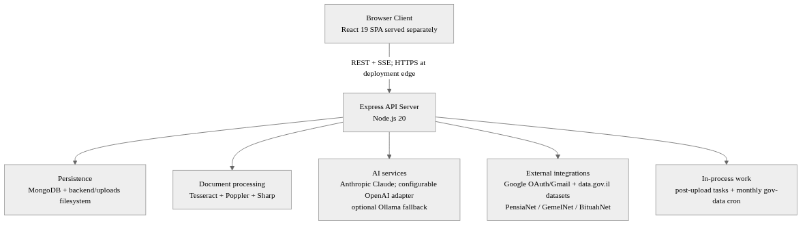

Figure 1 is a logical runtime view rather than a claim that every box is a separate container. The browser runs a client-rendered React SPA; there is no server-side rendering. It calls Express through JSON REST endpoints and receives chat tokens through Server-Sent Events (SSE). Express uses MongoDB for structured persistence, `backend/uploads/` for original files, and `.work/` for temporary OCR artifacts. It invokes Poppler and Tesseract as child processes, uses Sharp in-process, and calls external providers only from backend code. HTTPS is expected to terminate at the university reverse proxy; the Express process itself is plain HTTP in the repository's local topology.

Architecturally, FinGuide is a **client/server modular monolith**, not a microservice system. The backend domains are separate modules within one Node.js process and one MongoDB database. OCR binaries are subprocesses, not services; Claude/Ollama, Google, and government endpoints are external integrations. There is no Redis, message broker, durable job queue, Kubernetes definition, or backend-to-backend service mesh in the current repository.

The most important end-to-end path is: **React page → typed API helper → Vite/reverse proxy → Express middleware → route → controller → service/domain engine → Mongoose/filesystem/external adapter → serializer/DTO → JSON or SSE response**. This is a layered design with pragmatic shortcuts, not strict Clean Architecture: several controllers query Mongoose models directly, while complex domains delegate to services.

#### 3.1.1 Request Lifecycle

Every request served by the Express application in `backend/app.js` passes through a fixed ordered pipeline of middleware before reaching the route handler. The order is a design choice rather than an incidental one, and each stage is placed where it is because the stages downstream depend on invariants it establishes.

1. **Rate limiting.** `express-rate-limit` is installed as the first middleware, with a 15-minute window and a threshold that switches on `NODE_ENV`: 2 000 requests per window in development and 100 in production. Placing rate limiting first rejects excess traffic before body parsing or database work. Rejected requests return a Hebrew error message consistent with the rest of the user-facing surface.
2. **CORS.** A dynamic origin function accepts requests either with no `Origin` header (for example, curl or server-to-server calls) or from a whitelist consisting of the configured `CLIENT_URL` and the two localhost development origins (`http://localhost:5173`, `http://127.0.0.1:5173`). `credentials: true` permits credentialed cross-origin requests if the application later uses cookies; current authentication is carried explicitly in an `Authorization: Bearer …` header by the frontend API helper.
3. **Body parsing.** `express.json({ strict: false })` and `express.urlencoded({ extended: true })` parse JSON and form-encoded request bodies respectively; `strict: false` accepts JSON primitives at the top level, which some clients emit for single-value updates. The Multer middleware responsible for multipart file uploads is not installed here — it is attached only to the specific upload routes that require it (`POST /api/documents/upload`, `POST /api/auth/profile/image`) so that the general request path is not burdened with multipart parsing overhead.
4. **Static uploads.** A narrow static file route serves `/uploads/profile-images` from the local filesystem. This is intentionally the *only* subdirectory of `backend/uploads/` exposed as static content: payslip PDFs are not served statically. Downloads of payslip files go through the authenticated `GET /api/documents/:id/download` handler, which resolves the requested path and rejects any path that escapes the uploads directory.
5. **Health check.** `GET /api/health` is defined before the authenticated route modules and returns a JSON payload with a server timestamp. It is deliberately unauthenticated so that container orchestrators and reverse proxies can probe liveness without holding a JWT.
6. **Route modules.** Twenty-three route modules are mounted under `/api`, one per bounded domain (auth, documents, ai, findings, onboarding, smart-onboarding, profile, insights, recommendations, notifications, integrations/gmail, tax-assistant, financial-health, copilot, score-agent, pension, gemel, insurance, dashboard, agents, gov, summary-email, and executive report). Each module owns its own path prefix and applies the `protect` middleware from `backend/middleware/auth.js` where authentication is required. `protect` extracts the Bearer token from the `Authorization` header, verifies it against `JWT_SECRET`, loads the corresponding user via `User.findById(decoded.id).select('-password')`, and attaches the loaded document to `req.user`. Any failure — missing header, invalid signature, expired token, or a user id whose record has been deleted — is converted into a typed `AuthError` and delegated to the error handler with a Hebrew message; the protected route handler never runs. This design keeps the identity check at the boundary of the routing layer rather than inside individual controllers.
7. **404 handler and error handler.** Any request that reaches the end of the middleware chain without a match is answered by a `404` JSON body, and any error passed via `next(err)` — whether raised by `protect`, by a controller, by a Mongoose operation, or by Multer — is centralized in `middleware/errorHandler.js`. The error handler maps Mongoose validation errors, JWT errors, Multer errors, and custom `AppError` subclasses to typed responses with appropriate status codes and Hebrew messages.

This lifecycle establishes origin, rate, and parsing rules globally. Authentication and input validation remain route-specific: protected modules attach `req.user`, while public authentication actions and `/api/health` do not. Controllers translate HTTP requests into domain operations, but the repository does not enforce a rule that controllers may never access models directly.

#### 3.1.2 Deployment Topology

The checked-in container topology is a **development topology**, defined by `docker-compose.yml` and `backend/Dockerfile`. `npm run dev:docker` provisions exactly two services: `mongo` and `backend`. It does **not** build or serve the React frontend, and it does not include Nginx, Apache, TLS termination, or a production process manager. The `mongo` service uses `mongo:7`, exposes port 27017 to the host, and stores data in the named `mongo_data` volume. The backend image starts from `node:20-bullseye` and installs `tesseract-ocr`, `tesseract-ocr-heb`, and `poppler-utils`. Containerizing those native dependencies improves consistency; it does not by itself prove identical OCR results across CPU architectures or future image rebuilds.

Inside the container Express listens on port 5000 and Compose publishes it as host port **5001**, which matches Vite's default proxy target. `VITE_API_URL` can override that target. The backend reaches MongoDB through `MONGODB_URI=mongodb://mongo:27017/finguide`. Bind mounts preserve `backend/uploads` and `backend/.work` across backend-container rebuilds; the named volume preserves MongoDB data.

For the university server, an additional deployment edge is required: build `frontend/dist` with Vite, serve those static files from Nginx or Apache, proxy `/api` (and the permitted profile-image path) to Express, and terminate HTTPS with the university DNS certificate. Express and MongoDB can run under Docker Compose, but the current Compose file must be extended or paired with a host-level web server. This is a deployment requirement, not functionality already present in the repository.

The checked-in backend image also sets `NODE_ENV=development` and starts `npm run dev` (Nodemon). A production university deployment should use `NODE_ENV=production` and `npm start`, inject secrets rather than use Compose defaults, avoid exposing MongoDB publicly unless administration requires it, and back up both `mongo_data` and the uploads volume. These are required hardening changes; the current Docker files should not be presented as production-ready unchanged.

### 3.2 Data Collection and Preprocessing

#### 3.2.1 Document Ingestion

Documents are submitted through `POST /api/documents/upload`. Route-scoped Multer middleware accepts PDF and Excel MIME types, enforces `MAX_UPLOAD_SIZE_MB` (default 10 MB), and writes a UUID-named staging file under `backend/uploads/`. `processFinancialDocument` computes a SHA-256 checksum and rejects a duplicate before analysis.

The upload service is also a **document-type dispatcher**, not merely a payslip OCR endpoint:

1. A recognized Har HaBituach Excel file is parsed into insurance-policy records and imported through `insuranceImportService`; the staging file is removed and no ordinary `Document` record is returned.
2. A recognized Har HaKesef or pension report (Excel or PDF) is parsed into pension-fund records and imported through `pensionImportService`; the staging file is then removed.
3. Other files create a `Document` with `pending`, then `processing`, status. A PDF text peek routes Form 106 to `form106Service`; remaining PDFs enter payslip extraction. Remaining Excel files use the structured Har HaBituach parser and may fail if they are unsupported.

This explains why the MongoDB domain contains separate `InsurancePolicy` and `PensionFund` collections in addition to `Document`: recognized domain reports are normalized into their target collections rather than all being stored as `analysisData` documents.

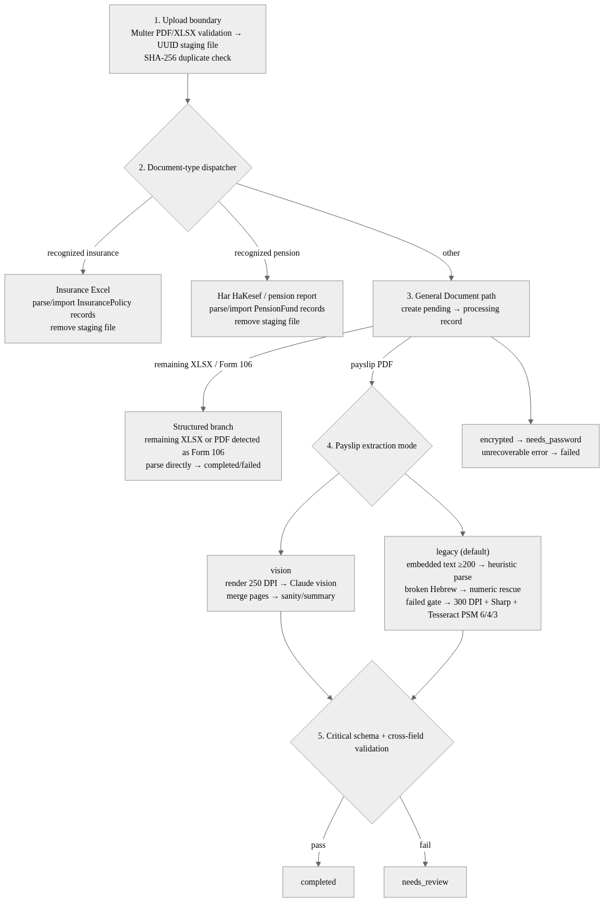

For files that reach the `Document` path, the HTTP handler awaits parsing/extraction before returning. The persisted outcome is `completed`, `needs_review`, `needs_password`, or `failed`. After a successful completion, `runPostUploadSideEffects` uses `setImmediate` to start notification creation, insights/recommendations, and optional AI digest generation without delaying the upload response. These are best-effort tasks in the same Node.js process—not durable queue jobs—and therefore have no persisted retry if the process stops.

#### 3.2.2 Multi-Path Text Extraction

`extractPayslipFile` first checks `PAYSLIP_EXTRACTION_MODE`. The default, `legacy`, uses the three-stage text/OCR cascade below. When set to `vision`, it bypasses that cascade: pages are rendered at the configured vision DPI (default 250), sent to the configured Claude vision model (default Sonnet 4.6), merged, sanity-checked, and normalized to the same schema. Vision mode requires an Anthropic API key and is an alternative production path, not a fourth fallback after Tesseract.

The default legacy mode attempts three paths in sequence:

**Path 1 — Direct PDF text extraction (pdf_text).** The pipeline first attempts text extraction via Poppler's `pdftotext` utility, which handles Hebrew encoding more reliably than pure JavaScript PDF parsers on many Israeli payroll exports. If `pdftotext` yields fewer than 50 characters, the system falls back to the `pdf-parse` Node.js module. If the combined text contains at least 200 characters and does not exhibit the broken-Hebrew encoding pattern described in Section 2.2, the text is passed directly to `extractPayslipFinancialEN`. An additional quality gate requires that the extracted `analysisData` contains `gross_total > 500` and `net_payable > 500` — without both of these salary fields, the extraction is considered to have failed even if the text was successfully read. The gate is implemented as follows:

```javascript
// payslipOcr.js — Path 1 success requires both core salary fields
const gross = data?.salary?.gross_total;
const net = data?.salary?.net_payable;
if (!(gross > 500 && net > 500)) {
  // non-broken text falls through to image OCR
}
```

**Why synchronous processing:** the upload handler runs extraction inside the HTTP request cycle. **Alternative:** place the existing extractor behind a persistent job queue and expose status polling. **Trade-off:** synchronous processing simplifies status handling and avoids queue infrastructure, but the reproduced image fixtures required roughly 23–27 seconds each in the development environment (see Section 4.2.1).

**Path 2 — Numeric rescue.** If Path 1 yields text of adequate length but broken Hebrew encoding (as detected by the `isLikelyBrokenHebrew` heuristic, which checks for a ratio of Unicode replacement characters above 1.5% or fewer than 8 Hebrew characters in a 400-character sample), the system still attempts extraction. Hebrew labels cannot be reliably matched, but numeric values — salary amounts, percentages, identification numbers — can often still be extracted from the corrupted text because Arabic numerals survive encoding corruption.

**Path 3 — Image-based OCR.** When text extraction fails, the system falls back to rendering each PDF page as a 300 DPI PNG image using `pdftoppm`, preprocessing the image with Sharp, and submitting the result to Tesseract.

#### 3.2.3 Image Preprocessing

Before submission to Tesseract, each page image undergoes a preprocessing chain implemented with the Sharp Node.js library:

1. **Auto-rotation.** Sharp applies EXIF-based rotation to correct orientation artifacts from scanning.
2. **Grayscale conversion.** The color image is converted to an 8-bit grayscale representation, eliminating color variation that adds noise without contributing to character recognition.
3. **Contrast normalization.** Sharp's `normalize()` operation stretches the grayscale histogram to the full 0–255 range, improving contrast on faded or low-contrast documents.
4. **Thresholding.** A fixed global threshold of 170 binarizes the image before OCR. This is the value implemented in the current pipeline; the repository does not contain a parameter-sweep experiment proving that it is optimal across payslip layouts.

The preprocessing chain is simple and deterministic. The current code does not implement adaptive threshold selection, and the fixed value should be treated as a tunable implementation parameter rather than a proven optimum.

After preprocessing, the image is submitted to Tesseract with the combined Hebrew and English language model (`heb+eng`), LSTM-based OEM 1, the `preserve_interword_spaces=1` configuration, and three PSM candidates (6, 4, 3) run in sequence. The raw text output from each candidate is scored by `rankExtractionCandidates`, which sorts candidates by resolution score, confidence, and warning count:

```javascript
// payslipOcrResolver.js — select best OCR candidate
function rankExtractionCandidates(candidates = []) {
  return [...candidates].sort(
    (a, b) =>
      (b.data?.quality?.resolution_score ?? 0) - (a.data?.quality?.resolution_score ?? 0) ||
      (b.data?.quality?.confidence ?? 0) - (a.data?.quality?.confidence ?? 0) ||
      (a.data?.quality?.warnings?.length ?? 0) - (b.data?.quality?.warnings?.length ?? 0),
  );
}
```

The highest-scoring candidate advances to field extraction.

#### 3.2.4 LLM Adjudication for Ambiguous Fields

Inside the legacy parser, a field can have several heuristic candidates. The system invokes LLM adjudication only when at least two candidates exist and the gate in `shouldAdjudicate` reports low confidence, a close tie, or a reconciliation violation. It skips confident fields and becomes a no-op when no Anthropic key or LLM budget is available. Claude Haiku 4.5 must return an index into the existing candidate list (or `null`), so it cannot create a new monetary value. The final field score for an accepted candidate is adjusted using:

```
finalScore = max(chosenScore, min(1.0, 0.85 + (confidence − 0.6) × 0.3))
```

This formula ensures that high-confidence adjudications produce field-level scores near 0.85–1.0, providing a calibrated quality signal to downstream components. The field adjudicator uses the fixed `claude-haiku-4-5` model for short candidate comparisons. The separate vision-extraction path defaults to `claude-sonnet-4-6` through `PAYSLIP_VISION_MODEL`, while the standard chat service also defaults to Haiku 4.5 through `CHAT_MODEL`. Keeping these call sites explicit makes the accuracy/cost choice configurable without conflating chat, vision, and field adjudication.

#### 3.2.5 analysisData Canonical Schema

All payslip extraction paths ultimately produce an `analysisData` object conforming to schema version 1.9. `Document.js` declares it as `type: Object`, which Mongoose treats as a flexible nested object rather than a field-by-field schema. This permits iterative additions and backfill via `npm run reprocess:payslips`, but MongoDB/Mongoose do not enforce the nested extraction contract; the Zod validation layer enforces only the critical fields at processing time.

The schema is versioned via the `schema_version` field, allowing the reprocessing script to identify and backfill documents produced by older extraction algorithms.

The top-level structure of `analysisData` v1.9 is:

```
{
  schema_version: "1.9",
  period: { month: string },
  salary: { gross_total: number, net_payable: number, components: [...] },
  deductions: { mandatory: { total, income_tax, national_insurance, health_insurance } },
  contributions: {
    pension: { employee, employee_amount, employer, base_salary_for_pension },
    study_fund: { employee, employer }
  },
  tax: { gross_for_income_tax, tax_credit_points, personal_credit },
  national_insurance: { employee_amount, employer_amount },
  employment: { employer_name, employment_start_date, employment_type },
  parties: { employer_name, employee_name, employee_id },
  insurances: { ... },
  quality: { score, extraction_path, validation: { issues, warnings } },
  raw: { rawText, ocr_text },
  summary: { date }
}
```

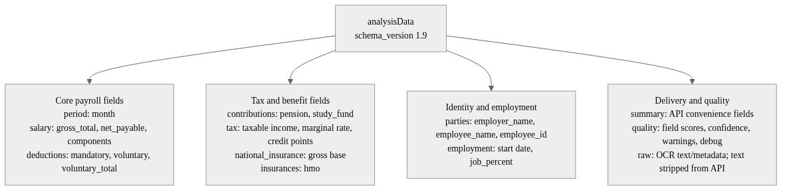

The `quality` sub-object records extraction metadata, field scores, warnings, and internal debug information. Final document status is not determined by a single overall quality threshold. `validatePayslipAnalysis` requires a valid period, positive gross and net, and a non-negative mandatory-deduction total, then applies cross-field checks such as net not exceeding gross. A failed critical-schema or cross-field check produces `needs_review`; otherwise the document is `completed`. `documentSerializer.js` removes raw OCR text and `quality.debug` before API delivery.

### 3.3 Implementation Details

The subsections below trace the data flow from backend request handling through findings detection, AI advisory, and frontend presentation. Each major subsystem includes explicit design rationale where architectural alternatives were considered.

#### 3.3.1 Backend Architecture

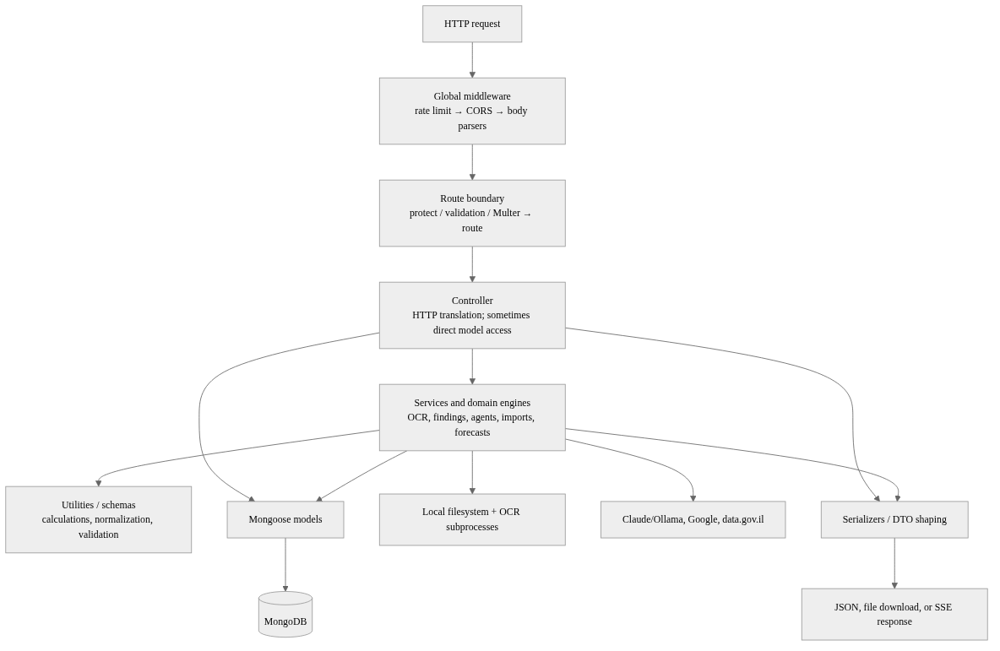

The backend follows a layered organization, but the dependencies are pragmatic rather than perfectly strict:

- **Global and route middleware.** `app.js` applies rate limiting, CORS, body parsing, health, 404, and error handling. Individual route modules attach authentication, express-validator rules, and Multer only where needed.
- **Routes (`backend/routes/`).** Twenty-three mounted modules define HTTP methods and prefixes and dispatch to controllers. Auth contains both public and protected actions; most domain modules apply `protect` to the entire router.
- **Controllers (`backend/controllers/`).** Controllers translate HTTP inputs and outputs. Complex operations delegate to services, but some controllers also perform ownership-scoped Mongoose reads or updates directly. The repository therefore should not be described as a strict controller/service/repository architecture.
- **Services and domain engines (`backend/services/`, `backend/ai/`).** These contain OCR, document dispatch, findings, forecasting, imports, government-data adapters, chat, and both agent orchestration systems. Services may call Mongoose models, filesystem/native tools, or external APIs.
- **Utilities and schemas (`backend/utils/`, `backend/schemas/`).** These hold reusable normalization, calculations, timelines, duplicate checks, and Zod validation. Many are pure and unit-testable, although not every utility is guaranteed dependency-free.
- **Persistence and response boundaries.** `backend/models/` defines Mongoose collections and indexes. Serializers and DTO helpers remove internal fields and shape API responses; for example, `documentSerializer.js` strips raw OCR text and debug details.

Request lifecycle: An incoming HTTP request is processed by the global middleware stack defined in `app.js` before reaching a matching route. Protected routes pass through `protect`, which verifies the Bearer token and attaches the retrieved User to `req.user`. Controllers and async route wrappers propagate errors through Express's `next(error)` convention; `errorHandler` converts supported Mongoose, JWT, Multer, and application errors into JSON responses. Depending on the endpoint, the successful response may be JSON, a protected file download, or an SSE stream.

#### 3.3.2 Golden-Fixture Regression Testing

The extraction pipeline is regression-tested against fixtures stored under `backend/services/__fixtures__/golden/`. As of July 2026, the evaluator discovers nine fixtures: seven annotated Michpal/Malam Plus payslips contribute field-level scores, and two IDF image fixtures exercise the image path but have no scorable expected fields. The `npm run eval:ocr` script processes each fixture, compares extracted fields with its committed `expected.json`, and reports per-field accuracy and confusion details. This provides a repeatable baseline for measuring extraction quality as the label dictionary and preprocessing chain evolve. A next-generation extraction architecture (extraction-v2) is under evaluation using additional fixtures under `backend/fixtures/extraction-v2/`; it is not yet wired into the production upload path.

Once a document reaches `status: 'completed'` with a populated `analysisData` object, the findings engine consumes the same canonical schema without re-parsing the PDF. This separation — extract once, analyze many times — keeps compliance logic deterministic and testable independently of OCR variance.

#### 3.3.3 Findings Detection Engine

The findings detection engine is invoked by `GET /api/findings` and produces a structured list of financial anomalies and warnings for the authenticated user. The findings are generated from two layers:

**Layer 1 — Metadata findings.** Before analyzing payslip content, the engine checks for document-level problems: the user has no uploaded documents at all; there are multiple documents with identical filename and file size (suspected duplicates); one or more documents have remained in `pending` or `processing` status without update for more than 30 days (stale documents); one or more payslips have missing `periodMonth` or `periodYear` metadata; and a payslip has a period date in the future (likely a data entry error).

**Layer 2 — Financial findings.** Three specialized detectors analyze the content of completed payslips. Each detector is a pure function of the `analysisData` payload plus the user's onboarding data, which makes the layer independently unit-testable and reproducible against the golden fixture corpus (Section 4.1.3).

*Fund deposit detection* (`detectFundWithoutDeposit.js`). **What:** for each payslip, and for both `pension` and `study_fund`, the detector determines whether a fund section was identified in extraction and whether the summed employee-plus-employer deposit for that section is zero. **How:** section presence is established from any of four positive signals — a stored OCR detection flag (`storedDetection.sectionDetected`), a positive `base_salary_for_pension` (or study-fund equivalent), the presence of un-abstained contribution candidates in the quality object, or a non-empty contribution block without the `missingLine` warning. Deposit-zero is inferred from a stored `noDeposit` flag when available, otherwise from the sum of extracted amounts. **Why this way:** the four-signal disjunction addresses OCR variance across vendors — one vendor emits a `base_salary_for_pension` line without an explicit pension header, another emits the header without a base — so a single indicator would either miss cases (low recall) or over-flag them (low precision). A special case exempts a `severance`-only pension deposit, because Israeli pension law recognises employer-side severance provisioning independently of the employee/employer contribution channel [7]. **Alternative considered:** flagging on a single high-confidence indicator (for example, only when the OCR emits `noDeposit: true`). This alternative was rejected as too conservative because extraction confidence on the golden corpus is not high enough to rely on a single signal. The current multi-signal detector reached full recall only on the limited scenario evaluation reported in Chapter 4; that result is not presented as population-level evidence. In addition to per-document findings, the detector performs an onboarding cross-check: if the user declared `hasPension` or `hasStudyFund` during onboarding but the most recent payslip shows no fund section, it emits a mismatch finding, closing the loop between user-declared expectations and payslip reality.

*Contribution rate gap detection* (`detectContributionRateGap.js`). **What:** for each fund side (employee, employer, and — for pension — severance), the detector computes an *implied* percentage as `(amount / base) × 100` and compares it against the *stated* percentage extracted from the payslip and the configured reference minimum in `config/contributionRateThresholds.js`. **How:** three finding types can be emitted per side: `inconsistency` (stated vs implied differ by more than `inconsistencyTolerancePercent`, default 0.35 pp), `belowMinimum` (the effective rate — stated when available, otherwise implied — is below the configured reference), and `dataIncomplete` (the section is present but neither amount nor rate can be recovered). Defaults are pension employee 6.0%, pension employer 6.5%, pension severance 6.0%, study-fund employee 2.5%, and study-fund employer 7.5%. The study-fund values represent a common contribution arrangement, not a universal statutory obligation. All thresholds are overridable through environment variables (`PENSION_EMPLOYEE_MIN_RATE_PERCENT`, `CONTRIBUTION_RATE_INCONSISTENCY_TOLERANCE`, and related keys) so the screening layer can be tuned for an applicable agreement without a code change. The core comparison logic is:

```javascript
// detectContributionRateGap.js — implied vs stated rate check
const impliedPercent = computeImpliedPercent(amount, base, analysisData, thresholds);
const consistencyGap =
  statedPercent != null && impliedPercent != null &&
  Math.abs(statedPercent - impliedPercent) > thresholds.inconsistencyTolerancePercent;
const effectivePercent = statedPercent ?? impliedPercent;
const belowMinimum =
  effectivePercent != null && minimumPercent != null &&
  effectivePercent < minimumPercent;
```

The 0.35 percentage-point tolerance is a configurable engineering threshold intended to avoid strict floating-point/rate equality. The repository does not contain a calibration study proving it optimal. Reference floors are version-controlled configuration and must be reviewed when law or applicable employment agreements change [7], [14], [15].

*Deposit continuity gap detection* (`detectDepositContinuityGap.js`). **What:** across a user's uploaded payslip history, the detector distinguishes between two structurally different kinds of contribution breaks: *on-payslip gaps*, where a payslip exists for a month but the deposit column is zero; and *missing-payslip gaps*, where two deposit-bearing payslips are separated by one or more months for which no payslip was uploaded at all. **How:** the shared `buildFundTimeline` utility (`utils/contributionTimeline.js`) constructs a monthly timeline across the user's history, classifying every month as `hasDeposit`, `noDepositOnPayslip`, `missing`, `uncertain`, or `beforeEmployment`. The detector then runs a windowed scan that looks for runs of `noDepositOnPayslip` bracketed by `hasDeposit` months (an internal on-payslip break) or `hasDeposit` followed by trailing `noDepositOnPayslip` (a trailing break). A separate branch counts contiguous `missing` months to emit missing-payslip findings, and an uncertainty counter tracks months where extraction quality is too low to classify confidently. **Why two categories:** the two break types have different remediation actions — on-payslip zero deposits require the user to contact the employer or fund manager, while missing-payslip gaps typically require the user to upload the corresponding months. Collapsing them into a single "gap" finding would obscure this distinction. **Why the `beforeEmployment` filter:** without it, the detector would flag every month prior to the user's employment start date as a missing-payslip gap. The detector consults `analysisData.employment.employment_start_date` and skips months earlier than the resolved employment start, treating unknown start dates as a soft signal rather than a hard mask [15]. The behaviour is tunable through `config/depositContinuityConfig.js` (minimum-gap length, lookback window, and required deposit density), reflecting the same configuration-first discipline used for the rate detector.

All findings are assigned a severity level and sorted with `warning` findings listed before informational findings. Each finding carries a `meta` object containing the relevant fund type, the affected period months, the associated document identifiers, and a `findingKind` discriminator (`deposit`, `rate`, or `continuity`), enabling the frontend to render deep-link URLs into the payslip history view with the relevant periods highlighted.

Findings feed both the Hub dashboard and the AI assistant: rule-based intents such as `pension_employee`, `pension_employer`, and `pension_total` read the same contribution fields that the detectors analyze, ensuring consistent source data whether the user views a finding card or asks a conversational question.

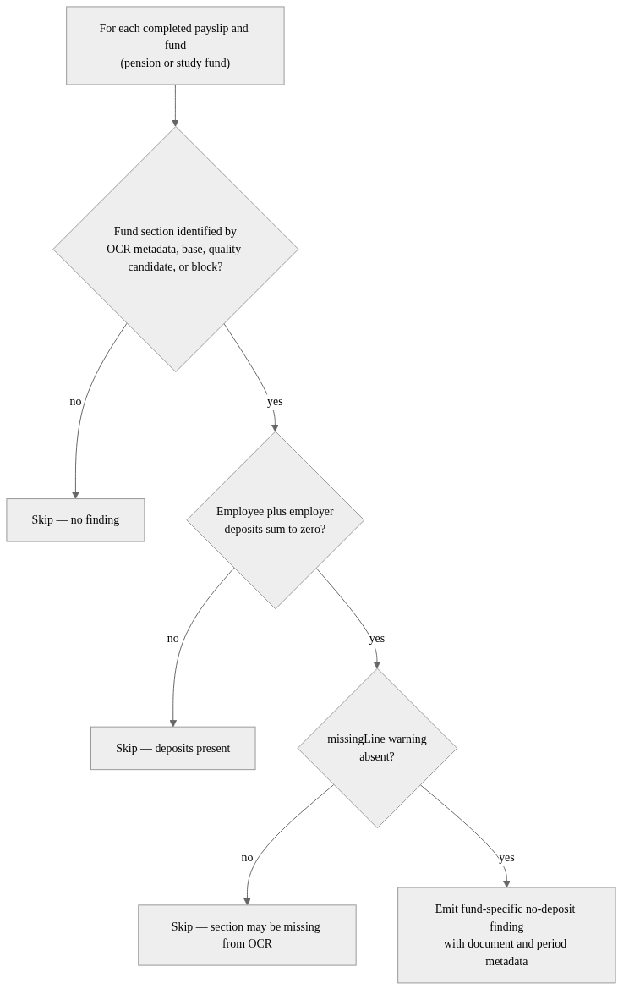

Figure 9 summarizes the per-document branch shared by pension and study-fund detection. Section presence can come from stored OCR detection metadata, a positive contribution base, an un-abstained quality candidate, or a populated contribution block. A `missingLine` warning overrides those weak signals and suppresses the finding. Pension severance-only payments are treated as a deposit exception. Separately from the diagram, the detector compares the latest payslip with the user's onboarding declarations and can emit an onboarding-mismatch finding.

#### 3.3.4 Data Models

The database is not a single payslip collection. Mongoose models fall into four groups: identity/profile (`User`, `UserProfile`), user-owned financial data (`Document`, `InsurancePolicy`, `PensionFund`, deposits and import snapshots), generated application state (`ChatMessage`, `Insight`, `Recommendation`, `Notification`, `ExecutiveReport`, `AgentRunLog`), and government-market datasets/caches (`PensiaNet*`, `GemelNet*`, `BituahNetFund`). User-owned queries are normally scoped by `user`; government collections are shared reference data.

**User and UserProfile models.** `User` stores credentials, lightweight onboarding compatibility fields, password-reset fields, and Gmail connection metadata:
- `name`: string, max 100 characters.
- `email`: string, unique indexed, lowercase normalized.
- `googleId`: string, sparse unique index (null for non-Google users).
- `password`: string, `select: false` (never returned in queries by default), minimum 6 characters.
- `onboarding`: a legacy-compatible subset containing completion state and basic employment/pension declarations used by auth responses and older checks.
- `gmailIntegration`: nested object recording Gmail OAuth tokens for the optional email integration feature.
Password hashing is handled by a Mongoose `pre('save')` hook that calls `bcryptjs.genSalt(10)` followed by `bcryptjs.hash` whenever the password changes. The separate `UserProfile` collection owns the comprehensive onboarding/settings data: personal attributes, employment, expenses, assets, insurance declarations, retirement data, goals, and risk preferences. This dual-model arrangement exists for backward compatibility; exam explanations should not imply that the full profile lives inside `User`.

**Document model** (`backend/models/Document.js`). A Document represents an uploaded file that remains in the general document pipeline—usually a payslip, but also potentially Form 106 or another supported structured document. Insurance and pension reports recognized by the dispatcher can instead be normalized directly into their domain collections:
- `user`: ObjectId reference to the User, with a compound index on `{user, uploadedAt}` for efficient per-user queries sorted by upload date.
- `filename`: string, unique — the UUID filename assigned at upload time.
- `checksumSha256`: string — the hex-encoded SHA-256 digest of the file content.
- `status`: enum `['uploaded', 'pending', 'processing', 'completed', 'needs_review', 'needs_password', 'failed']`.
- `analysisData`: Mongoose `type: Object` (treated as a flexible nested object) containing the versioned extraction result.
- `processingError`: string — the error message recorded when status is `failed`.
- `source`: enum `['manual', 'gmail']` — whether the document was uploaded manually or imported via the Gmail integration.
- `emailMetadata`: nested object storing Gmail message and attachment identifiers for deduplicated Gmail imports.

The model also stores category/period/source metadata, file size and MIME type, timestamps, and indexes for per-user chronological reads and Gmail attachment deduplication. The original file path is deliberately absent from serialized API responses; downloads use the authenticated controller.

#### 3.3.5 Authentication

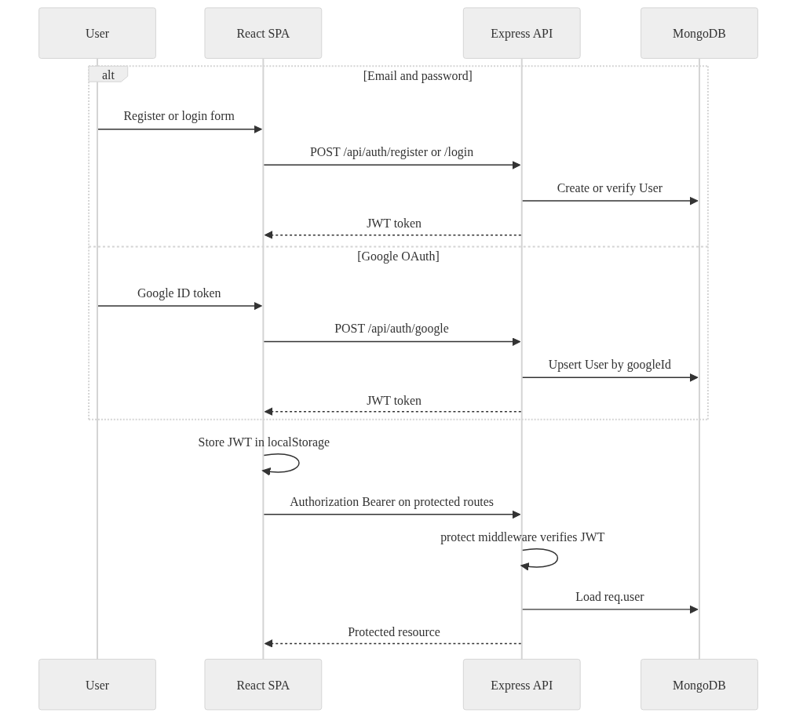

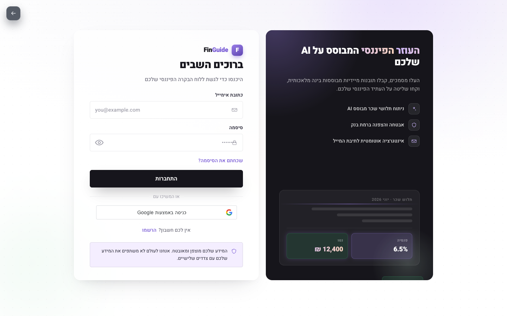

**Figure 16** shows the Hebrew login surface that exposes the JWT and Google OAuth entry points summarized in Figure 8.

The system supports two authentication modes.

*Local authentication* is implemented using JSON Web Tokens. The `POST /api/auth/register` endpoint accepts a validated name, email, and password (minimum 6 characters, must contain at least one uppercase letter, one lowercase letter, and one digit, per express-validator rules). The user record is created in MongoDB — the pre-save hook hashes the password — and a 7-day JWT is returned. The `POST /api/auth/login` endpoint finds the user by email using `User.findOne().select('+password')` (the `+password` projection overrides the default `select: false`), verifies the password with `bcrypt.compare`, and returns a new JWT on success.

*Google OAuth 2.0* is implemented via the `POST /api/auth/google` endpoint. The client submits a Google ID token obtained from the Google Sign-In button. The server verifies the token using `OAuth2Client.verifyIdToken` from the `google-auth-library` package, which validates the token's signature, issuer, expiry, and audience against the configured client ID (`GOOGLE_CLIENT_ID`). The verified payload yields the user's email, name, and Google subject identifier. The server performs an upsert: it searches for a user with a matching `googleId` or email, linking the Google identity to an existing account if one is found, or creating a new account with a random UUID password placeholder if the email is not registered.

All protected API routes pass through the `protect` middleware. JWT verification failure, missing token, or a deleted user account produce standardized 401 responses. Token expiry is configurable via the `JWT_EXPIRE` environment variable; the default is 7 days.

#### 3.3.6 AI Assistant

The AI assistant is exposed through the `POST /api/ai/chat` (standard request/response) and `POST /api/ai/chat/stream` (Server-Sent Events streaming) endpoints, and the `GET /api/ai/financial-tips` endpoint.

*Intent detection.* Before invoking a language model, `detectIntent` in `aiController.js` performs keyword classification. The current function can return 26 labels, including greeting and fallback. Its financial labels cover gross and net salary, employee/employer/total pension, study and provident funds, income tax, National Insurance, mandatory deductions, leave balances, documents, notifications, recommendations, insurance profile, what-if questions, anomalies, employer information, salary changes, and financial summaries. Hebrew patterns are supplemented by selected English fallbacks and negative conditions; for example, general pension questions containing "ממוצע" or "בישראל" are kept out of the personal pension handlers.

**Why rule-first routing:** deterministic handlers read stored user fields and return `source: "rule"`; the LLM does not generate those numeric values. This improves traceability but does not make an answer infallible, because an OCR field or rule can still be wrong. **Alternative considered:** asking an LLM to classify and answer every request. That would reduce auditability and increase cost. **Trade-off:** keyword routing is brittle to paraphrase, as the three misclassified queries in the n = 39 evaluation set illustrate. New rules therefore require matching regression cases.

```javascript
// aiController.js — keyword intent routing (excerpt)
function detectIntent(message) {
  const msg = normalizeMessage(message);
  if (msg.includes('חריג') || msg.includes('anomaly')) return 'anomaly_check';
  if (msg.includes('פנסיה') && (msg.includes('כמה') || msg.includes('שילמתי'))) return 'pension_total';
  if (msg.includes('קופת גמל') || msg.includes('גמל להשקעה')) return 'gemel_fund';
  // ... additional intent patterns
  return 'fallback';
}
```

*Rule-based responses.* When a supported label is returned, `buildRuleBasedAnswer` reads the assembled user context. For example, `pension_employee` and `pension_employer` format the corresponding amounts from the latest payslip, while `pension_total` reports both when available. These answers reuse values already normalized from `analysisData`; their accuracy therefore remains dependent on the extraction quality documented in Chapter 4.

*LLM fallback.* When `buildRuleBasedAnswer` returns `null` — either because the intent is `'fallback'` or because the user context lacks the fields needed for a deterministic answer — control passes to `claudeChatService.chat()`. The service constructs an enhanced system prompt that includes the user's completed payslip data (up to 50 documents), active insights and recommendations, pension and insurance analysis results, and a reference block covering Israeli pension rates, common insurance types, the 2026 income-tax brackets, and mortgage-rate ranges. The user and assistant turns are persisted as `ChatMessage` documents so that subsequent turns pass conversation history to the model. **API contract:** the JSON response includes a `source` field that takes exactly one of three values — `"rule"` for deterministic answers, `"claude"` for Anthropic-served LLM answers, and `"ollama"` for locally-served fallback answers. This label is the primary observability signal for evaluating routing quality (Section 4.2.4) and for triaging user complaints about wrong numeric answers.

The standard chat service defaults to Claude Haiku 4.5 (`claude-haiku-4-5`) and can be overridden through `CHAT_MODEL`. When `ANTHROPIC_API_KEY` is unset — for example, during local development or offline testing — the service falls back to an Ollama-hosted local model (default `llama3.1:8b`), and the response is labelled `source: "ollama"`. The vision-extraction path is configured separately and defaults to Sonnet 4.6. This separation keeps chat demonstrable without an external key and prevents OCR-model configuration from silently changing conversational behavior.

There are two provider adapters in the backend. `claudeChatService` powers standard chat, streaming, and most `backend/ai` explanations using the Anthropic SDK with Ollama fallback. Separately, `aiProviderService` is used by selected domain narratives/advisory services and supports `AI_PROVIDER=claude`, `openai`, or `ollama` through direct HTTP calls. Therefore setting `AI_PROVIDER=openai` does not change `/api/ai/chat`; `CHAT_PROVIDER`/`CHAT_MODEL` govern that path.

*Streaming.* The `/chat/stream` endpoint uses Node.js's `res.write()` to deliver SSE frames over the response to an authenticated POST request. The frontend consumes the stream with `fetch` rather than browser `EventSource`, because a JSON request body is submitted first. This avoids a WebSocket upgrade and bidirectional protocol for a flow that only streams server-to-client after the message is sent [13]. It would not support simultaneous client audio streaming on that same response channel.

The response header sets `Content-Type: text/event-stream` and `Cache-Control: no-cache`. The LLM response is streamed token by token using the `@anthropic-ai/sdk` streaming API, with each token chunk wrapped in an SSE `data:` frame of type `token`. A final `done` event signals stream completion, and error events deliver error metadata to the client for graceful degradation.

#### 3.3.7 Multi-Agent AI Orchestration

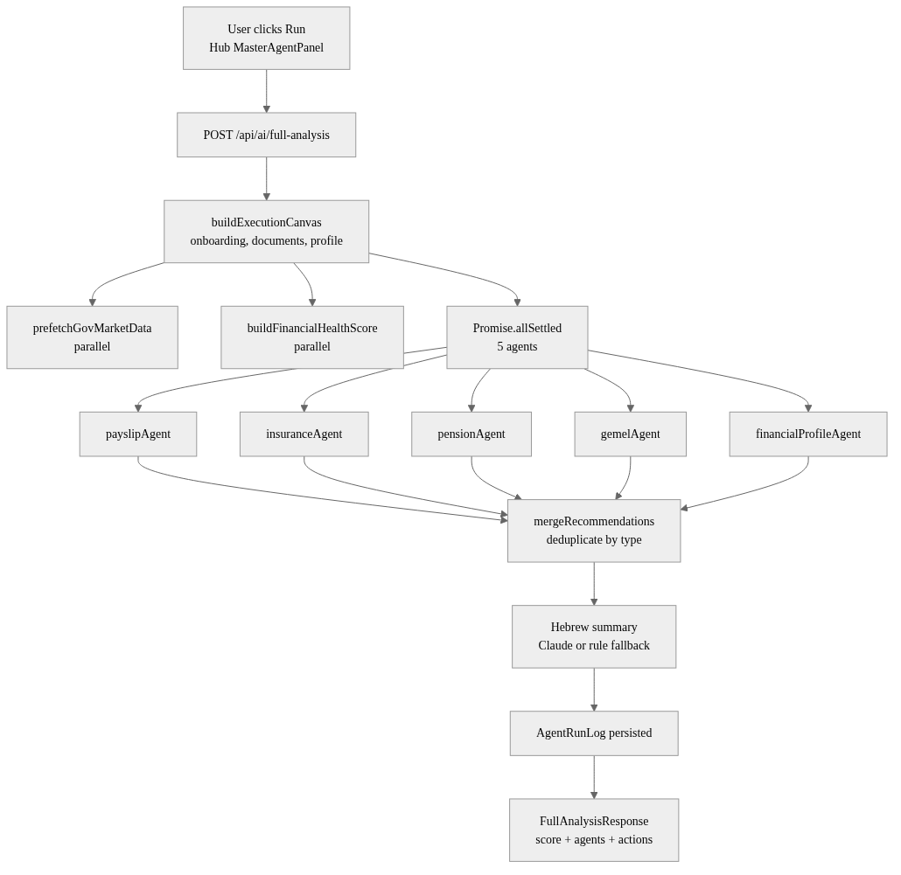

The orchestration layer is exposed through `POST /api/ai/full-analysis` (`fullAnalysisController.js` → `parallelAnalysisService.js` → `ai/agents/orchestratorAgent.js`). On the Hub it runs only when the user invokes a full or focused run; there is no page-load effect that starts it automatically. A focused run passes one domain plus `skipLLM: true`; a full run uses `focus: 'all'` and may call multiple model-backed explanation paths plus the final orchestrator summary.

The pipeline proceeds through five stages:

**Step 0 — Execution Canvas.** `buildExecutionCanvas` reads `UserProfile` and counts completed payslips, active insurance policies, pension funds, and provident/study funds. It combines those counts with selected profile facts to create domain tasks and data-availability flags. `focus` controls which of payslip, insurance, pension, and gemel are enabled; the profile agent is added only for `focus: 'all'`. The canvas does not load or execute existing recommendations.

**Step 0.5 — Government data prefetch and global score (parallel).** `prefetchGovMarketData` loads pension-track and insurance-service-index data through adapters that can return process-memory cache, local/fixture/static fallback, or remote `data.gov.il` data. It also reads the persisted PensiaNet/GemelNet/BituahNet sync status from MongoDB. Concurrently, `buildFinancialHealthScore` computes the user's score for the current year. Government-data failure is represented in metadata and does not abort the five agents.

The financial health score is a deterministic composite totaling 100 points:
- *Document completeness* (25): up to 15 for payslip-month coverage, 7 for Form 106, and 3 for a pension document.
- *Salary stability* (20): 5 for employer identification plus up to 15 based on gross-salary stability.
- *Tax readiness* (20): starts at 20 and deducts for missing payslip coverage, missing Form 106, and tax issues.
- *Pension consistency* (20): starts at 20 and deducts for missing employee/employer pension deposits.
- *Risk insurance* (15): profile completion contributes 5; critical recommendations, high-severity issues, and duplicates subtract 6, 2, and 2 respectively.

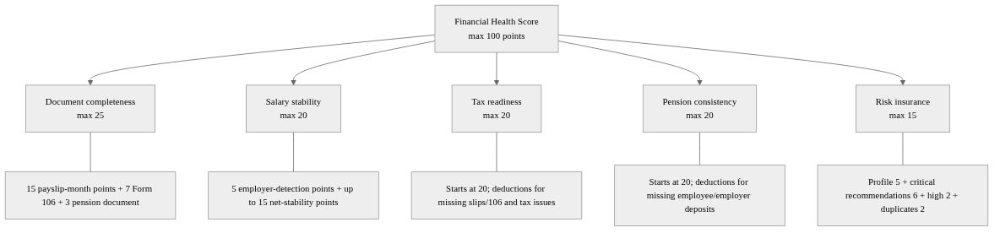

Each sub-score is computed by a dedicated function within `financialHealthScoreService.js` using the user's payslip history and profile data.

**Step 1 — Agents in parallel.** Five agent functions run concurrently via `Promise.allSettled`:
- `runPayslipAgent`: retrieves payslip summaries, runs salary trend analysis, generates rule-based recommendations, and optionally calls Claude for an LLM explanation.
- `runInsuranceAgent`: builds policy aggregation, duplicate/missing-coverage analysis, health checks, market/service comparisons, recommendations, and an optional explanation.
- `runPensionAgent`: runs the pension analysis service, including contribution, projection, benchmark, health, fund-advice, and deterministic/LLM-formatted insights.
- `runGemelAgent`: runs provident/study-fund analysis plus the gemel advisor report and market comparison when data exists.
- `runFinancialProfileAgent`: computes profile completeness, a risk profile, and deterministic priorities; it does not call Claude.

The agents return structured DTOs, and the orchestrator builds a reduced context instead of passing raw Mongoose documents to its final LLM prompt. Their internals are similar but not identical: payslip and insurance explicitly add optional explanations, pension and gemel delegate explanation/fallback behavior to their analysis services, and profile is rule-only. `Promise.allSettled` prevents one rejected agent promise from failing the entire run; the orchestrator converts that rejection into a per-agent error result.

**Step 2 — Recommendation merging and action items.** `mergeRecommendations` attaches the agent id, deduplicates by recommendation `type`, and sorts by urgency. `buildActionItems` adds domain verdicts, insurance-waste signals, high/medium recommendations, score actions, and missing-data tasks; it deduplicates by domain plus title and returns at most eight Hub actions.

**Step 3 — Orchestrator summary.** The orchestrator assembles a reduced context from the canvas, government data, global score, action items, and agent results. The context forms the prompt for a final Claude call that produces a unified Hebrew narrative. If Claude is unavailable or `skipLLM: true`, `generateHebSummary` produces a rule-based summary from the same results. The response identifies the path through `summarySource` (`"claude"` or `"rule"`).

Every analysis run attempts to write an `AgentRunLog` containing its run id, user, agents, statuses, duration, recommendation count, and summary source. Logging failure is non-fatal, and a TTL index removes logs after 90 days.

**Relationship to the second agent API.** The repository also exposes `/api/agents/*`, which is a separate question-routing and RAG subsystem under `backend/services/agents/`; it is not called by `/api/ai/full-analysis`. `POST /api/agents/ask` builds user context in `agentController`, classifies a question rule-first (then Claude/Ollama if needed), and routes it to one of six specialists: payslip, pension, gemel, financial analysis, financial planning, or insurance. General questions can retrieve up to three chunks from the local embedding/vector-store subsystem before Claude/Ollama answers. `/api/agents/embed` and `/rag/index` populate that store explicitly. In short: `/api/ai/full-analysis` is a parallel five-domain report pipeline for the Hub, while `/api/agents/ask` is a single-question specialist router with optional RAG.

**Executive-report composition.** `/api/executive/report` is a third entry point that reuses the same five `backend/ai/agents` functions but does not consume or cache the preceding `/api/ai/full-analysis` response. When `ExecutiveReportPage` mounts, it starts a new server run: canvas, health score, and five agents are collected; outputs are normalized; `globalPriorityEngine` merges conflicts and ranks actions; `reportSectionBuilder` creates the report; and an optional LLM call polishes only the executive summary. The report is stored in `ExecutiveReport` for seven days. PDF download looks up that user-owned cached report by `runId` and renders it with PDFKit. Thus navigating from a completed Hub run to the executive report currently performs a second agent computation.

#### 3.3.8 Savings Forecast

The savings forecast module (`POST /api/findings/savings-forecast`) implements a linear projection model for pension accumulation:

```
projectedBalance = currentBalance + monthlyContribution × monthsToRetirement
```

The model is intentionally simple: it does not account for investment returns on the accumulated balance, inflation, or changes in contribution rate over the forecast horizon. This design choice prioritizes transparency and auditability over false precision; users are informed of the model's assumptions in the UI.

`savingsForecastService` resolves the monthly contribution input from one of two sources in order of priority: the `pension.employee` plus `pension.employer` fields from the most recent completed payslip with non-zero pension contributions; or an explicit `currentMonthlyContribution` parameter provided by the user in the request body. If neither source is available, the endpoint returns HTTP 400. The service generates two scenarios — current trajectory (unmodified monthly contribution) and an adjusted scenario (with a user-specified increased contribution) — and returns a yearly timeline of projected balances for each scenario, enabling a comparison chart in the frontend.

#### 3.3.9 Frontend Architecture

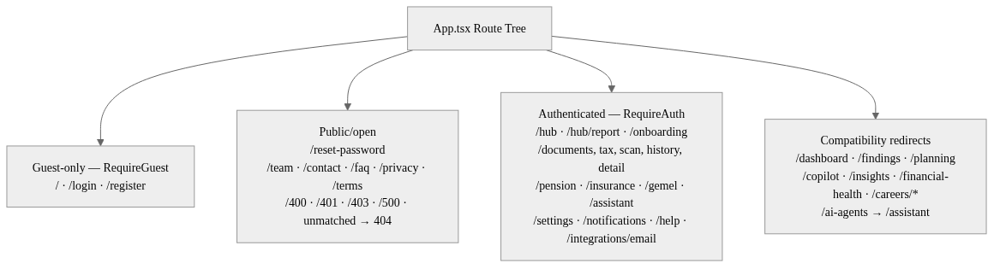

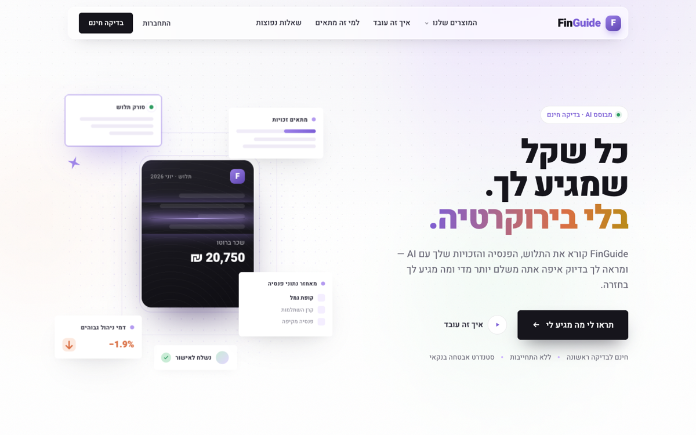


The React 19 application is organized around a route tree declared in `App.tsx`. Guest-only routes include login and registration; open routes include password reset and informational pages such as `/team`, `/contact`, `/faq`, `/privacy`, and `/terms`. Application areas such as `/hub`, `/documents`, `/assistant`, `/pension`, `/gemel`, `/insurance`, and `/settings` are wrapped in `RequireAuth`, which reads the authentication state from `AuthProvider` and redirects unauthenticated users to the login screen. Compatibility paths such as `/dashboard`, `/findings`, and `/ai-agents` redirect to their current destinations. Figures 15 and 17 illustrate public Hebrew surfaces; Figure 16 shows the authentication screen.

The primary application areas accessible after authentication are:
- **First-run flow** (`/onboarding`): authenticated users whose backend response does not report `onboardingCompleted: true` are redirected directly to the smart-onboarding page before data-dependent routes become available.
- **Hub and executive report** (`/hub`, `/hub/report`): aggregate score, actions, agent results, and the consolidated report.
- **Documents and payslip history** (`/documents`, `/documents/scan`, `/documents/history`, and detail routes): upload, processing status, chronological records, and manual completion of missing fields.
- **Financial domains** (`/pension`, `/insurance`, `/gemel`): pension, insurance, and provident-fund analysis.
- **AI surfaces** (`/assistant` plus the floating panel): `/assistant` uses `POST /api/agents/ask`, the specialist-agent/RAG router described in Section 3.3.7. The floating assistant is owned by `AiChatProvider` and uses `POST /api/ai/chat/stream`, the rule-first/SSE chat described in Section 3.3.6. They are related user experiences but separate backend pipelines.
- **Account tools** (`/notifications`, `/settings`, `/integrations/email`, `/help`): notifications, profile/security settings, Gmail integration, and help.

Legacy URLs such as `/dashboard`, `/findings`, `/planning`, `/copilot`, `/insights`, and `/financial-health` redirect to current routes rather than rendering independent pages. `/ai-agents` redirects to `/assistant`, and the tax surface is mounted at `/documents/tax`.

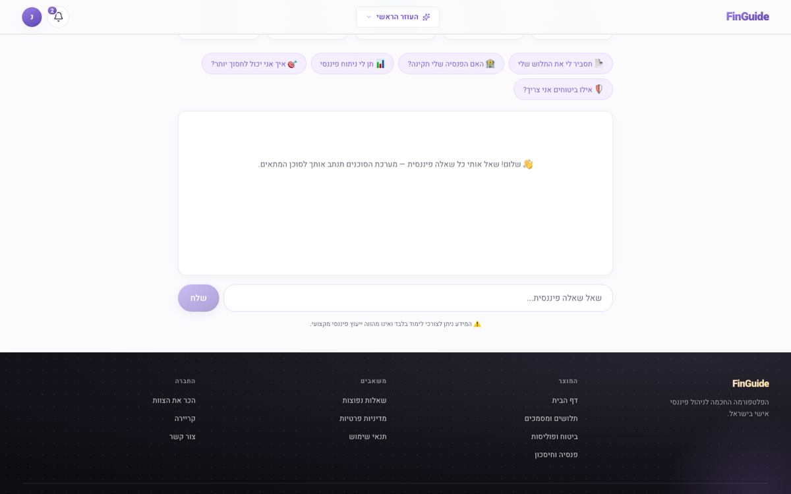

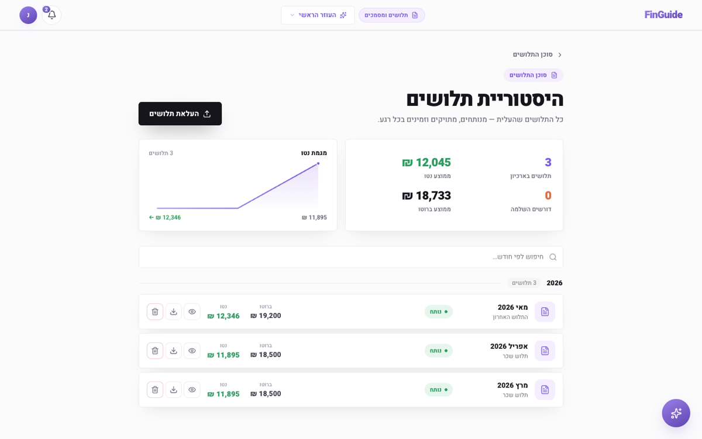

Figures 13–16 document implemented interface surfaces. Names, salaries, balances, rates, notification counts, and other values visible inside these screenshots are demonstration or decorative data; they are not evaluation measurements and are not used in Tables 1–6.

The application entry (`main.tsx`) composes `BrowserRouter` → `AuthProvider` → `AiChatProvider` → `App` inside React Strict Mode. `AuthProvider` reads the token from `localStorage` and calls `GET /api/auth/me`; a failed 401 clears the session and `RequireAuth` redirects. `AiChatProvider` keeps short-lived UI/conversation state in `sessionStorage`, adds page context, consumes the POST-based SSE stream through `fetch`, and exposes browser speech recognition when supported. Shared API helpers attach the JWT as a Bearer token and normalize JSON/blob errors. Primary product surfaces use Hebrew RTL layout, while technical fallbacks and development/error strings may still contain English.

The frontend does not use Redux or a server-state framework. Cross-cutting state is limited to the authentication and chat providers; pages and feature hooks own their loading/error/domain state with React hooks and call modules under `frontend/src/api/`. Client route guards improve navigation and hide protected pages, but they are not the security boundary—the backend `protect` middleware and ownership-scoped database queries remain authoritative.

`documentToPayslip.ts` exports the two primary payslip mappers: `documentToPayslipHistoryItem` and `documentToPayslipDetail`. Additional specialized consumers read selected `analysisData` fields through typed shapes in `DocumentDetailsPage.tsx`, `payslipAnalysisSummary.ts`, and `payslipEnrichment.ts`. Raw OCR text and internal `quality.debug` data are removed by `documentSerializer.js` before API responses, so none of these frontend consumers receives the sensitive diagnostic payload.

#### 3.3.10 Extended Domain Modules

Beyond the core payslip pipeline, FinGuide implements additional REST domains mounted in `app.js`:

**Insights and recommendations** (`/api/insights`, `/api/recommendations`). The insights module runs payslip trend analysis via `POST /api/insights/run` and persists structured insight records with severity and dismissal state. The recommendations module executes rule-based insurance and pension recommenders through `POST /api/recommendations/run`, surfacing actionable items the Hub and assistant can reference.

**Copilot** (`/api/copilot`). Provides a consolidated financial snapshot via `GET /api/copilot/analysis` (profile, latest payslip, budget, investments, health score, goals) and supports goal management and monthly markdown reports generated by Claude with a rule-based fallback.

**Gmail integration** (`/api/integrations/gmail`). Optional OAuth connection allowing users to import payslip PDF attachments from Gmail (`POST /connect`, `POST /sync`), reducing manual upload friction while keeping credentials scoped to the user's account.

**Dashboard aggregation** (`/api/dashboard/summary`). Combines documents, profile, policies, and recommendations in a single `Promise.all` response for overview screens.

**Government-market synchronization** (`backend/jobs/govMarketMonthlySync.js`). After Express begins listening, `server.js` starts an in-process `node-cron` task unless `GOV_MARKET_CRON_ENABLED=false`. The default schedule is `0 2 18 * *` in `Asia/Jerusalem` (02:00 on the 18th of each month). It synchronizes PensiaNet, GemelNet, and BituahNet data into MongoDB and performs an initial seed when the pension-market collection is empty. An in-memory flag prevents overlap within one process. This is not a durable distributed scheduler: a missed run is not replayed when the server was down, and multiple server replicas would each own a scheduler unless deployment disables all but one.

These modules reuse the same authentication and error-handling boundaries, but their persistence differs: some write user-owned models, government sync writes shared market collections, and chat/RAG maintain their own stores. Detailed route tables appear in Appendix A.

### 3.4 Evaluation Metrics

The system is evaluated along three dimensions, using the same thresholds reported in Chapter 4:

**OCR accuracy.** Field-level extraction is measured on the seven fixtures with scorable annotations; two additional IDF image fixtures exercise the pipeline but are skipped in field denominators because their `expected.json` files contain no tracked values. A numeric field counts as correct when its value is within **0.5%** of the committed expected value (`npm run eval:ocr`). Strings require exact match.

**Findings precision and recall.** On the annotated scenario corpus (n = 10: seven synthetic controls and three golden-derived cases), precision is the fraction of generated findings that correspond to genuine anomalies; recall is the fraction of annotated anomalies detected (`npm run eval:findings`).

**AI assistant routing.** Intent classification accuracy on the Hebrew query set (n = 39): a query is correct when `detectIntent()` returns the expected intent label (`npm run eval:ai-routing`). Rule-based responses are additionally checked for factual accuracy against payslip fixtures.

**Functional verification (Objectives 4–6).** Automated unit and integration tests confirm multi-agent orchestration, savings-forecast calculation, and frontend mapping contracts (Table 6). These tests do not measure end-user usability; they establish that the implemented code paths succeed under fixture-driven assertions.

### 3.5 Software and Hardware Specifications

FinGuide uses a deliberately layered technology stack. Each technology has a specific responsibility, and the boundaries between them are reflected in the repository structure and deployment model.

| Technology | Responsibility in FinGuide | Reason for selection and interaction |
|---|---|---|
| React 19 | Component-based Hebrew RTL single-page interface | Supports reusable screens, providers, route guards, and responsive state-driven updates. React consumes only the typed REST contract exposed by the backend. |
| TypeScript | Static typing for frontend components, API DTOs, and mapping utilities | Detects incompatible data shapes during compilation and makes the `analysisData`-to-UI boundary explicit. |
| Vite | Frontend development server and production bundler | Provides fast development reloads, TypeScript/React compilation, environment variables, and a development proxy for `/api`. |
| Node.js 20 | JavaScript runtime for the server and background jobs | Its asynchronous I/O model suits database operations, filesystem access, external APIs, and OCR subprocess coordination. |
| Express | REST API, middleware pipeline, routing, validation, and error handling | Keeps HTTP concerns separate from controllers and domain services while allowing authentication, CORS, rate limiting, and uploads to be composed per route. |
| MongoDB 7 | Persistent storage for users/profiles, documents, chats, insights, recommendations, policies, funds, generated reports, agent logs, and market-reference records | A document model fits nested and evolving structures such as `analysisData`; findings themselves are generated on request rather than stored in a dedicated Finding collection. |
| Mongoose | MongoDB object modeling and validation | Defines schemas, indexes, ownership relationships, defaults, and query helpers while keeping persistence logic explicit. |
| Multer | Multipart upload handling | Enforces file type and size limits before a document enters the processing pipeline. |
| `pdf-parse` and Poppler | PDF text extraction, rasterization, and metadata handling | Digital PDFs first use their embedded text layer; `pdftotext` and `pdftoppm` provide deterministic native fallbacks and page images for OCR. |
| Tesseract OCR (`heb` + `eng`) | Text recognition for scanned or text-deficient payslips | Provides offline Hebrew/English OCR without requiring a cloud vision service. Multiple page-segmentation modes are ranked by downstream field quality. |
| Sharp | Image normalization and preprocessing | Corrects orientation and prepares image inputs before OCR or profile-image storage. |
| Anthropic Claude / Ollama | Optional natural-language reasoning and ambiguous-field assistance | Claude supplies hosted LLM inference, while Ollama provides a local alternative. Deterministic rules remain the first choice for numeric financial answers. |
| Google OAuth and Gmail APIs | Google Sign-In and optional payslip attachment import | OAuth tokens are verified server-side; Gmail access uses a restricted read-only scope and is isolated behind authenticated integration routes. |
| JWT and bcrypt | Stateless API authentication and password hashing | bcrypt protects stored passwords; signed JWTs identify users on protected requests. Ownership checks then scope every financial query to that user. |
| Jest, Supertest, Testing Library | Unit, integration, API, and frontend component verification | The testing layers validate pure calculations, database-backed request flows, UI mappings, and regression fixtures. |
| Docker and Docker Compose | Development runtime for the backend, OCR binaries, and MongoDB | The checked-in Compose file has backend and MongoDB services only; frontend static hosting, TLS, and a reverse proxy remain deployment work. |

**End-to-end technology flow.** A browser loads the Vite-built SPA and calls an Express route through the development proxy or production reverse proxy. Global and route middleware apply rate, origin, parsing, authentication, validation, and upload rules. Controllers either query an ownership-scoped model or delegate to a service. The upload service first dispatches recognized insurance/pension reports; otherwise it creates a Document and routes Form 106 or payslip extraction. Default payslip extraction uses direct text, numeric rescue, then Tesseract OCR; configured vision mode replaces that cascade. The normalized result is persisted as `analysisData`, after which findings, forecasts, chat context, and agents reuse it. A serializer/DTO boundary removes raw OCR/debug fields before frontend mapping. Google, government-data, and AI credentials stay in backend environment variables.

**Backend software (from `backend/package.json`):**

| Component | Version |
|---|---|
| Node.js runtime | 20.x (Docker base image) |
| Express | ^4.18.2 |
| Mongoose | ^8.0.3 |
| Jest | ^30.2.0 |
| pdf-parse | ^1.1.4 |
| Sharp | ^0.34.5 |
| @anthropic-ai/sdk | ^0.97.1 |
| bcryptjs, jsonwebtoken, multer | ^2.4.3 / ^9.0.2 / ^1.4.5-lts.1 |

**Frontend software (from `frontend/package.json`):**

| Component | Version |
|---|---|
| React | ^19.2.0 |
| TypeScript | ~5.9.3 |
| Vite | ^7.2.4 |
| react-router-dom | ^7.13.0 |
| Jest + ts-jest | ^30.2.0 / ^29.4.6 |

**System binaries (OCR pipeline):** Tesseract OCR with Hebrew language pack (`tesseract-ocr-heb`), Poppler utilities (`pdftoppm`, `pdftotext`). These are bundled in the backend Docker image (`dev:docker`); on macOS development hosts they must be installed separately or accessed via Docker.

**Hardware and deployment environment:** The repository defines a Linux container environment with Node.js 20, MongoDB, Poppler, and Hebrew/English Tesseract dependencies. The OCR-equipped host used for the recorded July evaluation was not benchmarked for CPU and RAM, so the latency figures are environment-specific. For the university deployment, the team intends to request a Linux VM with at least 4 vCPU, 8 GB RAM, and 50 GB persistent storage, with separate persistence for MongoDB and uploaded files. This is a proposed deployment target, not a measured minimum. The application applies rate limits of 2,000 requests per 15 minutes in development and 100 in production, and can use Ollama (`llama3.1:8b`) when `ANTHROPIC_API_KEY` is unset.

### 3.6 Security and Data Privacy

Payslips (תלושי שכר) contain sensitive personal and financial data — national ID numbers, salary amounts, employer names, and contribution details. FinGuide treats this data as confidential employee information subject to access control, transport security assumptions, and informational-use disclaimers (see §1.4).

**Authentication.** Local accounts use bcrypt-hashed passwords (`bcryptjs`, salt rounds 10) with the password field stored as `select: false` on the User model so that it is never returned by default queries. JSON Web Tokens are issued on register and login using `JWT_SECRET` (minimum 10 characters, validated at server boot in `server.js`). Google OAuth 2.0 verifies ID tokens via `OAuth2Client.verifyIdToken`, checking signature, issuer, expiry, and audience against `GOOGLE_CLIENT_ID`. Protected routes pass through the `protect` middleware (`middleware/auth.js`), which extracts the Bearer token from the `Authorization` header, verifies it with `jsonwebtoken`, attaches the corresponding User document to `req.user`, and returns a standardised 401 `AuthError` on any failure. **Why a Bearer-token model:** it decouples authentication from cookies, simplifies the CORS story, and lets the same API serve the browser SPA and, in the future, headless mobile clients. **Trade-off:** JWTs cannot be revoked before expiry without a stateful denylist, so the default 7-day `JWT_EXPIRE` window is a deliberate compromise between session ergonomics and blast radius; a shorter window would improve security at the cost of more frequent re-authentication.

**Authorization and data isolation.** Document queries are scoped to `req.user._id`, and download handlers combine an ownership check with `path.resolve(...).startsWith(uploadsDir)` before streaming a file. `path.resolve` normalizes ordinary `..` segments, but it does not resolve symbolic links and a raw prefix comparison is weaker than a separator-aware containment check. Production hardening should use `fs.realpath`, `path.relative`, and an explicit uploads-directory boundary. The implemented ownership check remains the primary user-isolation control.

**AI data grounding.** The assistant's `buildUserContext(userId)` loads payslips, profile, insights, and recommendations exclusively from the database for the authenticated user. Client-supplied `userData` in chat requests is not treated as a trusted financial source — preventing clients from injecting fabricated payslip values that would then be quoted by rule-based answers. **Why this matters:** the rule layer is designed to be numerically auditable (§3.3.6). If client data were accepted, the source label `"rule"` would no longer guarantee that the numbers came from a stored, extractable payslip.

**Storage and transport.** General uploaded files are stored locally under `backend/uploads/` with SHA-256 checksums recorded for deduplication; recognized pension/insurance imports can remove the staging file after normalization. The API is intended to run behind HTTPS in production; development uses Vite proxying `/api` and `/uploads` to `VITE_API_URL` (default `127.0.0.1:5001`). Gmail OAuth tokens may be encrypted at rest with `GOOGLE_TOKEN_ENCRYPTION_KEY` (or `JWT_SECRET` fallback) via `tokenCrypto.js`. Object storage is not implemented; moving uploads there would require replacing the filesystem adapter and download path.

**Rate limiting and boot validation.** The `express-rate-limit` middleware is installed as the first entry in the app-wide middleware chain, applying **2,000 requests per 15 minutes in development** and **100 requests per 15 minutes in production** per client IP (`app.js`). CORS is configured with an allow-list including `CLIENT_URL` and the Vite development origins. `server.js` refuses to start without `JWT_SECRET` (at least 10 characters) and `MONGODB_URI`. These are implemented constants, not values derived from a recorded capacity or security study; production tuning should be based on deployment traffic and threat monitoring.

**Privacy posture and current limitations.** FinGuide does not sell payslip data. When the user invokes an externally hosted AI provider, selected payslip context may be included in the request sent to that provider; a locally hosted Ollama configuration keeps that inference path on the deployment host. Deployment documentation must disclose the configured provider and obtain appropriate user consent before real personal documents are processed. Original upload files are not currently application-encrypted at rest, retention is controlled through user deletion and server operations, and production backup encryption and retention depend on the hosting environment. Logs, screenshots, fixtures, and backups must therefore be reviewed for personal identifiers. Production deployment should add encrypted storage, documented retention and backup-deletion periods, secret management, and an explicit consent notice. Outputs are informational only and do not constitute certified financial, tax, pension, or legal advice (§1.4, §5.2).

---

## Chapter 4: Results and Analysis

This chapter reports evaluation results against the objectives stated in Section 1.3. Section 4.1 describes the experimental setup and reproducibility harnesses; Sections 4.2 and 4.3 present and interpret measured outcomes; Section 4.4 compares FinGuide with existing alternatives; and Section 4.5 discusses whether the project objectives were met.

### 4.1 Experimental Setup

Evaluation was conducted in an OCR-equipped development environment with Node.js 20.x, MongoDB (local or Atlas via `MONGODB_URI`), and Poppler/Tesseract available either natively or through `dev:docker`. The host's detailed hardware and operating-system configuration was not recorded, and no production load test was performed. Reproduction commands are `npm run eval:ocr`, `npm run eval:findings`, `npm run eval:ai-routing`, and `npm run bench:upload-latency`, supplemented by the Jest unit and integration test suite described below. Rate limiting during development is set to 2,000 requests per 15 minutes (100 in production), which did not constrain the recorded evaluation runs.

#### 4.1.1 Automated Test Suite

At the documented repository revision, the backend test suite comprises **147** `*.test.js` files (excluding `node_modules`), executed against an in-process MongoDB instance provided by `mongodb-memory-server` (v11). Jest 30 runs with `--runInBand` to prevent race conditions from concurrent database writes. Tests are organized under:

- `backend/__tests__/` — unit tests for parsers, OCR resolver, and service modules
- `backend/tests/unit/` — additional unit tests for utilities and controllers
- `backend/tests/integration/` — end-to-end API tests via Supertest (auth, documents, findings, pension, recommendations)

The frontend test suite comprises **13** test files under `frontend/src/`, running in jsdom with ts-jest and `@testing-library/react` 16. Root `npm test` also runs `vite build`, enforcing TypeScript compile checks.

**Not covered:** browser-based end-to-end (Playwright/Cypress) tests, production load tests, and formal penetration testing. OCR quality on unseen vendors relies on golden fixtures plus manual exploratory review.

The key test files and what each covers are:

| File | Coverage focus |
|---|---|
| `auth.routes.test.js` | Registration, login, Google OAuth, password reset flows |
| `documents.uploadMetadata.test.js` | File upload, metadata assignment, status transitions |
| `payslipOcrParser.test.js` | Amount parsing, period parsing, Hebrew label recognition |
| `payslipOcrResolver.test.js` | Candidate ranking, PSM selection, gross/net disambiguation |
| `documentProcessingService.test.js` | Pipeline state machine (pending → completed / failed) |
| `findings.savingsForecast.test.js` | Linear forecast model, edge cases (zero balance, same-year retirement) |
| `payslipHistoryAggregationService.test.js` | Annual aggregation, monthly bucketing, missing-month detection |
| `detectSalaryAnomalies.test.js` | Month-over-month anomaly detection, outlier flagging |
| `documentToPayslip.test.ts` | `analysisData` → `PayslipHistoryItem` mapping correctness |

#### 4.1.2 OCR Evaluation Framework

The golden directory contains **nine** Israeli payslip fixtures as of July 2026: three Malam Plus PDFs, four Michpal PDFs, and two IDF image-based fixtures. Every directory includes `expected.json`, but only the seven Malam Plus/Michpal files contain tracked expected values and therefore contribute to the accuracy denominators. The two IDF fixtures currently contribute execution evidence only and are reported separately.

**Annotation evidence.** The committed `expected.json` files are the evaluator's source of truth. The repository does not encode who annotated each value, whether annotation was independent, or a formal adjudication procedure. Therefore, this book reports the fixture values as committed test expectations and does not claim an unrecorded multi-review annotation protocol.

Each document is processed via `extractPayslipFile`. A numeric field counts as correct when within **0.5%** of ground truth; string fields require exact match. Reproduction: `cd backend && npm run eval:ocr`.

The production extraction function is invoked directly. In the reproduced run, the three Malam Plus PDFs completed through `pdf_text`; all four scored Michpal PDFs fell back to Tesseract OCR. The two IDF image fixtures also executed through OCR but had zero tracked expected fields.

#### 4.1.3 Findings Detection Evaluation Framework

The findings evaluation corpus comprises **n = 10** scenarios in `backend/scripts/fixtures/findings-eval/scenarios.json`: seven annotated synthetic controls plus three scenarios derived from golden Michpal/Malam payslip periods and OCR contribution shapes. Expected finding kinds cover `deposit`, `rate`, and `continuity`, including negative controls.

Ground truth was defined by applying the statutory rules in Section 2.4 to each `analysisData` payload. Reproduction: `cd backend && npm run eval:findings`.

#### 4.1.4 AI Assistant Evaluation Framework

The AI routing evaluation set comprises **n = 39** Hebrew queries in `backend/scripts/fixtures/ai-routing-eval/queries.json`, spanning salary, pension (employee/employer/total), tax, National Insurance, vacation/sick days, documents, notifications, recommendations, insurance profile, what-if, anomaly, and open-ended advisory intents. Each query is classified by `detectIntent()` and compared against the annotated expected intent. Reproduction: `cd backend && npm run eval:ai-routing`.

#### 4.1.5 Regression and Continuous Verification

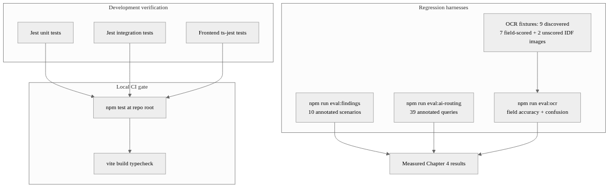

Regression is enforced at three layers: (1) Jest unit and integration tests on every `npm test`; (2) golden-fixture OCR evaluation via `npm run eval:ocr`; (3) annotated scenario sets for findings and AI routing. The `analysisData` schema version (`1.9`) is treated as a stable contract — changes to extraction must pass golden fixtures before merge.

**Latency benchmarking.** End-to-end synchronous extraction latency was measured on all nine discovered fixtures using `npm run bench:upload-latency` (see Table 4). Despite the script's historical “Path 1” heading, it invokes the production extractor and therefore includes OCR fallback when required. The measurements characterize one development environment only; production latency under concurrent uploads was not evaluated.

### 4.2 Presentation of Results

#### 4.2.1 Document Processing Pipeline Outcomes

The pipeline assigns one of four terminal statuses to every uploaded document:

- **`completed`**: All critical fields (`gross_total`, `net_payable`, mandatory deductions, `period.month`) were extracted with confidence above the quality threshold. The document is fully usable for analysis and findings detection.
- **`needs_review`**: Processing succeeded but at least one critical field is missing or below the confidence threshold. The document is partially usable; the frontend presents the extracted fields alongside the original PDF and prompts the user to verify or fill in missing values via `PATCH /api/documents/:id/fields`.
- **`needs_password`**: The PDF is encrypted. The document enters this state before any extraction is attempted; the user provides the password via the unlock flow and the pipeline re-runs.
- **`failed`**: An unrecoverable error occurred (corrupt PDF, missing Tesseract binary, unhandled exception). The `processingError` field records the failure reason.

The `needs_review` status is the key graceful-degradation mechanism: it ensures that even partial extractions are preserved and can be corrected through manual field entry, rather than silently discarding the document.

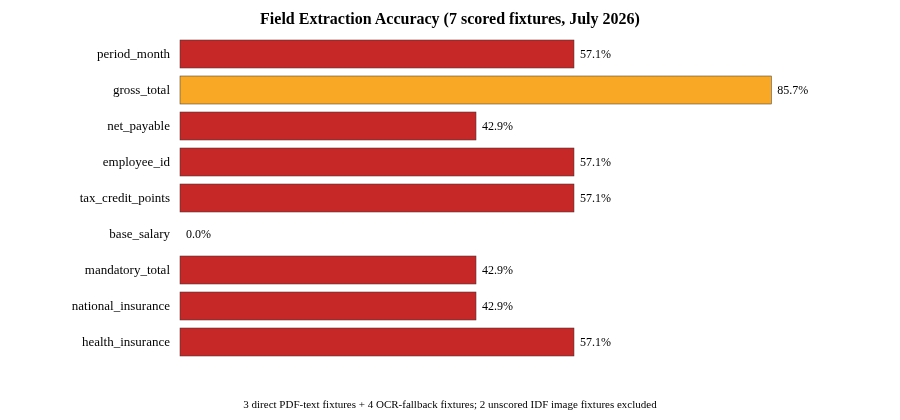

The July 2026 reproduction ran the current production extractor over nine discovered fixtures. Three Malam Plus PDFs completed through direct `pdf_text`; four Michpal PDFs fell back to image OCR after the text path failed its gross/net quality check. The two IDF image fixtures also ran through OCR, but their expected files contain no tracked field values and therefore cannot be used to claim field accuracy. Across all nine executions, average confidence was 0.596, average resolution score was 11.392, and the extractor produced an average of 2.44 warnings per fixture. These values describe this repository revision and environment, not all payslip formats.

**Path 2 probe.** The repository includes a synthetic PDF with intact Arabic numerals but deliberately broken labels (`services/__fixtures__/path-eval/broken-encoding-synthetic.pdf`). It is used to exercise numeric-rescue path selection; it is not included in the field-accuracy table and is not presented as a representative accuracy sample.

**Table 4:** End-to-end document processing latency (`npm run bench:upload-latency`, n = 9, July 2026)

| Fixture | Extraction behavior | Latency (ms) |
|---|---|---|
| malam-plus-202512 | direct PDF text | 81 |
| malam-plus-202601 | direct PDF text | 50 |
| malam-plus-202602 | direct PDF text | 47 |
| michpal-202209 | OCR fallback | 7,427 |
| michpal-202210 | OCR fallback | 7,293 |
| michpal-202211 | OCR fallback | 7,874 |
| michpal-202212 | OCR fallback | 7,800 |
| vision-idf-june-2026 | image OCR | 22,549 |
| vision-idf-may-2026 | image OCR | 26,957 |
| **Median** |  | **7,427** |
| **Mean** |  | **8,898** |
| **Min / Max** |  | **47 / 26,957** |

The timing difference follows the selected path: direct PDF-text extraction completed in under 100 ms in this run, while multi-candidate OCR required seconds. These are single-run development-machine measurements without warm-up, concurrency, or a production load profile.

#### 4.2.2 Field-Level Extraction Accuracy

**Table 1:** Field extraction accuracy on the seven scored fixtures (two additional IDF fixtures skipped per field, July 2026)

| Field | Correct | Mismatch | Missing | Accuracy |
|---|---|---|---|---|
| `period_month` | 4 | 3 | 0 | 57.1% |
| `gross_total` | 6 | 0 | 1 | 85.7% |
| `net_payable` | 3 | 2 | 2 | 42.9% |
| `employee_id` | 4 | 0 | 3 | 57.1% |
| `tax_credit_points` | 4 | 0 | 3 | 57.1% |
| `base_salary` | 0 | 3 | 0 | 0.0% (three applicable) |
| `mandatory_total` | 3 | 4 | 0 | 42.9% |
| `national_insurance` | 3 | 4 | 0 | 42.9% |
| `health_insurance` | 4 | 3 | 0 | 57.1% |
| `income_tax` | 5 | 2 | 0 | 71.4% |
| `personal_credit` | 7 | 0 | 0 | 100.0% |

The evaluator exposes several concrete failure modes. Malam Plus periods were shifted one month forward in all three files. `gross_total` was missing on `michpal-202211`; `net_payable` was correct in only three files, mismatched in two, and missing in two. All three applicable Malam Plus `base_salary` values differed from the committed expectations. Mandatory-deduction fields also showed cross-row candidate errors. `personal_credit` was the only tracked field correct in all seven scored fixtures. The result supports the existence and reproducibility of the extraction pipeline, but it does not support a claim of production-ready accuracy.

#### 4.2.2a Format Diversity — IDF Payslip Profile (Unit Evidence)

Beyond Michpal and Malam Plus golden PDFs, the repository includes three IDF (צה״ל) Hebrew payslip text fixtures (`tests/fixtures/payslip-he-regression-idf-{march,may,june}.txt`) exercised by `tests/unit/idfPayslipProfile.test.js`. These are **not** PDF OCR measurements; they validate the format-profile layer (`idfPayslipProfile.js` / `payslipFormatProfiles.js`) that specializes parsing when IDF layout markers are detected.

| Harness | Result (July 2026) |
|---|---|
| `idfPayslipProfile.test.js` | **15 / 15** passed |

This test confirms that layout-specific IDF parsing logic behaves as coded on the three text fixtures. Separately, the two IDF image fixtures executed through OCR but had no tracked expected values; neither result is presented as measured IDF PDF accuracy.

#### 4.2.3 Findings Detection


**Table 2:** Findings engine precision and recall (annotated scenario corpus, n = 10, July 2026)

| Metric | Value |
|---|---|
| Scenarios evaluated | 10 |
| Of which synthetic | 7 |
| Of which derived from golden payslip periods / OCR contributions | 3 |
| Finding kinds tested | deposit, rate, continuity |
| True positives | 9 |
| False positives | 0 |
| False negatives | 0 |
| Precision | 100.0% |
| Recall | 100.0% |

The original seven scenarios remain synthetic `analysisData` controls. Three additional scenarios reuse periods and contribution shapes extracted from the golden Michpal/Malam fixtures (pension `noDeposit` payloads and an Oct–Dec 2022 period pair with a missing November). Precision and recall stay at 100% on this expanded set (n = 10). Generalization beyond these vendors and synthetic controls still requires a larger manually reviewed corpus.

The findings engine applies a conservative definition of compliance gaps: any calendar month between two deposit-bearing payslips for which no payslip exists in the system is flagged as a potential continuity gap. This design choice favors recall over precision — a false positive (spurious gap alert) requires only user confirmation to dismiss, while a false negative (missed genuine gap) may allow employer non-compliance to go undetected.

#### 4.2.4 AI Assistant Intent Classification

**Table 3:** AI assistant intent routing accuracy (Hebrew query set, n = 39, July 2026)

| Metric | Value |
|---|---|
| Queries evaluated | 39 |
| Intent classification correct | 36 (92.3%) |
| Misclassified | 3 |
| Routed to rule-based layer | 34 |
| Routed to LLM fallback | 5 |

The evaluation set covers pension employee/employer intents, vacation and sick days, documents summary, notifications, recommended actions, and what-if phrasing. Three misclassifications remain:

1. *"האם יש לי ביטוח חיים מספיק בגיל 45?"* — classified as `profile_insurance` (expected `fallback`) because the `האם יש לי` pattern matches before advisory context is considered.
2. *"מה מצב הביטוחים שלי?"* — classified as `fallback` (expected `profile_insurance`) because the query lacks the `יש לי ביטוח` trigger phrase.
3. *"מה ההבדל בין קופת גמל לביטוח מנהלים?"* — classified as `gemel_fund` (expected `fallback`) because the provident-fund keyword wins even though the query asks for an open-ended comparison.

These cases illustrate keyword-routing brittleness for advisory, short-form insurance, and compound comparison questions (Section 5.3).

#### 4.2.5 Error Analysis — Period, Salary, and Deduction Fields

The reproduced confusion report identifies both path-selection and candidate-resolution problems. All three Malam Plus files completed by direct PDF text, yet `period_month` was shifted one month forward and all three applicable `base_salary` values were wrong. This points to period interpretation and salary-component selection rather than character recognition.

The four Michpal PDFs required OCR fallback. One `gross_total` was missing. For `net_payable`, `michpal-202209` was ₪300 too high, `michpal-202211` selected 48,717.07 instead of 6,445.82, and two periods returned no net value. National Insurance was wrong on all four Michpal files, while health-insurance candidates were wrong on three. These errors show that successful OCR execution does not guarantee correct row-to-label association.

**Mitigation path:** add vendor-specific period rules, expand row and label dictionaries, improve gross/net and component ranking, use spatial table coordinates where available, and require a larger reviewed corpus before promoting extraction-v2. The UI's `needs_review` and manual-completion flow must remain active whenever the critical-field quality gate is not satisfied.

#### 4.2.6 Functional Verification for Objectives 4–6

Objectives 4–6 were not subjected to user-study metrics (task-completion time, SUS, or NPS). They were, however, verified by automated unit and integration tests that exercise the implemented contracts. Table 6 summarizes the July 2026 re-run used for this project book.

**Table 6:** Functional verification evidence for Objectives 4–6 (automated tests, July 2026)

| Objective | Scope verified | Harness / suites (examples) | Result |
|---|---|---|---|
| 4 — Multi-agent analysis | Parallel domain agents, orchestrator assembly, controller dispatch, Hub `POST /api/ai/full-analysis` path | `ai.parallelAnalysisService`, `ai.payslipAgent`, `agents.orchestrator`, `agentController` | **34 / 34** passed |
| 5 — Savings forecast | Linear projection math and service resolution of document vs manual contribution sources | `linearSavingsForecast`, `savingsForecastService` | **10 / 10** passed |
| 6 — Hebrew RTL UI mapping | `analysisData` → UI mapping, payslip upload hook, and analysis-summary helpers | frontend `documentToPayslip`, `usePayslipUpload`, `payslipAnalysisSummary` | **10 / 10** passed |

These counts are *functional* evidence: they confirm that orchestrated analysis, forecast calculation, and frontend mapping behave as coded under controlled fixtures. They do **not** measure usability with end users. UI screenshots in Figures 13–17 document the Hebrew surfaces that the Objective 6 routes render.

### 4.3 Data Analysis and Interpretation

The results are interpreted against the six objectives defined in Section 1.3.

**Objective 1 — Automated payslip ingestion and OCR (implemented, accuracy target not yet met).** The production pipeline processed all nine discovered fixtures and selected direct text or OCR fallback as designed. On the seven scored fixtures, however, `gross_total` reached 85.7%, `period_month` 57.1%, and `net_payable` 42.9%. The two IDF image fixtures contain no tracked expected values. Objective 1 is therefore met as an implemented ingestion and extraction workflow, but the current evidence does not justify a claim of reliable field accuracy.

**Objective 2 — Financial findings detection (met on test corpus).** The n = 10 scenario set (synthetic + golden-derived) achieved 100% precision and recall on deposit, rate, and continuity kinds.

**Objective 3 — Personalized AI assistant (largely met).** Intent routing reached 92.3% (36/39) on the Hebrew query set. The three misses cover an advisory insurance question, a short insurance-status question, and an open-ended provident-fund comparison (Section 4.2.4).

**Objectives 4–6 — Multi-agent analysis, savings forecast, Hebrew UI (implemented and functionally verified).** The multi-agent orchestration (34 automated tests), linear savings forecast (10 tests), and RTL mapping/UI helpers (10 frontend tests) passed on the July 2026 harness (Table 6). No end-user study was conducted; attainment is therefore architectural and functional rather than UX-scored. Figures 13–17 show the corresponding product surfaces.

**Pipeline design validation.** The recorded evaluation demonstrates that the system changes paths: Malam Plus used direct text, while Michpal and IDF inputs executed through OCR. The low net and deduction accuracy confirms that path execution must be separated from field correctness and that `needs_review` is necessary rather than optional.

**Findings and AI coupling.** The findings engine and AI assistant read the same `analysisData` contract, ensuring consistent answers whether the user views a finding card or asks a conversational question. Hybrid rule-first routing limits hallucination risk on factual queries [11].

### 4.4 Comparison with Existing Approaches

The following comparison follows a structured format: each alternative's strength, FinGuide's advantage, and FinGuide's limitation relative to that alternative.

**Manual payslip review**
- *Strength:* Requires no software; the employee can spot obvious gross/net errors immediately.
- *FinGuide advantage:* Automates implied-rate computation, deposit timeline construction, and statutory minimum checks that employees rarely perform manually (Objective 2).
- *FinGuide limitation:* Depends on extraction accuracy; manual review may catch layout-specific errors the parser misses (e.g., Malam Plus deduction rows).

**Employer payslip portals (Hilan, iCount)**
- *Strength:* Authoritative, structured display of each payslip as issued by the payroll system; no upload required when accessed through the employer.
- *FinGuide advantage:* Cross-period longitudinal analysis, compliance findings, and AI advisory across employers in a single Hebrew-native view (Objectives 2, 3, 6).
- *FinGuide limitation:* Requires PDF upload; does not replace the employer portal as the source of record.

**Generic personal financial management applications**
- *Strength:* Bank transaction aggregation provides spending visibility and budgeting across accounts.
- *FinGuide advantage:* Domain-specific payslip parsing and Israeli regulatory compliance checking unavailable in transaction-based PFM tools (Objectives 1, 2).
- *FinGuide limitation:* No banking API integration; cannot reconcile payslip net salary against bank deposits automatically.

**Tax advisors and accountants**
- *Strength:* Professional judgment, certification, and holistic tax planning including Form 106 and annual filings.
- *FinGuide advantage:* Continuous monthly monitoring at no marginal cost per review; immediate findings on each uploaded payslip (Objectives 2, 5).
- *FinGuide limitation:* Informational only — not certified financial or tax advice; linear savings forecast omits investment returns and inflation.

**Table 5:** Capability comparison matrix (qualitative design comparison; not an empirical vendor benchmark)

| Capability | Manual | Hilan / iCount | Bank PFM | Accountant | FinGuide |
|---|---|---|---|---|---|
| Payslip parse | Partial | Yes | No | Yes | Yes |
| Compliance checks (deposit/rate/continuity) | Partial | No | No | Yes | Yes |
| Cross-employer longitudinal view | No | No | Partial | Yes | Yes |
| Hebrew AI advisory | No | No | No | Partial | Yes |
| No banking API required | Yes | Yes | No | Yes | Yes |
| Certified professional advice | No | No | No | Yes | No |

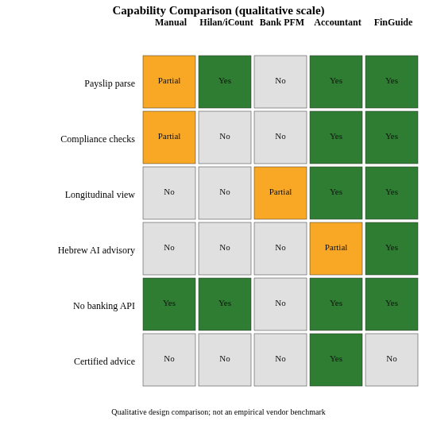

The matrix summarizes §4.4 as a qualitative design comparison; it is not the result of direct empirical testing of the named alternatives. FinGuide's own parsing and compliance claims are supported separately by Tables 1 and 2. The accountant column remains stronger on certified advice, which FinGuide explicitly disclaims (§1.4).

### 4.5 Discussion of Findings

Relative to the primary project aim — enabling Israeli employees to verify, analyze, and act on payslip data without specialist knowledge — the evaluation supports three conclusions.

First, **the multi-path Hebrew payslip workflow is operational, but extraction accuracy is not yet sufficient for unattended use**. The recorded evaluation switched correctly between direct text and OCR, but several period, net, base-salary, and deduction fields were wrong or missing. Manual review and correction are therefore part of the present product behavior, not merely an edge-case fallback.

Second, **rule-based compliance checking behaves consistently on the limited annotated scenarios when extraction output is complete**. The ten-scenario set produced nine true positives, no false positives, and no false negatives across deposit, rate, and continuity cases. This is regression evidence for the implemented rules, not proof of population-level reliability [7], [14], [15].

Third, **hybrid AI routing is effective but not complete**. The 92.3% intent accuracy on n = 39 queries supports the rule-first design for many structured Hebrew financial queries, while three misses show that advisory and compound questions need improved priority logic or a semantic classifier (Section 5.3).

The project objectives are **substantially met at the implementation level**, with mixed measured performance: findings scenarios and functional suites pass, AI routing reaches 92.3%, and OCR accuracy exposes material work still required. Objectives 4–6 are functionally verified by automated tests (Table 6) but lack end-user UX scoring. The integrated result addresses the system gap stated in §2.8 without claiming that the limited evaluation establishes production readiness [16], [17].

---

## Chapter 5: Conclusion and Future Work

### 5.1 Summary of Contributions

This project addressed the problem stated in Section 1.2 — Israeli employees' inability to independently verify payslip compliance and act on financial data — through six objectives. The contributions map to those objectives as follows:

1. **Multi-path Hebrew PDF payslip extraction pipeline** (Objective 1). Combines `pdftotext` / `pdf-parse` direct extraction, numeric rescue, and Tesseract image OCR with PSM multi-candidate ranking, LLM adjudication for conflicting fields, and the `analysisData` v1.9 canonical schema. On the seven scored fixtures, the reproduced run reached 85.7% on `gross_total`, 57.1% on `period_month`, and 42.9% on `net_payable`; the result establishes a measurable baseline and documents the need for continued extraction work.

2. **Rule-based financial findings engine** (Objective 2). Three detectors — missing fund deposits, contribution rate gaps (including below-statutory-minimum subtypes), and deposit continuity — achieved 100% precision and recall on the annotated findings scenario corpus.

3. **Hybrid AI assistant** (Objective 3). Keyword intent routing (26 possible labels, including greeting and fallback) with rule-based data-grounded responses and Claude/Ollama fallback; 92.3% intent classification accuracy on n = 39 Hebrew queries; SSE streaming for conversational delivery.

4. **Multi-agent financial analysis orchestration** (Objective 4). Five parallel agents (payslip, insurance, pension, provident fund, and financial profile) with recommendation merging, a 100-point composite health score, and orchestrator narrative generation via `POST /api/ai/full-analysis`. Verified by 34 automated agent/orchestrator unit tests (Table 6).

5. **Longitudinal financial planning** (Objective 5). Linear savings forecast module with scenario comparison, grounded in extracted pension contribution rates from the most recent completed payslip. Verified by 10 automated forecast unit tests (Table 6).

6. **Hebrew-native RTL web application** (Objective 6). React 19 and TypeScript SPA with Hub dashboard, payslip history, findings deep-links, AI assistant, and onboarding profile capture. Primary user-facing surfaces use Hebrew and RTL layout (`direction: rtl`; Figures 13–17). Verified by 10 frontend mapping, upload-hook, and analysis-summary tests (Table 6).

### 5.2 Limitations

**Evaluation corpus size and annotations.** OCR accuracy uses seven scored fixtures, with two additional IDF image fixtures containing no tracked expected fields; findings use n = 10 and AI routing n = 39. The repository does not document a formal independent annotation protocol. These small, committed test sets support reproducibility and regression checking but do not support broad generalization across Israeli payroll vendors and employment configurations.

**OCR completeness.** In the reproduced run, `gross_total` reached 85.7%, `period_month` 57.1%, and `net_payable` 42.9% across the seven scored fixtures. Period shifts, missing or incorrect net values, and row-level deduction confusion may yield `needs_review` status requiring manual field entry.

**Extraction quality gate.** The requirement that both `gross_total > 500` and `net_payable > 500` be present is a pragmatic heuristic that may reject legitimate edge cases (e.g., zero-gross unpaid-leave months).

**Synchronous processing.** Upload extraction runs inside the HTTP request cycle. In the reproduced run, the two IDF image fixtures required approximately 23 and 27 seconds. The current repository does not include a persistent job-queue integration, so long OCR requests have no durable retry mechanism.

**Flexible `analysisData`.** `Document.analysisData` is declared as Mongoose `type: Object`, enabling schema iteration but sacrificing database-level enforcement of nested extraction fields.

**LLM knowledge cutoff.** The assistant may cite outdated regulatory figures unless overridden by system-prompt constants; users must verify specific statutory amounts.

**Linear savings forecast.** The projection model omits investment returns and inflation, potentially underestimating terminal pension balances despite UI disclaimers.

**Scalability and load testing.** The system has not been load-tested under concurrent upload scenarios. Development rate limits (2,000/15 min) do not reflect production constraints.

**Israeli regulatory specificity.** Findings detectors are coupled to 2026 Israeli statutory floors; adaptation to other jurisdictions would require regulatory model replacement.

**No banking API integration.** Payslip PDF upload is the sole automated data source; bank and pension portal connections remain future work.

### 5.3 Future Work

Future work is prioritized by expected impact on the objectives in Section 1.3:

**High impact — extraction and scale**
1. *Asynchronous processing.* Place the existing extraction service behind a persistent job queue such as BullMQ to decouple upload latency from OCR duration and enable retry after transient failures.
2. *Expanded golden corpus.* Grow the OCR and findings evaluation sets across Hilan, iCount, Priority, and scanned payslips to strengthen generalization claims.
3. *Extraction-v2 promotion.* Promote the offline-evaluated next-generation extractor to production once it exceeds the rule-based baseline on an expanded corpus.

**Medium impact — advisory depth**
4. *PensiaNet integration.* Surface pension fund fee and return comparisons from government registry data in the findings engine.
5. *Embedding-based intent classification.* Replace or augment keyword routing to handle compound advisory questions (e.g., the misclassified life-insurance adequacy query in Section 4.2.4).
6. *Banking and pension portal APIs.* Connect to Israeli Open Banking and fund management portals for automated data import.

**Lower priority — scope expansion**
7. *Annual tax return assistance.* Extend Form 106 parsing and tax-year summary beyond basic metadata.
8. *Compounding savings model.* Add optional investment-return scenarios to the forecast module with explicit assumption disclosure.
9. *Machine learning for field extraction.* Fine-tuned Hebrew table extraction or layout models (e.g., LayoutLM variants) to improve non-standard payslip layouts.
10. *Multi-language support.* Arabic-language OCR and UI to expand coverage beyond Hebrew-primary users.

---

## References

[1] Smith, R. (2007). An overview of the Tesseract OCR engine. *Proceedings of the Ninth International Conference on Document Analysis and Recognition (ICDAR 2007)*, vol. 2, pp. 629–633. IEEE. https://doi.org/10.1109/ICDAR.2007.4376991

[2] Tesseract OCR Contributors. (2018). Tesseract 4.x: LSTM-based text recognition engine. Open-source project, Google. Available: https://github.com/tesseract-ocr/tesseract

[3] Nagy, G. (2000). Twenty years of document image analysis in PAMI. *IEEE Transactions on Pattern Analysis and Machine Intelligence*, 22(1), 38–62.

[4] Trier, Ø. D., & Jain, A. K. (1995). Goal-directed evaluation of binarization methods. *IEEE Transactions on Pattern Analysis and Machine Intelligence*, 17(12), 1191–1201.

[5] Goldberg, Y. (2017). *Neural Network Methods for Natural Language Processing*. Synthesis Lectures on Human Language Technologies. Morgan & Claypool Publishers. (Discusses morphologically rich languages including Hebrew in the context of NLP model design.)

[6] Xu, Y., Li, M., Cui, L., Huang, S., Wei, F., & Zhou, M. (2020). LayoutLM: Pre-training of text and layout for document image understanding. *Proceedings of the 26th ACM SIGKDD International Conference on Knowledge Discovery & Data Mining*, pp. 1192–1200.

[7] State of Israel. (2008). *Extension Order for Comprehensive Pension Insurance in the Economy (Combined Version)* (צו הרחבה [נוסח משולב] לפנסיה חובה), and subsequent amendments.

[8] Lusardi, A., & Mitchell, O. S. (2014). The economic importance of financial literacy: Theory and evidence. *Journal of Economic Literature*, 52(1), 5–44.

[9] Fielding, R. T. (2000). *Architectural styles and the design of network-based software architectures* (Doctoral dissertation, University of California, Irvine). Chapter 5 defines the REST architectural style.

[10] Brown, T. B., Mann, B., Ryder, N., Subbiah, M., Kaplan, J., Dhariwal, P., ... & Amodei, D. (2020). Language models are few-shot learners. *Advances in Neural Information Processing Systems*, 33, 1877–1901.

[11] Ji, Z., Lee, N., Frieske, R., Yu, T., Su, D., Xu, Y., ... & Fung, P. (2023). Survey of hallucination in natural language generation. *ACM Computing Surveys*, 55(12), 1–38.

[12] Xi, Z., Chen, W., Guo, X., He, W., Ding, Y., Hong, C., ... & Zhang, D. (2023). The rise and potential of large language model based agents: A survey. *arXiv preprint arXiv:2309.07864*. (Survey of LLM agent architectures including orchestration and tool-use patterns relevant to multi-domain financial analysis.)

[13] World Wide Web Consortium (W3C). (2015). *Server-Sent Events specification*. W3C Recommendation. https://www.w3.org/TR/eventsource/

[14] Israel Tax Authority. (2026). *Monthly deductions booklet and calculation tables for tax year 2026*. Israel Ministry of Finance. https://www.gov.il/BlobFolder/generalpage/income-tax-monthly-deductions-booklet/he/generalInformation_income-tax-monthly-deductions-booklet_monthly-deductions-booklet-2026.pdf

[15] National Insurance Institute of Israel. (2026). *Rates and amounts of National Insurance and health-insurance contributions for salaried employees*. https://www.btl.gov.il/INSURANCE/RATES/Pages/%D7%9C%D7%A2%D7%95%D7%91%D7%93%D7%99%D7%9D%20%D7%A9%D7%9B%D7%99%D7%A8%D7%99%D7%9D.aspx

[16] OECD. (2020). *OECD/INFE 2020 International Survey of Adult Financial Literacy*. OECD Publishing. https://www.oecd.org/financial/education/

[17] Bank of Israel. (2024). *Open banking and payment services — regulatory framework*. Bank of Israel. https://www.boi.org.il/

[18] Wintner, S. (2000). Hebrew computational linguistics: Challenges and directions. *Natural Language Engineering*, 6(1), 1–25.

---

## Appendix A: API Endpoint Reference

The following tables summarize the FinGuide API. Authentication is applied per route rather than solely by prefix: public authentication actions and `GET /api/health` do not require a token, while user-specific operations require a valid JWT Bearer token unless the route documentation states otherwise. The route source is authoritative for deployment and security review.

### Authentication (`/api/auth`)

| Method | Path | Description |
|---|---|---|
| POST | `/api/auth/register` | Register a new user (name, email, password) |
| POST | `/api/auth/login` | Authenticate with email and password; returns JWT |
| POST | `/api/auth/google` | Authenticate with a Google ID token |
| GET | `/api/auth/me` | Return the authenticated user's profile |
| PATCH | `/api/auth/me` | Update name or email |
| POST | `/api/auth/change-password` | Change password for authenticated user |
| POST | `/api/auth/profile/image` | Upload a profile image (JPEG/PNG/HEIC, resized to 512×512) |
| POST | `/api/auth/forgot-password` | Send a password reset email |
| POST | `/api/auth/reset-password` | Consume a reset token and set a new password |

### Documents (`/api/documents`)

| Method | Path | Description |
|---|---|---|
| POST | `/api/documents/upload` | Upload and process a payslip PDF |
| GET | `/api/documents` | List all documents for the authenticated user |
| GET | `/api/documents/payslip-history` | Structured payslip history with year-level statistics |
| GET | `/api/documents/recent-payslips` | The N most recent completed payslips (limit 1–12) |
| GET | `/api/documents/ai-insights` | AI-generated insights based on recent payslips |
| GET | `/api/documents/:id` | Retrieve a single document |
| GET | `/api/documents/:id/download` | Download the original PDF |
| GET | `/api/documents/:id/digest` | Return the AI-generated digest for a completed document |
| POST | `/api/documents/:id/reprocess` | Re-run extraction on an existing document |
| POST | `/api/documents/:id/unlock` | Supply a PDF password and re-process |
| PATCH | `/api/documents/:id/fields` | Manually fill fields the OCR did not extract |
| DELETE | `/api/documents/:id` | Delete a document and its file |
| DELETE | `/api/documents/all` | Delete all documents for the authenticated user |

### Findings (`/api/findings`)

| Method | Path | Description |
|---|---|---|
| GET | `/api/findings` | Generate and return all financial findings |
| POST | `/api/findings/savings-forecast` | Compute a savings forecast for two scenarios |

### AI Assistant (`/api/ai`)

| Method | Path | Description |
|---|---|---|
| POST | `/api/ai/chat` | Submit a chat message; returns a complete response |
| POST | `/api/ai/chat/stream` | Submit a chat message; streams tokens via SSE |
| GET | `/api/ai/chat/history` | Retrieve conversation history |
| GET | `/api/ai/chat/conversations` | List distinct conversation threads |
| GET | `/api/ai/financial-tips` | Return rule-based financial tips |
| POST | `/api/ai/full-analysis` | Run the full multi-agent financial analysis |

### Pension (`/api/pension`)

| Method | Path | Description |
|---|---|---|
| GET | `/api/pension/analysis` | Full pension analysis for the user |
| GET | `/api/pension/import-history` | Pension import history |
| POST | `/api/pension/simulate` | What-if pension scenario simulation |
| POST | `/api/pension/upload` | Upload pension statement metadata |
| POST | `/api/pension/upload-file` | Upload pension statement file |
| GET | `/api/pension/funds` | List user's pension funds |
| PATCH | `/api/pension/funds/:id` | Update a pension fund record |
| DELETE | `/api/pension/funds/:id` | Delete a pension fund |
| GET | `/api/pension/risk-advice` | Risk profile advice |
| GET | `/api/pension/fund-advice` | Fund-level advice |
| GET | `/api/pension/leading-funds` | Market leading funds reference |
| GET | `/api/pension/fund/:id` | Single fund detail |

### Copilot (`/api/copilot`)

| Method | Path | Description |
|---|---|---|
| GET | `/api/copilot/analysis` | Consolidated financial snapshot |
| GET | `/api/copilot/problems` | Detected financial problems |
| PUT | `/api/copilot/profile` | Update copilot financial profile |
| POST/PUT | `/api/copilot/goals` | Create or update savings goals |
| DELETE | `/api/copilot/goals/:id` | Delete a goal |
| POST | `/api/copilot/monthly-report` | Generate monthly markdown report |

### Insurance (`/api/insurance`)

| Method | Path | Description |
|---|---|---|
| GET | `/api/insurance/analysis` | Insurance coverage analysis for the user |
| GET | `/api/insurance/policies` | List imported insurance policies |
| GET | `/api/insurance/import-history` | Insurance import history |
| POST | `/api/insurance/upload-excel` | Upload Har HaBituach Excel export |
| DELETE | `/api/insurance/policies/:id` | Delete a policy record |
| GET | `/api/insurance/profile-insights` | Profile-derived insurance insights |
| GET | `/api/insurance/market-advice` | Market advice relative to profile |
| GET/POST | `/api/insurance/onboarding/*` | Insurance onboarding session and answers |
| DELETE | `/api/insurance/data` | Clear user insurance data |

### Government data nets (`/api/gov`)

| Method | Path | Description |
|---|---|---|
| GET | `/api/gov/status` | Aggregate status of government-net sync |
| POST | `/api/gov/sync` | Trigger government-net synchronization |
| GET | `/api/gov/gemel/advice` | Provident-fund (גמל) advice helpers |
| GET | `/api/gov/bituah/advice` | Insurance-net advice helpers |
| GET | `/api/gov/payslip/benchmarks` | Payslip benchmark helpers |
| GET/POST | `/api/gov/:net/*` | Per-net status, sync, and fund lookup routes |

### Additional Routes

| Method | Path | Description |
|---|---|---|
| GET | `/api/health` | Health check (unauthenticated) |
| GET/PUT/POST | `/api/onboarding/*` | User onboarding flow |
| GET/POST | `/api/smart-onboarding/*` | Guided domain onboarding state and answers |
| GET/PATCH | `/api/profile/*` | Extended user profile management |
| GET/POST/DELETE | `/api/integrations/gmail/*` | Gmail OAuth and payslip import |
| GET | `/api/financial-health/score` | Financial health score and breakdown |
| GET/POST/DELETE | `/api/notifications/*` | In-app notification management |
| GET/POST | `/api/recommendations/*` | Personalized recommendation management |
| GET/POST | `/api/insights/*` | Financial insight records |
| GET | `/api/tax-assistant/summary` | Tax assistant and Form 106 support |
| GET/POST/PUT/DELETE | `/api/copilot/*` | Copilot assistant endpoints |
| GET/POST | `/api/score-agent/*` | Score agent gaps and answers |
| GET/POST/DELETE | `/api/gemel/*` | Provident-fund analysis, records, and reports |
| GET | `/api/dashboard/summary` | Dashboard aggregation |
| GET/POST | `/api/agents/*` | Agent ask/list and RAG endpoints |
| GET/POST | `/api/summary-email/*` | Summary email / WhatsApp helpers |
| GET | `/api/executive/*` | Executive report data and PDF generation |

Twenty-three Express route modules are mounted in `app.js` (auth, documents, ai, findings, onboarding, smart-onboarding, profile, insights, recommendations, notifications, Gmail, tax-assistant, financial-health, copilot, score-agent, pension, gemel, insurance, dashboard, agents, gov, summary-email, executive report).

---

## Appendix B: Project Setup and Reproduction

### B.1 Prerequisites

- Node.js 20.x and npm
- MongoDB (local, Atlas, or Docker Compose via `npm run dev:docker`)
- For OCR on macOS without Docker: `tesseract` (with `heb` pack) and `poppler` (`pdftotext`, `pdftoppm`)
- Google Chrome (for `npm run build` in `Final_Project_Book/`)

### B.2 Installation

```bash
# From repository root
npm run install:all
```

### B.3 Environment variables (backend `.env`)

| Variable | Required | Purpose |
|---|---|---|
| `JWT_SECRET` | Yes (≥10 chars) | JWT signing |
| `MONGODB_URI` | Yes | MongoDB connection |
| `PORT` | No (default 5000) | API port |
| `CLIENT_URL` | Production setting | Additional allowed frontend origin for CORS |
| `GOOGLE_CLIENT_ID` | For OAuth | Google Sign-In |
| `GOOGLE_CLIENT_SECRET` | For Gmail | Gmail authorization-code exchange |
| `GOOGLE_TOKEN_ENCRYPTION_KEY` | Recommended for Gmail | Encrypt stored Gmail tokens; falls back to `JWT_SECRET` |
| `ANTHROPIC_API_KEY` | For Claude/vision | Standard chat, agent explanations, and vision extraction |
| `CHAT_PROVIDER`, `CHAT_MODEL` | Optional | Standard `/api/ai/chat` provider/model controls |
| `AI_PROVIDER`, `OPENAI_API_KEY`, `OPENAI_MODEL` | Optional | Separate domain-narrative provider adapter |
| `OLLAMA_URL`, `OLLAMA_MODEL` | Optional | LLM fallback |
| `PAYSLIP_EXTRACTION_MODE` | No (`legacy`) | Select legacy OCR cascade or Claude `vision` path |
| `PAYSLIP_VISION_MODEL` | For vision tuning | Vision model, default `claude-sonnet-4-6` |
| `GOV_MARKET_CRON_ENABLED`, `GOV_MARKET_CRON_SCHEDULE`, `GOV_MARKET_CRON_TZ` | Optional | In-process government-market synchronization |
| `MAX_UPLOAD_SIZE_MB` | No (default 10) | Upload limit |

Frontend development settings: `VITE_API_URL` controls the Vite proxy target and `VITE_GOOGLE_CLIENT_ID` configures Google Sign-In. Production API calls are relative paths, so the deployment reverse proxy should expose `/api` on the same public origin.

### B.4 Run development stack

```bash
npm run dev              # backend on PORT (documented example: 5001) + frontend :5173
npm run dev:docker       # MongoDB + backend with OCR tools; backend on host port 5001
```

Vite already defaults its API proxy to **5001**; set `VITE_API_URL` only when the backend is exposed on a different address or port.

### B.5 Evaluation and benchmark commands

```bash
cd backend
npm run eval:ocr
npm run eval:findings
npm run eval:ai-routing
npm run bench:upload-latency
npm test
```

### B.6 Build project book PDF

```bash
cd Final_Project_Book
export CHROME_PATH="/usr/bin/google-chrome"  # Linux; use the Chrome executable path on macOS
npm run build          # figures + PDF
npm run build:pdf      # PDF only (if figures already rendered)
npm run serve          # preview at http://127.0.0.1:8765
```

## Appendix C: analysisData v1.9 Field Reference

Top-level fields produced by the extraction pipeline (`schema_version: "1.9"`):

| Group | Key fields | Type / notes |
|---|---|---|
| `period` | `month` (YYYY-MM) | string |
| `salary` | `gross_total`, `net_payable`, `components[]` | numbers + line items |
| `deductions.mandatory` | `total`, `income_tax`, `national_insurance`, `health_insurance` | numbers |
| `contributions.pension` | `employee`, `employer`, `base_salary_for_pension`, rate percents | numbers |
| `contributions.study_fund` | `employee`, `employer`, `base_salary_for_study_fund` | numbers |
| `tax` | `gross_for_income_tax`, `tax_credit_points`, `personal_credit` | numbers |
| `employment` | `employer_name`, `employment_start_date`, `employment_type` | string / date |
| `parties` | `employer_name`, `employee_name`, `employee_id` | string |
| `quality` | `score`, `extraction_path`, `validation.issues`, `warnings` | metadata |
| `summary` | `date`, derived salary summaries | UI-facing aggregates |

Raw OCR text (`raw.rawText`, `raw.ocr_text`) and `quality.debug` are stripped by `documentSerializer.js` before API responses. The frontend never consumes those fields; `frontend/src/utils/documentToPayslip.ts` maps snake_case `analysisData` into camelCase UI types (`PayslipHistoryItem`, `PayslipDetail`).

---

*End of Final Project Book*
