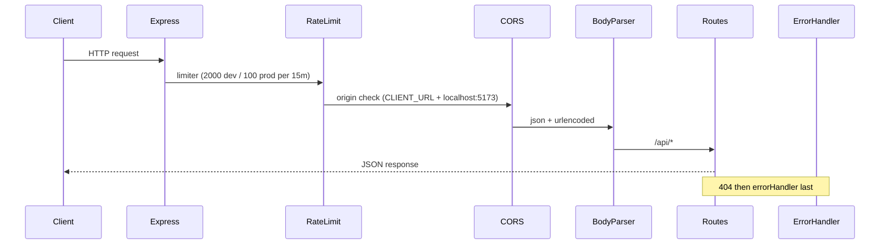
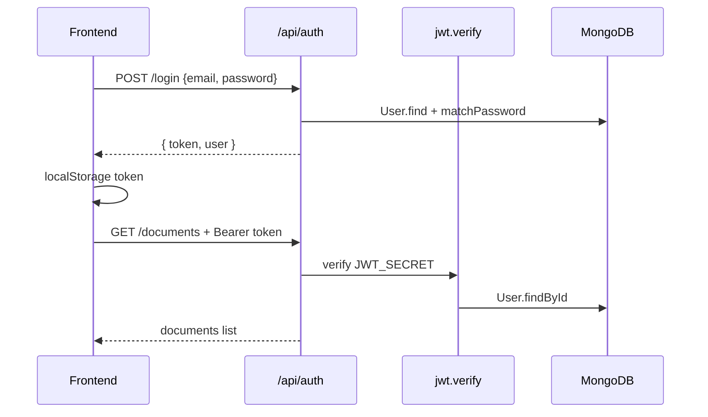
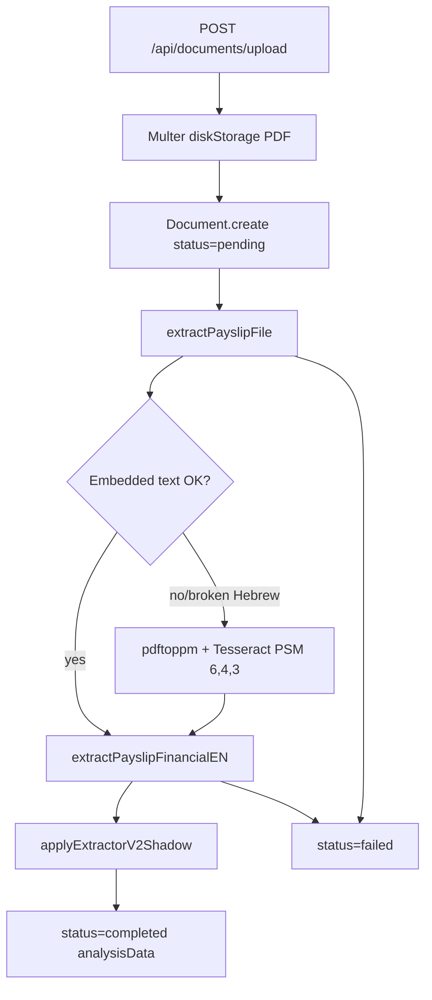
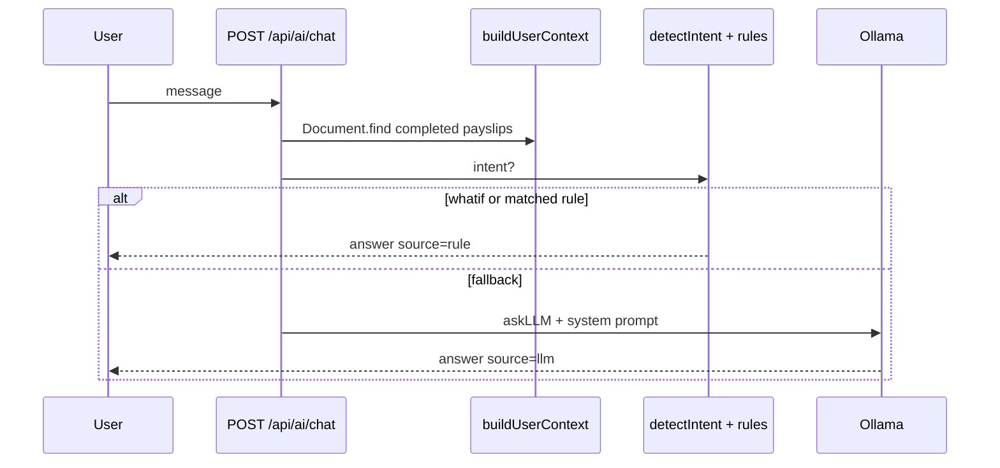
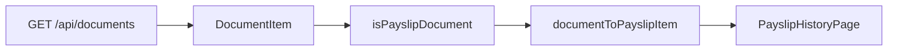
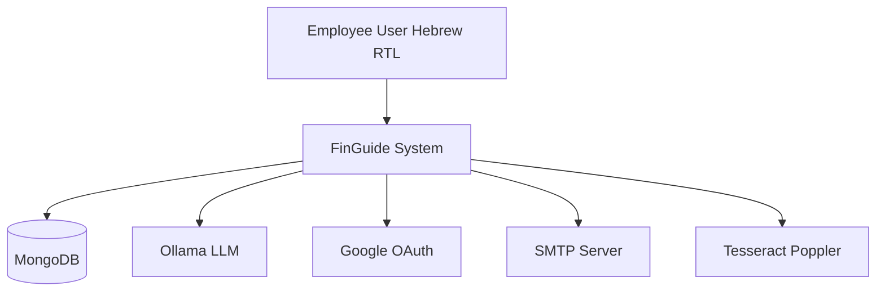
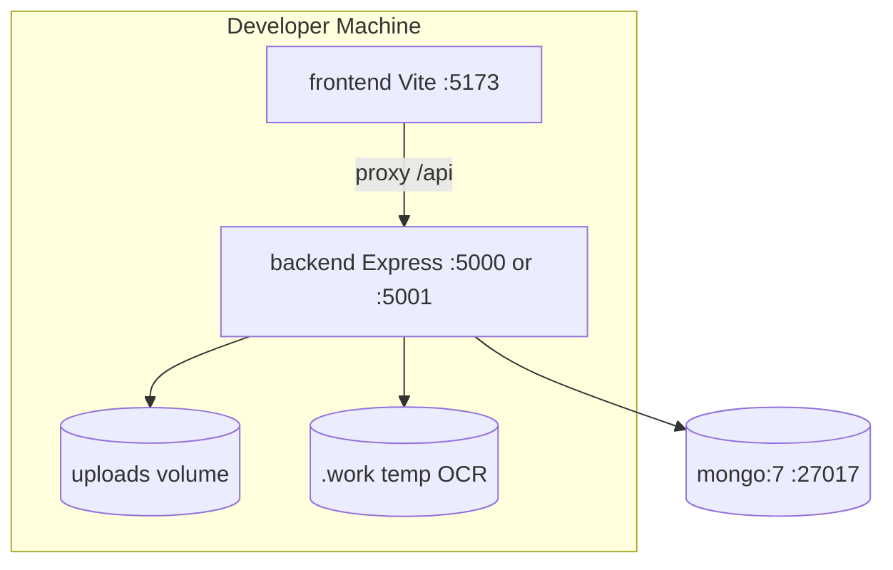
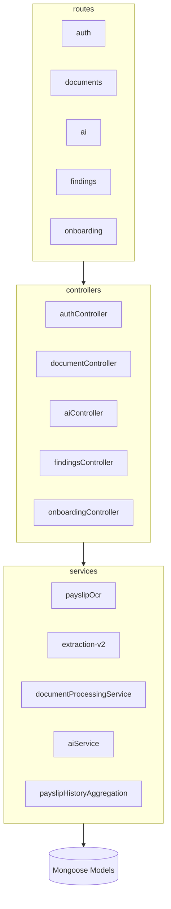

# FinGuide — Architecture Deep Dive

מסמך ארכיטקטורה ברמת Staff/Principal. נוצר מניתוח סטטי של הקוד ב-repo. עדכון אחרון: מאי 2026.

---

## 1. Executive Summary

1. **FinGuide** הוא מונורפו לניתוח תלושי שכר בעברית: `backend/` (Express + Mongoose) ו-`frontend/` (React 19 + Vite + TypeScript).
2. **זרימת הערך המרכזית:** העלאת PDF → חילוץ טקסט (pdf-parse או OCR) → `extractPayslipFinancialEN` → שמירה ב-`Document.analysisData` → תצוגה ב-UI דרך `documentToPayslip.ts`.
3. **extraction-v2** רץ במצב **shadow**: תוצאות v2 נשמרות ב-`analysisData.extraction_v2` בלי להחליף את מבנה ה-legacy שה-UI צורך.
4. **אימות:** JWT ב-`Authorization: Bearer`, Google OAuth דרך `google-auth-library`, סיסמה עם bcrypt ב-`User` pre-save hook.
5. **AI:** היברידי — כוונות (intents) עם תשובות rule-based, שאלות פתוחות ל-Ollama; הקשר נבנה תמיד מה-DB (לא מהלקוח).
6. **אחסון קבצים:** filesystem מקומי `backend/uploads/` (לא S3); הורדה מוגנת עם בדיקת path traversal.
7. **Docker Compose** מספק Mongo + backend עם Tesseract/Poppler; frontend רץ מחוץ ל-Docker.
8. **אין CI/CD, migrations, או observability מובנים** — סכימת Mongo מתפתחת דרך Mongoose בלבד.
9. **קוד מת (או לא מחובר):** `backend/routes/dev.js` לא mounted; `documentProcessingService.processDocumentAsync` לא נקרא מ-upload.
10. **`docs/FRONTEND-BACKEND-ROADMAP.md` מיושן** בחלקים מהותיים (ראו §12).

---

## 2. Repo Atlas

### 2.1 מבנה עליון

| נתיב | תפקיד |
|------|--------|
| [`backend/`](../backend/) | API, OCR, חילוץ, מודלים, בדיקות |
| [`frontend/`](../frontend/) | SPA עברית RTL |
| [`docs/`](../docs/) | Roadmap + מסמך זה |
| [`docker-compose.yml`](../docker-compose.yml) | Mongo 7 + backend |
| [`package.json`](../package.json) | `install:all`, `dev`, `dev:docker`, `test` |
| [`LLM_SERVICE_INTEGRATION_GUIDE.md`](../LLM_SERVICE_INTEGRATION_GUIDE.md) | תיעוד Ollama חיצוני (קורס) — לא מחווט לאפליקציה |

### 2.2 Tech Stack

| שכבה | טכנולוגיות |
|-------|------------|
| Backend | Node 18+/20, Express 4, Mongoose 8, Jest, Supertest |
| Frontend | React 19, React Router 7, Vite 7, TypeScript |
| DB | MongoDB 7 (local / Atlas / Docker) |
| OCR | Tesseract CLI (`heb+eng`), Poppler `pdftoppm`, sharp, pdf-parse |
| AI | Ollama HTTP API (`OLLAMA_URL`, `OLLAMA_MODEL`) |
| Auth | JWT, Google ID token, Nodemailer (SMTP reset) |
| Dev orchestration | concurrently (root), nodemon (backend) |

### 2.3 Entry Points

| Entry | קובץ | תיאור |
|-------|------|--------|
| Backend process | [`backend/server.js`](../backend/server.js) | `validateEnv` → `connectDB` → `createApp` → listen (פורט עם fallback אם תפוס) |
| Express app | [`backend/app.js`](../backend/app.js) | Middleware + mount routes |
| Frontend | [`frontend/src/main.tsx`](../frontend/src/main.tsx) | `BrowserRouter` + `AuthProvider` + `App` |
| Routes UI | [`frontend/src/App.tsx`](../frontend/src/App.tsx) | Route tree + guards |

### 2.4 סקריפטים (root)

```bash
npm run install:all   # backend + frontend deps
npm run dev           # backend:5000 + frontend:5173 (Mongo חיצוני)
npm run dev:docker    # mongo + backend על 5001→5000
npm test              # backend tests + frontend tests + frontend build
```

### 2.5 משתני סביבה

**Backend** ([`backend/.env.example`](../backend/.env.example)):

| קבוצה | משתנים |
|--------|---------|
| Server | `PORT`, `NODE_ENV`, `CLIENT_URL`, `APP_PUBLIC_URL` |
| DB | `MONGODB_URI` |
| Auth | `JWT_SECRET`, `JWT_EXPIRE`, `GOOGLE_CLIENT_ID` |
| AI | `OLLAMA_URL`, `OLLAMA_MODEL` |
| Upload | `MAX_UPLOAD_SIZE_MB` |
| OCR (אופציונלי) | `OCR_PDF_PAGES_MODE`, `OCR_PDF_MIN_TEXT_LENGTH` |
| SMTP | `SMTP_*`, `PASSWORD_RESET_EXPIRE_MINUTES` |

**Frontend** ([`frontend/.env.example`](../frontend/.env.example)): `VITE_GOOGLE_CLIENT_ID`, `VITE_API_URL`.

**פורטים:** dev מקומי — backend 5000, Vite 5173; Docker — backend ממופה ל-host **5001**. שים לב: `vite.config.ts` proxy ל-5000; אם backend על 5001 צריך ליישר `.env` / proxy.

### 2.6 קוד לא מחובר / מת

| פריט | מצב |
|------|------|
| [`backend/routes/dev.js`](../backend/routes/dev.js) | קיים, **לא** mounted ב-`app.js` |
| [`documentProcessingService.processDocumentAsync`](../backend/services/documentProcessingService.js) | מיוצא אך **לא** נקרא מ-`uploadDocument` (עיבוד סינכרוני ב-controller) |
| [`LLM_SERVICE_INTEGRATION_GUIDE.md`](../LLM_SERVICE_INTEGRATION_GUIDE.md) | תיעוד חיצוני; האפליקציה משתמשת ב-`OLLAMA_URL` מקומי |

---

## 3. Runtime & Request Architecture (Phase 1)

### 3.1 סדר Middleware (`app.js`)



1. `express-rate-limit`
2. `cors` (credentials, whitelist origins)
3. `express.json` + `urlencoded`
4. Static: `/uploads/profile-images` בלבד (לא כל uploads)
5. Routes
6. 404 JSON
7. `errorHandler`

### 3.2 טבלת Routes מלאה

| Method | Path | Handler | Auth |
|--------|------|---------|------|
| GET | `/api/health` | inline `app.js` | לא |
| POST | `/api/auth/register` | `authController.register` | לא |
| POST | `/api/auth/login` | `authController.login` | לא |
| POST | `/api/auth/google` | `authController.googleLogin` | לא |
| POST | `/api/auth/forgot-password` | `authController.forgotPassword` | לא |
| POST | `/api/auth/reset-password` | `authController.resetPassword` | לא |
| GET | `/api/auth/me` | `authController.getMe` | `protect` |
| PATCH | `/api/auth/me` | `authController.updateMe` | `protect` |
| POST | `/api/auth/change-password` | `authController.changePassword` | `protect` |
| POST | `/api/auth/profile/image` | `authController.updateProfileImage` | `protect` + multer |
| POST | `/api/documents/upload` | `documentController.uploadDocument` | `protect` |
| GET | `/api/documents` | `documentController.getDocuments` | `protect` |
| GET | `/api/documents/payslip-history` | `documentController.getPayslipHistory` | `protect` |
| GET | `/api/documents/:id` | `documentController.getDocument` | `protect` |
| GET | `/api/documents/:id/download` | `documentController.downloadDocument` | `protect` |
| DELETE | `/api/documents/:id` | `documentController.deleteDocument` | `protect` |
| POST | `/api/ai/chat` | `aiController.chatWithAI` | `protect` |
| GET | `/api/findings` | `findingsController.getFindings` | `protect` |
| POST | `/api/findings/savings-forecast` | `findingsController.getSavingsForecast` | `protect` |
| GET | `/api/onboarding` | `onboardingController.getOnboarding` | `protect` |
| PUT | `/api/onboarding` | `onboardingController.updateOnboarding` | `protect` |
| POST | `/api/onboarding/complete` | `onboardingController.completeOnboarding` | `protect` |
| GET | `/api/onboarding/status` | `onboardingController.getOnboardingStatus` | `protect` |

### 3.3 Error Taxonomy (`errorHandler.js`)

| מקור | status | type |
|------|--------|------|
| `AppError` | מותאם | `err.type` |
| Mongoose ValidationError | 400 | ValidationError |
| CastError | 404 | NotFoundError |
| Duplicate key 11000 | 400 | DuplicateKeyError |
| JsonWebTokenError / TokenExpiredError | 401 | AuthError |
| MulterError | 400 | FileUploadError |
| אחר | 500 | InternalServerError |

### 3.4 Auth Flow



- Middleware: [`backend/middleware/auth.js`](../backend/middleware/auth.js) — `protect` מצרף `req.user` (ללא password).
- Frontend: [`frontend/src/api/client.ts`](../frontend/src/api/client.ts) — קורא token מ-`localStorage`, [`AuthProvider`](../frontend/src/auth/AuthProvider.tsx) קורא `getMe` בעלייה.

---

## 4. Domain Model & Persistence (Phase 2)

### 4.1 User (`backend/models/User.js`)

- שדות: `name`, `email` (unique), `password` (select:false, bcrypt), `googleId` (sparse unique), `avatarUrl`, reset token fields.
- `onboarding`: `completed`, `completedAt`, `data` (salaryType, gross/hourly, job%, pension flags, …), `updatedAt`.
- Hook: `pre('save')` — hash password אם שונה.

### 4.2 Document (`backend/models/Document.js`)

| שדה | תיאור |
|------|--------|
| `user` | ObjectId → User (indexed) |
| `originalName`, `filename`, `filePath`, `fileSize`, `mimeType` | קובץ על דיסק |
| `metadata` | category, periodMonth/Year, documentDate, source |
| `checksumSha256` | כפילויות ב-findings |
| `status` | `uploaded` \| `pending` \| `processing` \| `completed` \| `failed` |
| `analysisData` | Object גמיש — payload אנליטי |
| `processingError` | הודעת כשלון |

**מחזור סטטוס (מעשי):**

| סטטוס | מי מגדיר | מתי |
|--------|----------|-----|
| `pending` | `uploadDocument` | יצירת רשומה לפני OCR |
| `completed` | `uploadDocument` | OCR הצליח |
| `failed` | `uploadDocument` | OCR נכשל |
| `processing` | `processDocumentNow` | שירות async (לא בשימוש ב-upload) |

### 4.3 API Serialization

[`documentSerializer.js`](../backend/serializers/documentSerializer.js) מסיר מ-API:
- `raw.rawText`, `raw.ocr_text` (מניעת דליפת טקסט מלא)
- `quality.debug`

### 4.4 Canonical Payslip JSON (ל-Frontend)

ה-UI **לא** קורא ישירות ל-`summary` של OCR. הממשק הקנוני לתצוגה הוא מבנה שמופק דרך:

1. **מקור אמת ב-DB:** `analysisData` עם `period`, `salary`, `deductions`, `contributions`, `parties`, `employment`, `summary`.
2. **שכבת מיפוי:** [`frontend/src/utils/documentToPayslip.ts`](../frontend/src/utils/documentToPayslip.ts) → `PayslipHistoryItem` / `PayslipDetail`.

תנאי תלוש תקף ב-UI: `status === 'completed'` + `analysisData` אובייקט.

### 4.5 Monetary Typing

[`backend/dto/monetaryValue.js`](../backend/dto/monetaryValue.js) — `createMonetaryValue({ amount, currency, source })` עם `normalizeAmount` / `enforceAmountBounds` מ-`utils/numeric.js`. **לא** משולב בכל מסלול OCR; שימוש נקודתי ב-DTO/validation.

### 4.6 אחסון קבצים

- Multer: [`backend/middleware/upload.js`](../backend/middleware/upload.js) — **PDF בלבד**, עד `MAX_UPLOAD_SIZE_MB` (ברירת מחדל 10).
- נתיב: `backend/uploads/{uuid}.pdf`
- הורדה: `path.resolve` + בדיקה ש-`resolvedPath.startsWith(uploadsDir)` — מניעת traversal.

---

## 5. Document Processing Pipeline (Phase 3) — Core Value Chain



### 5.1 שלבי OCR (`payslipOcr.js`)

1. **PDF:** ניסיון `pdf-parse`; אם טקסט ≥ `MIN_PDF_TEXT_LENGTH` (200) ועברית לא שבורה → `extractionMethod: pdf_text`, פיצול multi-month (`splitPayslipSections`).
2. **Fallback:** `pdftoppm` → PNG → `sharp` (grayscale, threshold) → `tesseract` עם PSM 6/4/4 — בחירת מועמד [`rankExtractionCandidates`](../backend/services/payslipOcrResolver.js).
3. **תמונה:** OCR ישיר על הקובץ.

מודולים עזר: `payslipOcrLabelMap`, `payslipOcrParties`, `payslipOcrContributions`, `payslipOcrContext`, `payslipOcrShared`.

### 5.2 מבנה `analysisData` (legacy / production)

`schema_version: '1.9'` — אובייקט ראשי מ-`extractPayslipFinancialEN`:

```javascript
{
  schema_version: '1.9',
  period: { month: 'YYYY-MM' },
  salary: { gross_total, net_payable, gross_minus_mandatory_deductions, components: [] },
  deductions: { mandatory: { total, income_tax, national_insurance, health_insurance, ... }, voluntary: {} },
  contributions: { pension: {...}, study_fund: {...} },
  tax: { gross_for_income_tax, taxable_income, marginal_tax_rate_percent, tax_credit_points, ... },
  national_insurance: { gross_for_national_insurance },
  employment: { employment_start_date, job_percent },
  parties: { employer_name, employee_name, employee_id },
  insurances: { hmo },
  quality: { warnings, candidates, ... },
  raw: { ocr_engine, ocr_lang, text_sha256, rawText, ocr_text, extractionMethod, rawLines },
  summary: { /* buildPayslipSummary — שטוח ל-AI */ grossSalary, netSalary, tax, ... },
  pipeline_version: 'extractor-v2-shadow',  // אחרי shadow
  extraction_v2: { meta, fields },           // shadow
  quality: { validation, debug: { extraction_v2_shadow } }
}
```

`summary` נבנה ב-[`payslipOcrSummary.js`](../backend/services/payslipOcrSummary.js) — משמש בעיקר את `aiController.buildUserContext`.

### 5.3 extraction-v2 (Shadow)

| קובץ | תפקיד |
|------|--------|
| [`extraction.service.js`](../backend/services/extraction-v2/extraction.service.js) | `extractPayslipFields` |
| [`validation.service.js`](../backend/services/extraction-v2/validation.service.js) | `validatePayslipExtraction` |
| [`extractionResult.contract.js`](../backend/services/extraction-v2/contracts/extractionResult.contract.js) | `CANONICAL_FIELD_KEYS` (35 שדות) |
| [`compatibility.adapter.js`](../backend/services/extraction-v2/adapters/compatibility.adapter.js) | המרה ל-legacy (לא בשימוש ב-upload path) |

**Shadow logic** (זהה ב-`documentController` ו-`documentProcessingService`):

- קורא `rawText` / `rawLines` מה-legacy.
- מריץ v2, שומר ב-`extraction_v2` + `quality.validation`.
- כשלון v2 → warning, **לא** מוחק legacy.

סקריפטים: `npm run debug:extractor:v2`, `npm run reprocess:payslips`.

### 5.4 שדות עברית / מיפוי (legacy)

מיפוי תוויות: [`payslipOcrLabelMap.js`](../backend/services/payslipOcrLabelMap.js). פרסור משותף: [`payslipOcrShared.js`](../backend/services/payslipOcrShared.js) — `parseMoney`, `parsePercent`, תאריכים, HMO.

### 5.5 Edge Cases (מבדיקות)

| Fixture / Test | מה ננעל |
|----------------|---------|
| `payslip-ocr-json-sample.json` | מבנה שורות OCR |
| `payslip-ocr-pass-ranking.json` | דירוג מועמדי PSM |
| `payslipOcrParser.test.js` | פרסור סכומים ותקופות |
| `documentProcessingService.test.js` | מעבר processing→completed/failed |

---

## 6. Analytics & AI (Phase 4)

### 6.1 Findings

[`findingsController.js`](../backend/controllers/findingsController.js) — heuristics על מטא-דאטה + ניתוח `analysisData`:

- אין מסמכים, כפילויות (שם+גודל), pending/processing, מסמכים ישנים (>30 יום), מטא-דאטה חסר, תאריך עתידי.
- **קרן ללא הפקדה:** [`detectFundWithoutDeposit.js`](../backend/utils/detectFundWithoutDeposit.js) — פנסיה וקה"ש, כולל סתירת onboarding.
- **פער באחוזי הפרשה:** [`detectContributionRateGap.js`](../backend/utils/detectContributionRateGap.js) — מוצהר מול משתמע (סכום÷בסיס) + סף מינימום מ-[`contributionRateThresholds.js`](../backend/config/contributionRateThresholds.js).
- **חוסר רצף בהפקדות:** [`detectDepositContinuityGap.js`](../backend/utils/detectDepositContinuityGap.js) — ציר זמן משותף [`contributionTimeline.js`](../backend/utils/contributionTimeline.js) + [`payslipPeriod.js`](../backend/utils/payslipPeriod.js); ממצאי חור בתלוש / חודש ללא תלוש / אי-ודאות; קונפיג [`depositContinuityConfig.js`](../backend/config/depositContinuityConfig.js).
- **מטא-דאטה בממצאים:** `GET /api/findings` מחזיר אופציונלית `meta: { fundType, periods, documentIds, findingKind }` לקישור UI להיסטוריית תלושים (`?highlight=YYYY-MM,...`).

### 6.2 Savings Forecast

`POST /api/findings/savings-forecast` → [`savingsForecastService.js`](../backend/services/savingsForecastService.js) + [`linearSavingsForecast.js`](../backend/utils/linearSavingsForecast.js).

### 6.3 Payslip History Intelligence

`GET /api/documents/payslip-history?year=` → [`payslipHistoryAggregationService.js`](../backend/services/payslipHistoryAggregationService.js) + [`taxAdjustmentRulesService.js`](../backend/services/taxAdjustmentRulesService.js).

Frontend: `getPayslipHistoryFromIntelligence` ב-`documentToPayslip.ts`.

### 6.4 AI Assistant



- [`aiService.js`](../backend/services/aiService.js): `buildFinancialSystemPrompt`, `askLLM`, `polishHebrewAnswer`.
- אין אמון ב-`userData` מהלקוח — רק DB.
- `simulateWhatIf` + `detectSalaryAnomalies` לכוונות ספציפיות.
- `LLM_SERVICE_INTEGRATION_GUIDE.md` — פרוקסי Nginx לקורס; **לא** מוחלף בקוד האפליקציה.

### 6.5 Onboarding

- API: CRUD על `User.onboarding`.
- Frontend: [`OnboardingPage.tsx`](../frontend/src/pages/OnboardingPage.tsx) — **אין** gate גלובלי ב-`RequireAuth` שמכריח השלמה (ניתן לגשת ל-dashboard בלי onboarding).

---

## 7. Frontend Architecture (Phase 5)

### 7.1 Routes (`App.tsx` + `APP_ROUTES`)

| Route | Page | API עיקרי |
|-------|------|-----------|
| `/` | Landing | — |
| `/login`, `/register` | AuthScreen | `auth.api` |
| `/reset-password` | ResetPasswordPage | auth reset |
| `/dashboard` | DashboardPage | documents, findings, health |
| `/onboarding` | OnboardingPage | `onboarding.api` |
| `/documents` | DocumentsPage | `documents.api` |
| `/documents/:id` | DocumentDetailsPage | documents |
| `/documents/scan` | ScanStatusPage | upload flow |
| `/documents/history` | PayslipHistoryPage | payslip-history |
| `/documents/history/:id` | PayslipDetailPage | `documentToPayslip` |
| `/findings` | FindingsPage | `findings.api` |
| `/assistant` | AssistantPage | `ai.api` |
| `/settings` | SettingsPage | auth, profile |
| `/integrations/email` | IntegrationsEmailPage | **stub בלבד** |

### 7.2 Data Flow לכרטיס תלוש



מיפוי עיקרי (`analysisData` → UI):

| Backend | Frontend field |
|---------|----------------|
| `period.month` | `periodLabel`, `periodDate` |
| `salary.gross_total` | `grossSalary` |
| `salary.net_payable` | `netSalary` |
| `salary.components[]` | `earnings[]` |
| `deductions.mandatory.*` + `contributions.*` | `deductions[]` |
| `parties.*` | `employerName`, `employeeName` |
| `employment.job_percent` / `summary.jobPercentage` | `jobPercent` |

### 7.3 API Clients

[`frontend/src/api/`](../frontend/src/api/): `client.ts` (base + JWT), `auth.api.ts`, `documents.api.ts`, `findings.api.ts`, `ai.api.ts`, `onboarding.api.ts`, `profile.api.ts`, `health.api.ts`.

Vite proxy: `/api`, `/uploads` → `127.0.0.1:5000`.

---

## 8. Quality, Testing & Ops (Phase 6)

### 8.1 Backend Tests (ערך גבוה)

| קובץ | התנהגות נעולה |
|------|----------------|
| `auth.routes.test.js` | register/login/JWT |
| `documents.uploadMetadata.test.js` | upload + metadata (ממוק `processDocumentAsync`) |
| `payslipOcrParser.test.js` | פרסור תלוש |
| `payslipOcrResolver.test.js` | דירוג OCR |
| `documentProcessingService.test.js` | async processing states |
| `findings.savingsForecast.test.js` | תחזית חיסכון |
| `payslipHistoryAggregationService.test.js` | אגרגציה שנתית |
| `detectSalaryAnomalies` (`__tests__/`) | חריגות שכר |

### 8.2 Frontend Tests

- כמעט יחיד: [`documentToPayslip.test.ts`](../frontend/src/utils/documentToPayslip.test.ts) — פער כיסוי משמעותי.

### 8.3 Docker & OCR

[`backend/Dockerfile`](../backend/Dockerfile): Node 20 + `tesseract-ocr-heb` + `poppler-utils`.

ללא Docker על macOS מקומי — `tesseract` עלול להיות חסר (`ENOENT` עם הודעה מפורשת).

### 8.4 Security Checklist

| נושא | מצב |
|------|------|
| JWT secret validation בהפעלה | כן (`server.js`) |
| Rate limiting | כן (גבוה ב-dev) |
| Upload type/size | PDF only, 10MB |
| Download path traversal | כן |
| Google token verify | ב-`googleLogin` |
| Password reset | token hash + SMTP |
| CORS | whitelist |
| חסר: helmet, CSP, audit log, virus scan | — |

### 8.5 Observability

- `console.error` / `console.warn` בפיתוח; אין metrics/tracing/structured logging.

---

## 9. C4 & ADR Synthesis (Phase 7)

### 9.1 Context Diagram



### 9.2 Container Diagram



### 9.3 Backend Components



### 9.4 ADR Notes

1. **מונורפו דו-חבילתי** — פיתוח מהיר, שיתוף types עתידי אפשרי; deploy נפרד (SPA סטטי + API).
2. **Filesystem uploads** — פשטות ל-MVP; מגביל scale אופקי וגיבוי — מעבר ל-S3/pre-signed URLs בעתיד.
3. **extraction-v2 shadow** — מאפשר השוואת דיוק בלי לשבור UI שתלוי ב-legacy shape.
4. **Ollama מקומי** — פרטיות ועלות; tradeoff: תלות בתשתית וזמינות; מדריך הקורס לפרוקסי חיצוני לא מוטמע.
5. **עיבוד סינכרוני ב-upload** — UX פשוט (תשובה עם analysis); סיכון timeout על PDFים כבדים — `documentProcessingService` מוכן ל-async אך לא מחובר.
6. **AI hybrid rules+LLM** — מפחית hallucination לשאלות נפוצות; LLM רק ב-fallback.
7. **ללא migrations** — מהירות פיתוח; סיכון drift בין סביבות — צורך ב-scriptי backfill כש-schema משתנה.
8. **Mongoose `analysisData: Object`** — גמישות מקסימלית; קושי ב-validation צד שרת קשיח.

### 9.5 סדר למידה למפתח חדש

1. `README.md` + `npm run dev:docker`
2. `backend/app.js` + `routes/*`
3. `uploadDocument` → `payslipOcr.extractPayslipFile`
4. `Document` model + `documentSerializer`
5. `documentToPayslip.ts` + `PayslipHistoryPage`
6. `aiController` + `findingsController`
7. בדיקות `payslipOcrParser.test.js`, `documents.uploadMetadata.test.js`

---

## 10. API ↔ Domain ↔ Collection

| API Prefix | Domain | Mongo Collection | Key Files |
|------------|--------|------------------|-----------|
| `/api/auth` | Identity | `users` | `User.js`, `authController.js` |
| `/api/documents` | Payslip documents | `documents` | `Document.js`, `documentController.js`, `payslipOcr.js` |
| `/api/findings` | Document health + forecast | `documents` (read) | `findingsController.js` |
| `/api/ai` | Financial assistant | `documents` (context) | `aiController.js`, `aiService.js` |
| `/api/onboarding` | User profile setup | `users.onboarding` | `onboardingController.js` |

---

## 11. Frontend Mapping Reference

ראו [`documentToPayslip.ts`](../frontend/src/utils/documentToPayslip.ts) — סעיף 7.2.

פונקציות ציבוריות:

- `isPayslipDocument`, `sortPayslipDocuments`
- `documentToPayslipItem`, `documentToPayslipDetail`
- `getPayslipHistoryFromDocuments`, `getPayslipHistoryFromIntelligence`
- `formatPeriodLabel`, `periodMonthToDate`

---

## 12. Roadmap Alignment (`FRONTEND-BACKEND-ROADMAP.md`)

| פריט ב-Roadmap | סטטוס בקוד (2026) |
|----------------|-------------------|
| `analysisData` תמיד `{}` | **Stale** — מתמלא ב-upload |
| אין OCR / עיבוד | **Stale** — pipeline מלא |
| `PATCH /api/auth/me` חסר | **Stale** — קיים |
| Avatar חסר | **Partial** — `POST /api/auth/profile/image` קיים |
| היסטוריית תלושים דמו | **Stale** — `payslip-history` + UI |
| Email integration | **נכון** — stub בפרונט בלבד |
| Pagination documents | **נכון** — עדיין חסר |
| עדכון סטטוס async / polling | **Partial** — סינכרוני ב-upload; `processDocumentAsync` לא מחובר |

---

## 13. Open Questions (מקסימום 15)

1. האם יש תוכנית להפעיל `buildCompatibleAnalysisData` ולהחליף legacy ב-production?
2. למה `documentProcessingService` לא מחובר ל-upload — timeout בפרודקשן?
3. האם `upload` אמור לקבל גם תמונות (קוד OCR תומך; multer — PDF בלבד)?
4. מדיניות retention ל-`uploads/` ו-`.work/`?
5. האם `onboarding.completed` אמור לחסום routes בפרונט?
6. האם `VITE_API_URL` בשימוש או רק proxy ב-dev?
7. תוכנית CI (lint/test על PR)?
8. האם `heic-convert` בשימוש בנתיב upload נוכחי?
9. כיצד מטופלים PDF רב-עמודיים מחוץ ל-section הראשון?
10. האם `detectSalaryAnomalies` אמור להזין findings אוטומטית?
11. אסטרטגיית deploy לפרונט (S3? CDN?) — לא מתועד.
12. ניהול סודות `JWT_SECRET` / SMTP בפרודקשן?
13. האם יש rate limit נפרד ל-`/api/ai/chat`?
14. גרסת `schema_version` — מי גורם ל-migration של מסמכים ישנים?
15. האם `finguide-monorepo: file:..` ב-backend dependencies מכוון?

---

## 14. Verification Checklist

- [x] כל `/api/*` routes מתועדים עם handler
- [x] Upload → OCR → extraction → DB עם citations
- [x] `analysisData` fields + producers
- [x] Auth, onboarding, AI — sequence diagrams
- [x] Roadmap stale items סומנו
- [x] Unmounted/dead code רשום
- [x] Email integration = stub only

---

## 15. הפניות

- REST מלא: [`backend/docs/API.md`](../backend/docs/API.md)
- בדיקות: [`backend/docs/TESTING.md`](../backend/docs/TESTING.md)
- פרומפט למידת repo: תוכנית `finguide_agent_prompt` (Cursor plans)
