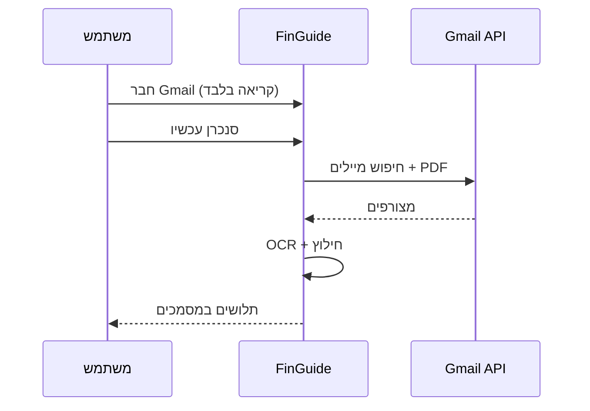

# FinGuide — פורמט מצגת התקדמות (יום חמישי)
## לשימוש ב-Cursor / NotebookLM / Gamma

**קהל:** מרצה שמכיר את ה-POC — אין צורך בהסבר "מה זה FinGuide מאפס".  
**מטרת המצגת:** להראות **לאן הולכים**, **מה נוסף אחרי ה-POC**, ו**איך עובדים ביטוחים + ייבוא Gmail**.  
**משך מומלץ:** 7–10 דקות · **7 שקופיות**

**תמונות מהמערכת (להדבקה):**
- `docs/presentation/01-dashboard.png` — לוח בקרה
- `docs/presentation/02-findings-pension.png` — ממצאים / פנסיה

---

## הנחיות ל-Cursor (העתיקי את הבלוק הזה כפרומפט)

```
צור מצגת בעברית, RTL, 7 שקופיות, סגנון מקצועי-סטארטאפ (לא גנרי AI).

קהל: מכיר את POC של FinGuide — מצגת התקדמות ליום חמישי.
טון: ביטחון, התקדמות ממשית, לא מכירת מוצר מאפס.

כל שקופית: כותרת אחת + 3–5 בולטים מקסימום + הערת דובר אחת (משפט אחד).
הוסף מקום לתמונה בשקופיות 3 ו-6 (ציין "הדבק צילום מסך").

נושאים חובה:
1. אחרי POC — לאן אנחנו הולכים (חזון קצר)
2. מה נוסף בקוד מאז ה-POC (רשימה ממוקדת)
3. ביטוחים — איך זה עובד (פרופיל → כללים → המלצות, לא סוכן ביטוח)
4. Gmail — ייבוא תלושים (קריאה בלבד, PDF, כפילויות, סיסמת PDF)
5. עוזר מס + ציון פיננסי (תמצית)
6. דמו מומלץ להצגה חיה
7. מה הבא / סיכום

אל תכלול: היסטוריה ארוכה של OCR, ארכיטקטורה טכנית עמוקה, הבטחות ייעוץ מס.
כלול disclaimer קצר: לא ייעוץ פיננסי/מס.
```

---

# שקופית 1 — אחרי ה-POC: לאן FinGuide הולכת

**כותרת:** FinGuide — מ-POC למוצר שמנגיש את התחום האפור

**בולטים:**
- **היום:** מערכת שקוראת תלושים ומסמכים, מזהה בעיות, ומתרגמת לעברית פשוטה
- **החזון:** כל שכיר/ה בישראל יבין **מה קורה בכסף שלו** — לפני רואה חשבון / יועץ / סוכן
- **שלושה עמודי תווך:** (1) **מסמכים** מרוכזים (2) **ממצאים + ציון** (3) **המלצות** (ביטוח, מס, פנסיה)
- **לא מחליפים מומחה** — מצמצמים חוסר ודאות ומארגנים מידע

**הערת דובר:** "אתם מכירים את ה-POC — היום נראה מה בנינו מעליו ולאן זה רץ."

**תמונה:** אופציונלי — לוגו / שקופית כיסוי מה-Blueprint המקורי

---

# שקופית 2 — מה הוספנו מאז ה-POC (התקדמות בפועל)

**כותרת:** מה נבנה — סיכום אחרי ה-POC

**בולטים — תשתית מסמכים:**
- Pipeline משותף להעלאה ידנית **ו-Gmail** (`financialDocumentService`)
- חילוץ OCR + סטטוסים: הושלם / דורש בדיקה / **PDF מוגן בסיסמה** / נכשל
- היסטוריית תלושים, ממצאים (פנסיה, השתלמות, רצף הפקדות, אחוזים)

**בולטים — יכולות חדשות למשתמש:**
| יכולת | נתיב | מה זה נותן |
|--------|------|------------|
| **ייבוא Gmail** | `/integrations/email` + כפתור במסמכים | תלושים נכנסים אוטומטית |
| **עוזר מס** | `/tax-assistant` | תלושים חסרים, 106, מעסיקים, חריגות מס |
| **ציון פיננסי** | `/financial-health` + דשבורד | ציון 0–100 + פעולות מומלצות |
| **המלצות ביטוח** | `/insurance` | פערי כיסוי לפי פרופיל + תלושים |

**בולטים — איכות:**
- ~326 בדיקות backend, build frontend עובר
- ענף: `feat/tax-assistant` (מוכן ל-PR)

**הערת דובר:** "זה לא רק UI — יש API, לוגיקה, וטסטים על הזרימות המרכזיות."

---

# שקופית 3 — איך האתר נראה (דמו ויזואלי)

**כותרת:** הממשק היום — מרכז שליטה אחד

**בולטים:**
- לוח בקרה: מסמכים, ממצאים, AI, **ציון פיננסי**
- ניווט: מסמכים · היסטוריית תלושים · ממצאים · עוזר מס · **ציון פיננסי** · ביטוחים
- הכל בעברית RTL, מותאם לשכירים בישראל

**תמונה:** **הדבקי** `docs/presentation/01-dashboard.png`

**הערת דובר:** "זה המסך שמשתמש רואה אחרי העלאת תלושים — לא מצגת, מוצר אמיתי."

---

# שקופית 4 — ביטוחים: איך זה עובד

**כותרת:** המלצות ביטוח — חכם, לא סוכנות

**בולטים — מקורות מידע:**
1. **אונבורדינג / פרופיל** — גיל, ילדים, משכנתא, רכב, מה כבר יש (חיים / בריאות / נכות / דירה / רכב)
2. **תלושים** — תובנות פנסיה נמוכה/חסרה משפיעות על המלצות
3. **מחירוני טווח** — הערכת עלות לפי גיל והכנסה (לא הצעת מחיר מחייבת)

**בולטים — לוגיקת כללים (דוגמאות):**
- אין ביטוח חיים + ילדים/משכנתא → **המלצה קריטית** לביטוח חיים
- אין בריאות משלים + גיל 30+ → המלצה לבריאות
- עבודה ראשית + גיל מתחת ל-60 + ללא נכות → המלצה לאובדן כושר

**בולטים — חוויית משתמש (`/insurance`):**
- כרטיס לכל המלצה: למה, טווח מחיר, חשיבות
- פעולות: **סמן כרכשתי** / **התעלם** / **רענן המלצות**
- רץ אוטומטית אחרי עדכון פרופיל או העלאת מסמך

**בולטים — מה זה לא:**
- לא מוכרים פוליסות · לא מחליפים סוכן · **הסבר והמלצה** בלבד

**תמונה:** אופציונלי — צילום `/insurance` (אם יש) או `02-findings-pension.png` כ"ניתוח"

**הערת דובר:** "הביטוח נכנס לציון הפיננסי (15 נקודות) — פער ביטוחי מוריד את הציון."

---

# שקופית 5 — Gmail: לקיחת מסמכים ישירות מהמייל

**כותרת:** ייבוא תלושים מ-Gmail — בלי לחפש קבצים ידנית

**בולטים — זרימה (4 שלבים):**
```
חיבור Gmail (OAuth) → סנכרון → חיפוש מיילים רלוונטיים → PDF לתוך FinGuide
```

1. **חיבור** — `/integrations/email` או **"ייבוא תלושים מהמייל"** בעמוד מסמכים  
2. **הרשאה** — `gmail.readonly` בלבד (קריאה, לא שליחה/מחיקה/עריכה)  
3. **חיפוש חכם** — מיילים עם PDF + מילות מפתח: תלוש, שכר, payslip, 106…  
4. **עיבוד** — אותו pipeline כמו העלאה ידנית: OCR → תלוש במערכת  

**בולטים — אמון ושקיפות:**
- מוצג במפורש: רק PDF · רק מיילים רלוונטיים · לא נוגעים בתיבה  
- כפילויות (אותו קובץ מ-Gmail) — **מדולגות**  
- מסמך מסומן: **"יובא מ-Gmail"**  
- PDF מוגן סיסמה → סטטוס `needs_password`, המשתמש מזין סיסמה **רק לפתיחה** (לא נשמרת)

**בולטים — דמו חי:**
- חבר Gmail → "סנכרן עכשיו" → רואים תלושים ברשימת מסמכים  
- *דרישה:* `GOOGLE_CLIENT_SECRET` בשרת (הגדרה חד-פעמית)

**דיאגרמה לשקופית (אופציונלי):**


**הערת דובר:** "זה מוריד חיכוך — רוב האנשים מקבלים תלוש במייל ולא מעלים אותו."

---

# שקופית 6 — עוזר מס + ציון פיננסי (תמצית)

**כותרת:** תמונת מצב אחת — מס + שלמות פיננסית

**בולטים — עוזר מס (`/tax-assistant`):**
- בדיקות שנתיות: תלושים חסרים, טופס 106, מעסיקים מרובים, חריגות מס, פנסיה חסרה
- מבוסס על אותם תלושים שכבר במערכת

**בולטים — ציון פיננסי (0–100):**
| קטגוריה | נקודות | בודק |
|---------|--------|------|
| שלמות מסמכים | 25 | תלושים בשנה, 106, מסמכי פנסיה |
| יציבות שכר | 20 | עקביות נטו, מעסיק |
| מוכנות מס | 20 | עוזר מס |
| עקביות פנסיה | 20 | הפקדות עובד/מעסיק |
| ביטוחים | 15 | פרופיל + המלצות |

- ווידג'ט בדשבורד + עמוד `/financial-health` + פעולות מומלצות  
- Disclaimer: מבוסס מסמכים שהועלו — לא ייעוץ

**תמונה:** `02-findings-pension.png` או צילום `/financial-health` אם קיים

**הערת דובר:** "שני הכלים האלה עונים על 'האם אני מסודר/ת לשנה?' בלי אקסל."

---

# שקופית 7 — דמו מומלץ + מה הבא

**כותרת:** סיכום והמשך

**בולטים — מסלול דמו (3 דקות):**
1. התחברות → לוח בקרה (ציון פיננסי)  
2. מסמכים → **ייבוא תלושים מהמייל** או תלוש קיים  
3. ממצאים → פנסיה / השתלמות  
4. עוזר מס → מה חסר לשנה  
5. ביטוחים → המלצה אחת + למה  

**בולטים — מה הבא (לא היום):**
- דיוק חילוץ גבוה יותר · הסברים חינוכיים ליד כל ממצא  
- Gmail בפרודקשן · שמירת סיסמת PDF (אופציונלי — "בקרוב")  
- זרימת 106 מלאה · מובייל  

**בולטים — מסר סיום:**
> FinGuide הופך תלושים ומיילים לתמונת מצב ברורה — ממצאים, ציון, מס וביטוח — כדי שכל אחד יידע מה הצעד הבא.

**הערת דובר:** "שאלות? אפשר לפתוח דמו חי על localhost או לשלוח לינק ל-PR."

---

# נספח — טבלת השוואה POC → היום (למצגת או שקופית נספית)

| נושא | POC (היה) | היום (יש) |
|------|-----------|-----------|
| העלאת PDF | ✓ | ✓ + מטא-דאטה |
| OCR תלוש | בסיסי | ✓ + needs_review / password |
| ממצאים פנסיה | חלקי | ✓ מלא + רצף הפקדות |
| Gmail | ✗ | ✓ קריאה בלבד |
| עוזר מס | ✗ | ✓ |
| ציון פיננסי | ✗ | ✓ |
| ביטוחים מותאמים | ✗ / דמו | ✓ כללים + UI |
| AI צ'אט | ✓ | ✓ + כוונות |

---

# נספח — משפטים מוכנים לדובר (עברית)

**פתיחה (30 שנ'):**  
"אחרי ה-POC שהכרתם, התמקדנו בשלושה דברים: להכניס מסמכים בקלות — כולל מ-Gmail, להסביר מס וביטוח בשפה פשוטה, ולתת ציון אחד שמרכז את התמונה."

**מעבר לביטוחים:**  
"ביטוח זה תחום אפור ענק. אנחנו לא סוכנות — אנחנו אומרים לפי הפרופיל והתלושים שלך: כנראה חסר לך X, ולמה."

**מעבר ל-Gmail:**  
"הקלט הכי טבעי לתלוש הוא המייל. חיברנו קריאה בלבד, מורידים רק PDF רלוונטי, ושאר העיבוד זהה להעלאה ידנית."

**סגירה:**  
"יש מוצר רץ, טסטים ירוקים, ו-PR ממתין. השלב הבא: דיוק, פרודקשן Gmail, וחוויית 'מה לעשות עכשיו' ליד כל ממצא."

---

*קובץ זה: `docs/presentation/THURSDAY_PROGRESS_CURSOR_FORMAT.md` — עדכן תאריך/שמות לפני ההצגה.*
